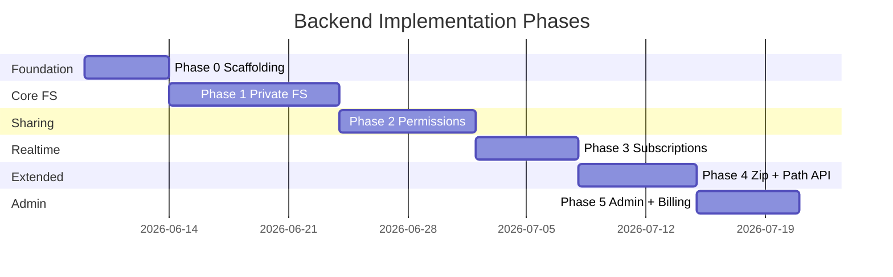

# Ha-to-Pe File System — Backend Implementation Plan

End-to-end plan for implementing the Ha-to-Pe backend from empty repository to production-ready API. This document is the execution guide for backend work; it references [requirement.md](./requirement.md), [usecase.md](./usecase.md), [db_schema.md](./db_schema.md), and [tech_stack.md](./tech_stack.md).

---

## 1. Goals and Success Criteria

### 1.1 Backend Deliverables

By the end of all phases, the backend must:

1. Expose **GraphQL** (metadata, tree, permissions, search, subscriptions) and **REST** (upload, download, OAuth).
2. Enforce **permissions**, **quotas**, and **path safety** in the service layer on every operation.
3. Support **private**, **shared**, and **public** directories with ACL inheritance.
4. Provide **trash**, **zip/unzip**, **real-time events**, and **admin analytics**.
5. Achieve **≥ 90% test coverage** on `domain/` and `services/`.

### 1.2 Architecture Rules (non-negotiable)

| Rule | Detail |
|------|--------|
| Layered dependencies | `domain` → `repositories` → `services` → `api` |
| Thin API layer | Resolvers and route handlers delegate to services only |
| No business logic in resolvers | Permission checks live in services |
| Transactions in services | Quota + node updates in a single DB transaction |
| Blob bytes outside DB | `storage_key` on `nodes`; adapter in `storage/` |
| Paths resolved at runtime | Never persist full logical paths |

### 1.3 Target Directory Structure

```
backend/
├── pyproject.toml
├── alembic.ini
├── alembic/
│   └── versions/
├── app/
│   ├── __init__.py
│   ├── main.py                      # FastAPI app factory
│   ├── core/
│   │   ├── config.py                # pydantic-settings
│   │   ├── database.py              # engine, session, Base
│   │   ├── security.py              # JWT, password hashing
│   │   ├── dependencies.py          # get_db, get_current_user
│   │   └── exceptions.py            # domain errors → HTTP/GQL errors
│   ├── domain/
│   │   ├── enums.py                 # NodeType, Visibility, Action, ...
│   │   ├── entities/                # plain dataclasses / pydantic models
│   │   └── value_objects/
│   │       ├── logical_path.py      # absolute/relative path resolution
│   │       └── permission_set.py    # merged effective permissions
│   ├── models/                      # SQLAlchemy ORM (maps to db_schema)
│   │   ├── user.py
│   │   ├── node.py
│   │   ├── permission.py
│   │   └── ...
│   ├── repositories/
│   │   ├── base.py
│   │   ├── user_repository.py
│   │   ├── node_repository.py
│   │   └── ...
│   ├── storage/
│   │   ├── base.py                  # BlobStorage protocol
│   │   └── local.py                 # LocalFilesystemStorage
│   ├── services/
│   │   ├── auth_service.py
│   │   ├── user_service.py
│   │   ├── node_service.py
│   │   ├── file_service.py
│   │   ├── trash_service.py
│   │   ├── search_service.py
│   │   ├── permission_service.py
│   │   ├── share_service.py
│   │   ├── zip_service.py
│   │   ├── quota_service.py
│   │   ├── presence_service.py
│   │   ├── event_service.py         # real-time broadcast
│   │   └── admin_service.py
│   └── api/
│       ├── graphql/
│       │   ├── schema.graphql
│       │   ├── context.py
│       │   ├── resolvers/
│       │   └── dataloaders.py
│       └── rest/
│           ├── auth.py
│           ├── upload.py
│           ├── download.py
│           └── admin.py
└── tests/
    ├── conftest.py
    ├── unit/
    └── integration/
```

---

## 2. Phase Overview



| Phase | Focus | Exit criterion |
|-------|-------|----------------|
| 0 | Scaffolding, models, auth skeleton | User can register/login; root dir created |
| 1 | Private tree, upload/download, trash, search | Full private FS via GraphQL + REST |
| 2 | Visibility, grants, invitations | Collaborator can access shared dir with ACL |
| 3 | Subscriptions, presence, versioning | Two clients see live dir changes |
| 4 | Zip/unzip, path resolution API | CLI-ready path and archive operations |
| 5 | Admin config, analytics, upgrades | Admin dashboard data available via API |

---

## 3. Phase 0 — Foundation

**Duration estimate:** 3–5 days  
**Requirements:** ACC-01–05, NFR-03, NFR-07  
**Tables:** `users`, `oauth_accounts`, `nodes` (minimal), `system_config`, `refresh_tokens`

### 3.1 Tasks

| # | Task | Output |
|---|------|--------|
| 0.1 | Initialize `pyproject.toml` with UV; add dependencies from [tech_stack.md](./tech_stack.md) | Lockfile, dev extras |
| 0.2 | Add `app/core/config.py` — `Settings` via pydantic-settings | `.env.example` |
| 0.3 | Add `app/core/database.py` — SQLAlchemy engine, `SessionLocal`, `Base` | DB connection works |
| 0.4 | Add Alembic; initial migration for `users`, `oauth_accounts`, `nodes`, `system_config`, `refresh_tokens` | `alembic upgrade head` |
| 0.5 | Implement ORM models matching [db_schema.md](./db_schema.md) §4.1–4.3 (users, nodes) | `app/models/` |
| 0.6 | Implement `domain/enums.py` — `NodeType`, `Visibility`, `OAuthProvider` | Shared enums |
| 0.7 | Implement `UserRepository`, `NodeRepository` (basic CRUD) | `app/repositories/` |
| 0.8 | Implement `QuotaService` — read default quota from `system_config` | Seed `default_quota_bytes` |
| 0.9 | Implement `UserService.register()` — transactional user + root node creation (db_schema §10) | ACC-04 satisfied |
| 0.10 | Implement `AuthService` — JWT issue/verify, refresh token persistence | ACC-02 |
| 0.11 | REST: `POST /auth/register`, `POST /auth/login`, `POST /auth/refresh`, `POST /auth/logout` | Email/password first |
| 0.12 | REST: OAuth stubs `GET /auth/google`, `GET /auth/github/callback` (Authlib) | ACC-03 |
| 0.13 | FastAPI `main.py` — mount app, CORS, exception handlers | `uvicorn app.main:app` |
| 0.14 | Ariadne: mount GraphQL at `/graphql`; `me` query returning current user + root | Schema skeleton |
| 0.15 | `tests/conftest.py` — test DB (SQLite in-memory), client fixtures | pytest runs |
| 0.16 | Unit tests: `UserService.register`, quota assignment | NFR-04 |
| 0.17 | Add `ruff`, `black`, `isort` config; pre-commit optional | NFR-07 |

### 3.2 GraphQL Schema (Phase 0)

```graphql
type User {
  id: ID!
  email: String!
  displayName: String!
  quotaBytes: BigInt!
  storageUsedBytes: BigInt!
  root: Directory!
}

type Query {
  me: User
}
```

### 3.3 Phase 0 Acceptance Tests

```python
# Integration tests to write
test_register_creates_user_and_root_directory()
test_login_returns_jwt()
test_me_query_returns_authenticated_user()
test_duplicate_email_rejected()
```

### 3.4 Definition of Done

- [ ] `uv run pytest` passes
- [ ] `uv run uvicorn app.main:app --reload` serves `/graphql` and `/docs`
- [ ] New user has `root_node_id` pointing to a `directory` node named `root`
- [ ] `system_config` contains `default_quota_bytes`

---

## 4. Phase 1 — Private File System

**Duration estimate:** 8–12 days  
**Requirements:** FS-01–05, UDL-01–06, TRH-01–06, SRC-01–04, STO-03–05  
**Use cases:** UC-04–18, UC-28

### 4.1 Domain and Storage

| # | Task | Output |
|---|------|--------|
| 1.1 | `storage/base.py` — `BlobStorage` protocol: `save`, `open_stream`, `delete`, `exists` | Interface |
| 1.2 | `storage/local.py` — `storage/{owner_id}/{node_id}` layout | Dev blob store |
| 1.3 | `domain/value_objects/logical_path.py` — parse, normalize, resolve relative/absolute | FS-04 |
| 1.4 | `domain/exceptions.py` — `NotFoundError`, `ConflictError`, `QuotaExceededError`, `PermissionDeniedError` | Typed errors |

### 4.2 Services

| Service | Methods | Notes |
|---------|---------|-------|
| `NodeService` | `list_children`, `get_node`, `mkdir`, `create_file`, `rename`, `move`, `copy` | Sibling name uniqueness (FS-03) |
| `FileService` | `init_upload`, `complete_upload`, `download`, `replace_content` | Uses `UploadSession` |
| `TrashService` | `move_to_trash`, `list_trash`, `restore`, `permanent_delete`, `empty_trash` | TRH-01–06 |
| `SearchService` | `search_in_subtree`, `search_global` | Recursive CTE; owner-only filter in P1 |
| `QuotaService` | `check_and_reserve`, `commit_usage`, `release` | `FOR UPDATE` on user row |

**Implementation order:**

```
QuotaService → NodeService → FileService → TrashService → SearchService
```

### 4.3 NodeService Key Logic

```
create (mkdir / touch):
  1. validate name
  2. check sibling uniqueness (deleted_at IS NULL)
  3. insert node
  4. emit activity_event

move:
  1. reject if target is descendant of source (directories)
  2. check sibling name conflict at target
  3. update parent_id, version++

rename:
  1. optimistic lock on version
  2. sibling uniqueness check
```

### 4.4 FileService Upload Flow (REST)

```
1. POST /upload/sessions          → FileService.init_upload()
   Input:  directory_id, file_name, size, mime_type
   Output: upload_session_id, upload_url

2. PUT  /upload/sessions/{id}     → stream bytes to BlobStorage
   Check quota before accepting first byte

3. POST /upload/sessions/{id}/complete → FileService.complete_upload()
   Create/update node, set storage_key, checksum, increment storage_used_bytes
```

### 4.5 Download Flow (REST)

```
GET /download/{node_id}
  → FileService.download()
  → check read permission (owner-only in P1)
  → StreamingResponse from BlobStorage.open_stream()
```

### 4.6 GraphQL Schema (Phase 1)

```graphql
enum NodeType { DIRECTORY FILE ZIP }

interface Node {
  id: ID!
  name: String!
  nodeType: NodeType!
  parent: Directory
  owner: User!
  sizeBytes: BigInt!
  createdAt: DateTime!
  updatedAt: DateTime!
  version: Int!
}

type Directory implements Node {
  children: [Node!]!
}

type File implements Node {
  mimeType: String
}

type Mutation {
  mkdir(parentId: ID!, name: String!): Directory!
  createFile(parentId: ID!, name: String!): File!
  rename(nodeId: ID!, name: String!, expectedVersion: Int!): Node!
  move(nodeId: ID!, targetParentId: ID!): Node!
  copy(nodeId: ID!, targetParentId: ID!): Node!
  moveToTrash(nodeId: ID!): Node!
  restoreFromTrash(nodeId: ID!): Node!
  permanentDelete(nodeId: ID!): Boolean!
  emptyTrash: Int!
}

type Query {
  node(id: ID!): Node
  directory(id: ID!): Directory
  trash: [Node!]!
  search(query: String!, scope: SearchScope!, directoryId: ID): [Node!]!
}

enum SearchScope { CURRENT_DIRECTORY GLOBAL }
```

### 4.7 Tests (Phase 1)

| Test file | Cases |
|-----------|-------|
| `test_node_service.py` | mkdir, rename conflict, move cycle rejection |
| `test_file_service.py` | upload, quota exceeded, download stream |
| `test_trash_service.py` | soft delete, restore, fallback to root, empty |
| `test_search_service.py` | subtree vs global, trashed excluded |
| `test_quota_service.py` | concurrent upload quota safety |
| `test_api_graphql_nodes.py` | integration via TestClient |
| `test_api_rest_upload.py` | multipart/stream upload |

### 4.8 Definition of Done

- [ ] Owner can manage full private tree via GraphQL
- [ ] Upload/download works via REST with streaming
- [ ] Trash lifecycle complete (UC-13–16)
- [ ] Search by name works (current + global, owner scope)
- [ ] Quota enforced on upload
- [ ] Integration tests cover upload → trash → restore → permanent delete

---

## 5. Phase 2 — Sharing and Permissions

**Duration estimate:** 6–10 days  
**Requirements:** VIS-01–04, PRM-01–05, NFR-06  
**Use cases:** UC-19–23  
**Tables:** `permission_grants`, `share_invitations`, `public_links`

### 5.1 Permission Engine (critical path)

Implement `PermissionService` **before** wiring sharing APIs.

| # | Task | Detail |
|---|------|--------|
| 2.1 | `domain/value_objects/permission_set.py` | Merge actions from grants |
| 2.2 | `PermissionService.resolve(user, node) -> PermissionSet` | Walk ancestor chain (db_schema §9.4) |
| 2.3 | `PermissionService.require(user, node, action)` | Raises `PermissionDeniedError` |
| 2.4 | Owner shortcut | Owner of `node.owner_id` or directory tree owner → full access (PRM-01) |
| 2.5 | `inherit` flag | Grants on ancestor apply to descendants (PRM-03) |
| 2.6 | Refactor all services | Inject `PermissionService`; replace owner-only checks |

### 5.2 Permission Resolution Algorithm

```
resolve(user, node):
  if user is owner of node.owner_id:
    return ALL_ACTIONS

  ancestors = walk_up(node)  # node → parent → ... → root
  effective = empty PermissionSet

  for dir in ancestors where dir.node_type == DIRECTORY:
    grant = find_grant(dir.id, user.id)
    if grant and (grant.inherit or dir == node.parent chain match):
      effective = effective.union(grant.actions)

  if node is in public directory subtree:
    apply public_link grants (read / optional write)

  return effective
```

### 5.3 ShareService

| Method | Use case |
|--------|----------|
| `set_visibility(directory_id, visibility)` | UC-19 |
| `invite(directory_id, email, actions, inherit)` | UC-20 |
| `accept_invitation(token)` | UC-21 |
| `decline_invitation(token)` | UC-21 A1 |
| `update_grant(directory_id, user_id, actions)` | UC-22 |
| `revoke_access(directory_id, user_id)` | UC-22 A1 |
| `create_public_link(directory_id, allow_write)` | UC-23 |
| `resolve_public_access(token)` | UC-23 guest access |

### 5.4 Search and List Filtering

- `SearchService.search_global` — only nodes where `PermissionService.resolve` includes `read`
- `NodeService.list_children` — same filter
- Authorization failures return generic error for inaccessible nodes (NFR-06)

### 5.5 GraphQL Additions (Phase 2)

```graphql
enum Visibility { PRIVATE SHARED PUBLIC }

type PermissionGrant {
  id: ID!
  grantee: User!
  actions: [String!]!
  inherit: Boolean!
}

type Mutation {
  setVisibility(directoryId: ID!, visibility: Visibility!): Directory!
  inviteCollaborator(directoryId: ID!, email: String!, actions: [String!]!, inherit: Boolean): ShareInvitation!
  acceptInvitation(token: String!): PermissionGrant!
  updateGrant(grantId: ID!, actions: [String!]!, inherit: Boolean): PermissionGrant!
  revokeGrant(grantId: ID!): Boolean!
  createPublicLink(directoryId: ID!, allowWrite: Boolean): PublicLink!
}

extend type Directory {
  visibility: Visibility!
  grants: [PermissionGrant!]!
}
```

### 5.6 Tests (Phase 2)

| Test | Scenario |
|------|----------|
| `test_permission_inheritance` | Grant on parent applies to nested file |
| `test_permission_no_inherit` | Grant on parent only, inherit=false |
| `test_collaborator_read_only` | Cannot write without write action |
| `test_public_link_read` | Guest can list public dir |
| `test_search_hides_inaccessible` | Global search omits private nodes |
| `test_invite_accept_flow` | End-to-end share |

### 5.7 Definition of Done

- [ ] All Phase 1 operations check `PermissionService`
- [ ] Shared directory invite → accept → collaborator can list/upload
- [ ] Public link provides read access without auth
- [ ] Table-driven tests for nested ACL inheritance (≥ 10 cases)

---

## 6. Phase 3 — Real-Time Collaboration

**Duration estimate:** 5–7 days  
**Requirements:** RTC-01–05  
**Use cases:** UC-24  
**Tables:** `directory_presence`

### 6.1 Components

| # | Task | Output |
|---|------|--------|
| 3.1 | `EventService` — `publish(directory_id, event)` | Internal pub/sub |
| 3.2 | Hook services to publish events | create, rename, move, delete, upload, trash |
| 3.3 | Ariadne subscription `directoryChanged(directoryId)` | GraphQL subscription |
| 3.4 | WebSocket transport for subscriptions | Ariadne `websocket` |
| 3.5 | `PresenceService` — heartbeat, list viewers | RTC-03 |
| 3.6 | Subscription `directoryPresence(directoryId)` | Presence stream |
| 3.7 | Optimistic locking | All mutating services check `expected_version`; return `409` on mismatch (RTC-04) |

### 6.2 Event Payload

```json
{
  "type": "NODE_CREATED | NODE_RENAMED | NODE_MOVED | NODE_TRASHED | NODE_RESTORED",
  "directoryId": "123",
  "nodeId": "456",
  "actorUserId": "789",
  "timestamp": "2026-06-08T12:00:00Z"
}
```

### 6.3 Service Change Pattern

```python
# After every mutation affecting a shared/public directory:
if directory.visibility in (SHARED, PUBLIC):
    await event_service.publish(directory_id, event)
```

### 6.4 Multi-Instance Note

Single-process: `asyncio.Queue` per directory.  
Production scale (later): swap `EventService` backend to Redis pub/sub without changing service call sites.

### 6.5 Tests

- `test_subscription_receives_create_event`
- `test_version_conflict_returns_error`
- `test_presence_expires_after_timeout`

### 6.6 Definition of Done

- [ ] Two GraphQL clients subscribed to same shared dir see changes within 1s
- [ ] Concurrent rename with stale version returns conflict
- [ ] Presence shows active viewers

---

## 7. Phase 4 — Zip, Path Resolution, CLI Support

**Duration estimate:** 5–8 days  
**Requirements:** ZIP-01–05, SHL-02–05, UDL-03  
**Use cases:** UC-25–27, UC-12

### 7.1 ZipService

| Method | Detail |
|--------|--------|
| `create_zip(sources, target_dir, name)` | Walk subtree, stream into archive, create `zip` node |
| `unzip(zip_id, target_dir)` | Validate entry count + uncompressed size (ZIP-04), extract, create nodes |
| `download_directory_as_zip(directory_id)` | On-the-fly zip stream (UC-12) |

Zip bomb limits read from `system_config`: `max_zip_entries`, `max_zip_uncompressed_bytes`.

### 7.2 Path Resolution API (for CLI)

Add `PathService` used by GraphQL and future CLI:

| Method | Purpose |
|--------|---------|
| `resolve(user, cwd_id, path_str) -> node_id` | Absolute or relative (SHL-02) |
| `build_path(node_id) -> str` | Logical path string for display |

GraphQL:

```graphql
type Query {
  resolvePath(cwdId: ID!, path: String!): Node
  nodePath(nodeId: ID!): String!
}

type Mutation {
  createZip(sourceIds: [ID!]!, targetParentId: ID!, name: String!): ZipArchive!
  unzip(zipId: ID!, targetParentId: ID!): Directory!
}
```

### 7.3 REST

```
GET  /download/directory/{id}/zip   → stream directory as zip
POST /zip                           → create zip (optional REST alternative)
POST /unzip/{id}                    → extract
```

### 7.4 Tests

- `test_create_zip_from_directory`
- `test_unzip_zip_bomb_rejected`
- `test_resolve_path_relative_and_absolute`
- `test_unzip_quota_enforced`

### 7.5 Definition of Done

- [ ] Zip/unzip round-trip works with permissions
- [ ] Zip bomb limits enforced
- [ ] `resolvePath` supports `..`, `.`, absolute `/root/...`
- [ ] Directory download as zip streams correctly

---

## 8. Phase 5 — Admin, Analytics, Billing

**Duration estimate:** 5–7 days  
**Requirements:** ADM-01–05, STO-02  
**Use cases:** UC-29–33  
**Tables:** `storage_tiers`, `storage_upgrades`, `activity_events`

### 8.1 Services

| Service | Methods |
|---------|---------|
| `AdminService` | `set_default_quota`, `set_config`, `get_analytics_summary`, `generate_report` |
| `BillingService` | `list_tiers`, `initiate_upgrade`, `confirm_payment` |
| `ActivityService` | `record(event)`, called from all services |

### 8.2 Admin Authorization

- `dependencies.require_admin` — checks `user.is_admin`
- All `/admin/*` REST and `admin*` GraphQL fields gated

### 8.3 GraphQL (Phase 5)

```graphql
type AdminStats {
  totalUsers: Int!
  totalStorageUsedBytes: BigInt!
  totalSharedDirectories: Int!
  uploadsLast30Days: Int!
}

type Query {
  adminStats: AdminStats          # admin only
  storageTiers: [StorageTier!]!
}

type Mutation {
  setDefaultQuota(bytes: BigInt!): Boolean!    # admin only
  purchaseStorageUpgrade(tierId: ID!): StorageUpgrade!
}
```

### 8.4 Analytics Queries

Pre-aggregate from `activity_events`:

```sql
-- uploads last 30 days
SELECT COUNT(*) FROM activity_events
WHERE event_type = 'upload' AND created_at >= :since;
```

Consider materialized summary table if report generation is slow (optional optimization).

### 8.5 Definition of Done

- [ ] Admin can set default quota via API
- [ ] Analytics summary returns correct counts
- [ ] Storage upgrade increases `users.quota_bytes` on completed payment
- [ ] Non-admin receives 403 on admin endpoints

---

## 9. Cross-Cutting Implementation Guide

### 9.1 Error Mapping

| Domain exception | HTTP | GraphQL |
|------------------|------|---------|
| `NotFoundError` | 404 | `NOT_FOUND` |
| `PermissionDeniedError` | 403 | `FORBIDDEN` |
| `ConflictError` | 409 | `CONFLICT` |
| `QuotaExceededError` | 413 | `QUOTA_EXCEEDED` |
| `ValidationError` | 422 | `BAD_USER_INPUT` |

### 9.2 Transaction Boundaries

| Operation | Tables touched atomically |
|-----------|---------------------------|
| Upload complete | `nodes`, `users.storage_used_bytes`, `upload_sessions`, `activity_events` |
| Move to trash | `nodes` (deleted_at, trash_owner_id, original_parent_id) |
| Permanent delete | `nodes` DELETE, blob delete, `users.storage_used_bytes` decrement |
| Accept invitation | `share_invitations`, `permission_grants` |
| Register user | `users`, `nodes`, update `root_node_id` |

### 9.3 Activity Event Instrumentation

Add `ActivityService.record()` calls in Phase 1; enrich in later phases. Minimum events:

```
node_created, upload, download, node_deleted, node_restored,
share_invited, share_accepted, zip_created, unzip, quota_exceeded
```

### 9.4 DataLoaders (GraphQL)

| Loader | Prevents N+1 on |
|--------|------------------|
| `node_by_id` | Node field resolution |
| `children_by_parent_id` | Directory.children |
| `user_by_id` | Node.owner |

### 9.5 Security Checklist (every phase)

- [ ] Path traversal blocked in `LogicalPath`
- [ ] File names sanitized (no `..`, no null bytes, max length 255)
- [ ] JWT expiry enforced; refresh token rotation
- [ ] Upload size limit from `system_config`
- [ ] CORS restricted to known origins
- [ ] Admin endpoints role-gated

---

## 10. API Surface Summary (Final)

### 10.1 GraphQL Queries

| Query | Phase |
|-------|-------|
| `me` | 0 |
| `node`, `directory`, `trash` | 1 |
| `search` | 1 |
| `resolvePath`, `nodePath` | 4 |
| `adminStats`, `storageTiers` | 5 |

### 10.2 GraphQL Mutations

| Mutation | Phase |
|----------|-------|
| `mkdir`, `createFile`, `rename`, `move`, `copy` | 1 |
| `moveToTrash`, `restoreFromTrash`, `permanentDelete`, `emptyTrash` | 1 |
| `setVisibility`, `inviteCollaborator`, `acceptInvitation`, `updateGrant`, `revokeGrant` | 2 |
| `createPublicLink` | 2 |
| `createZip`, `unzip` | 4 |
| `setDefaultQuota`, `purchaseStorageUpgrade` | 5 |

### 10.3 GraphQL Subscriptions

| Subscription | Phase |
|--------------|-------|
| `directoryChanged` | 3 |
| `directoryPresence` | 3 |

### 10.4 REST Endpoints

| Method | Path | Phase |
|--------|------|-------|
| POST | `/auth/register` | 0 |
| POST | `/auth/login` | 0 |
| POST | `/auth/refresh` | 0 |
| GET | `/auth/google`, `/auth/github/callback` | 0 |
| POST | `/upload/sessions` | 1 |
| PUT | `/upload/sessions/{id}` | 1 |
| POST | `/upload/sessions/{id}/complete` | 1 |
| GET | `/download/{node_id}` | 1 |
| GET | `/download/directory/{id}/zip` | 4 |
| GET | `/public/{token}/*` | 2 |
| GET | `/admin/reports/{type}` | 5 |

---

## 11. Testing Strategy by Phase

| Phase | Unit | Integration | Coverage target |
|-------|------|-------------|-----------------|
| 0 | UserService, AuthService | auth endpoints, me query | 80% services |
| 1 | Node, File, Trash, Search, Quota | GraphQL mutations, upload REST | 90% services |
| 2 | PermissionService (table-driven) | share invite flow | 90% services |
| 3 | EventService, version conflict | subscription receives event | 85% services |
| 4 | ZipService, PathService | zip round-trip, path resolve | 90% services |
| 5 | AdminService, BillingService | admin gating, upgrade | 85% services |

### 11.1 Test Fixtures

```python
@pytest.fixture
def user_with_tree(db):
    """User + root + sample files/dirs for reuse."""

@pytest.fixture
def shared_directory_with_collaborator(db):
    """Owner, collaborator, grants — for permission tests."""
```

### 11.2 CI Command

```bash
uv run ruff check app tests
uv run black --check app tests
uv run isort --check app tests
uv run pytest --cov=app/services --cov=app/domain --cov-fail-under=90
```

---

## 12. Local Development Workflow

```bash
# Setup
cd backend
uv sync --extra dev
cp .env.example .env

# Database
uv run alembic upgrade head

# Seed (optional script)
uv run python -m app.scripts.seed_config

# Run
uv run uvicorn app.main:app --reload --port 8000

# Test
uv run pytest -v
```

### 12.1 Environment Variables

See [tech_stack.md](./tech_stack.md) §8.3. Minimum for local dev:

```
DATABASE_URL=sqlite:///./dev.db
STORAGE_PATH=./storage
JWT_SECRET=dev-secret-change-in-prod
JWT_ACCESS_EXPIRE_MINUTES=30
DEFAULT_QUOTA_BYTES=549755813888
```

---

## 13. Production Hardening (Post Phase 5)

| Item | Action |
|------|--------|
| MySQL migration | Switch `DATABASE_URL`; run Alembic on MySQL |
| HTTPS | Reverse proxy (nginx / Caddy) |
| Blob storage | Swap `LocalFilesystemStorage` → S3 adapter |
| Redis | EventService backend for multi-instance |
| Rate limiting | slowapi on upload/auth endpoints |
| Logging | Structured JSON logs (user_id, node_id, action) |
| Monitoring | Health check `GET /health`; metrics endpoint |
| Backups | DB backups + blob storage replication |

---

## 14. Risk Register

| Risk | Mitigation | Phase |
|------|------------|-------|
| ACL inheritance bugs | Table-driven tests; explicit `PermissionService` | 2 |
| Quota race conditions | `SELECT ... FOR UPDATE` on user row | 1 |
| Zip bombs | Pre-scan entry count and uncompressed size | 4 |
| GraphQL N+1 | DataLoaders from Phase 1 | 1 |
| MySQL lacks partial unique index | App-level sibling check + tests | 1 |
| Subscription memory leak | Prune disconnected clients; heartbeat timeout | 3 |
| Circular user/root FK | Two-step registration transaction (db_schema §10) | 0 |

---

## 15. Recommended Build Order (Single Developer)

```
Week 1:  Phase 0 complete
Week 2:  NodeService + QuotaService + GraphQL tree
Week 3:  FileService REST upload/download + TrashService
Week 4:  SearchService + Phase 1 integration tests
Week 5:  PermissionService + refactor all services
Week 6:  ShareService + invitations + public links
Week 7:  Subscriptions + presence + version conflicts
Week 8:  ZipService + PathService
Week 9:  AdminService + activity analytics
Week 10: Production hardening + MySQL validation
```

Adjust pacing as needed; do not start Phase 2 until Phase 1 integration tests pass.

---

## 16. Document History

| Version | Date | Author | Changes |
|---------|------|--------|---------|
| 0.1 | 2026-06-08 | — | Initial backend implementation plan |
