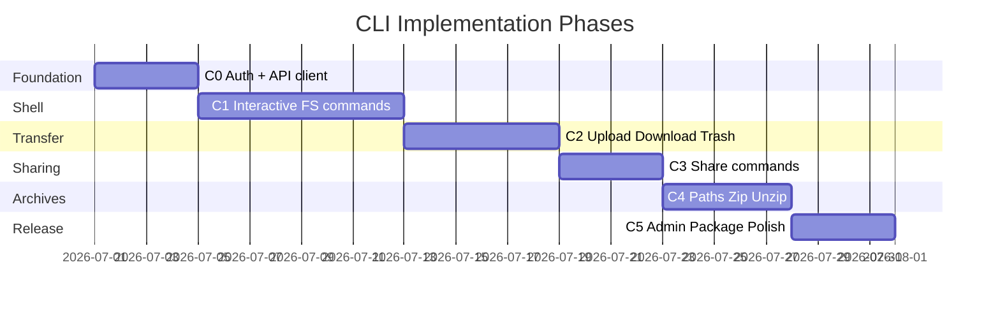

# Ha-to-Pe File System — CLI Implementation Plan

End-to-end plan for implementing the Ha-to-Pe terminal client (`cli/`) as a **virtual shell** over the backend API. This document aligns with [requirement.md](./requirement.md) (SHL-01–05), [usecase.md](./usecase.md) (UC-27), [tech_stack.md](./tech_stack.md), and [backend_implementation_plan.md](./backend_implementation_plan.md).

**Priority:** Must (SHL-05) — deliver after backend Phase 1; full path and zip support after backend Phase 4.

---

## 1. Goals and Success Criteria

### 1.1 CLI Deliverables

By the end of all phases, the CLI must:

1. Offer an **interactive shell** (`hatope shell`) with persistent `cwd` and Unix-like commands.
2. Offer **one-shot subcommands** (`hatope ls`, `hatope upload`, …) for scripting and CI.
3. Resolve **absolute and relative logical paths** against the remote tree (not the host OS tree).
4. Support **upload/download** between local disk (host paths) and remote nodes (logical paths).
5. Enforce the same **permissions and quotas** as the GUI — server-side only (SHL-04).
6. Ship as an installable package (`uv tool install` / PyPI).

### 1.2 Mental Model

```
┌─────────────────┐     HTTP      ┌─────────────────┐
│  User terminal  │ ────────────► │  Ha-to-Pe API   │
│  (local paths)  │   GraphQL     │  (logical tree) │
│                 │   + REST      │                 │
└─────────────────┘               └─────────────────┘

Local path:  ./photo.jpg, C:\Users\me\doc.pdf  → upload only
Remote path: /docs/report.pdf, ../shared/proj   → API operations
```

The CLI never maps remote paths to host filesystem paths.

### 1.3 Architecture Rules

| Rule | Detail |
|------|--------|
| API-only remote ops | All file/dir mutations go through GraphQL or REST |
| Session state local | `cwd` (remote directory id), tokens, config on disk |
| Thin command layer | Commands parse args → call `api/operations` → render output |
| Rich output | Tables for `ls`, progress bars for upload/download |
| No business logic | No client-side permission or quota math |
| Dual interface | REPL for interactive use; Typer subcommands for scripts |
| Python 3.12+ | Match backend; share enums/types optionally via workspace |

### 1.4 Dependency Map

| CLI phase | Requires backend phase | Notes |
|-----------|------------------------|-------|
| C0 | Backend Phase 0 | Auth + `me` query |
| C1 | Backend Phase 1 | Tree listing, mkdir, mv, trash mutations |
| C2 | Backend Phase 1 | REST upload/download |
| C3 | Backend Phase 2 | Sharing queries/mutations |
| C4 | Backend Phase 4 | `resolvePath`, zip/unzip |
| C5 | Backend Phase 5 | Admin subcommands (optional) |

Path note: basic `cd`/`ls` by name works in C1; `..` and absolute `/root/...` need backend `resolvePath` (Phase 4) or a client-side walker (interim).

### 1.5 Target Directory Structure

```
cli/
├── pyproject.toml
├── README.md
├── src/hatope/
│   ├── __init__.py
│   ├── __main__.py                # python -m hatope
│   ├── main.py                    # Typer app entry: `hatope`
│   ├── config.py                  # settings, config file paths
│   ├── session.py                 # Session: cwd_id, user, root_id
│   ├── credentials.py             # token load/save (~/.config/hatope/)
│   ├── api/
│   │   ├── client.py              # httpx AsyncClient / sync wrapper
│   │   ├── graphql.py             # execute(query, variables)
│   │   ├── rest.py                # upload, download, auth REST
│   │   └── operations.py          # NodeOps, TrashOps, ShareOps, ...
│   ├── path/
│   │   ├── logical.py             # parse path segments, . and ..
│   │   ├── resolver.py            # resolve(session, path) → node_id
│   │   └── display.py             # node_id → printable path string
│   ├── commands/
│   │   ├── auth.py                # login, logout, whoami
│   │   ├── fs.py                  # cd, ls, mkdir, touch, mv, cp, rm
│   │   ├── transfer.py            # upload, download
│   │   ├── trash.py               # trash, restore, purge
│   │   ├── search.py              # search
│   │   ├── zip_cmd.py             # zip, unzip
│   │   ├── share.py               # share, invite, public-link
│   │   └── admin.py               # admin stats, quota (C5)
│   ├── shell/
│   │   ├── repl.py                # interactive loop
│   │   ├── lexer.py               # split command line (quotes)
│   │   └── dispatch.py            # command name → handler
│   ├── output/
│   │   ├── console.py             # shared Rich Console
│   │   ├── tables.py              # ls, trash, search tables
│   │   ├── progress.py            # upload/download progress
│   │   └── errors.py              # API error → user message
│   └── exceptions.py              # CliError, NotLoggedIn, ...
└── tests/
    ├── conftest.py
    ├── unit/
    │   ├── test_path_resolver.py
    │   ├── test_lexer.py
    │   └── test_operations.py
    └── integration/
        └── test_shell_flow.py
```

---

## 2. Tech Stack

| Component | Technology | Purpose |
|-----------|------------|---------|
| Language | Python 3.12+ | Same as backend |
| CLI framework | Typer | Subcommands, `--help`, typing |
| Interactive shell | cmd-like REPL + `prompt_toolkit` (optional) | History, completion |
| Output | Rich | Tables, colors, progress, panels |
| HTTP | httpx | Sync client for CLI simplicity |
| GraphQL | httpx POST to `/graphql` | Queries and mutations |
| Auth storage | JSON in XDG config dir | `~/.config/hatope/credentials.json` |
| Local files | `pathlib.Path` | Host paths for upload/download |
| Package manager | UV | `uv sync`, `uv tool install` |
| Testing | pytest | Unit + integration |
| Formatting | black, isort, ruff | Match backend |
| Distribution | `pyproject.toml` `[project.scripts]` | Console script `hatope` |

### 2.1 Key Dependencies (planned)

```toml
[project]
name = "hatope-cli"
version = "0.1.0"
requires-python = ">=3.12"
dependencies = [
    "typer[all]>=0.12",
    "rich>=13",
    "httpx>=0.27",
    "pydantic>=2",
    "pydantic-settings>=2",
]

[project.optional-dependencies]
dev = ["pytest>=8", "pytest-httpx", "black", "isort", "ruff"]
repl = ["prompt-toolkit>=3"]  # optional tab completion

[project.scripts]
hatope = "hatope.main:app"
```

---

## 3. Phase Overview



| Phase | Focus | Exit criterion |
|-------|-------|----------------|
| C0 | Package scaffold, auth, API client | `hatope login` + `hatope whoami` work |
| C1 | REPL + cd, ls, mkdir, touch, mv, cp, rm | Interactive private FS navigation |
| C2 | upload, download, trash, restore, search | End-to-end file transfer from shell |
| C3 | share, invite, visibility | Share directory from CLI |
| C4 | Full path resolve, zip, unzip | `cd ../x`, absolute paths, archives |
| C5 | Admin commands, docs, PyPI-ready | `uv tool install` works |

---

## 4. Phase C0 — Scaffold, Auth, API Client

**Duration estimate:** 3–4 days  
**Requirements:** ACC-02, SHL-01  
**Backend gate:** Phase 0

### 4.1 Tasks

| # | Task | Output |
|---|------|--------|
| C0.1 | `cli/pyproject.toml` with UV; `src/hatope` layout | Package scaffold |
| C0.2 | `config.py` — `HATOPE_API_URL`, config dir `~/.config/hatope/` | Settings |
| C0.3 | `credentials.py` — save/load access + refresh tokens | Persistent auth |
| C0.4 | `api/client.py` — httpx client with auth header, 401 refresh | HTTP base |
| C0.5 | `api/graphql.py` — `gql(query, variables)` → dict | GraphQL helper |
| C0.6 | `api/rest.py` — login, register, refresh endpoints | REST auth |
| C0.7 | `commands/auth.py` — Typer: `login`, `logout`, `whoami` | Auth commands |
| C0.8 | `session.py` — load user root from `me` query on login | Session bootstrap |
| C0.9 | `output/errors.py` — map API errors to Rich messages | UX |
| C0.10 | pytest + `pytest-httpx` fixtures | Test setup |

### 4.2 Auth Flows

**Email/password (primary for CLI v1)**

```bash
hatope login --email user@example.com
# prompt password (hidden)
# → POST /auth/login → store tokens
```

**OAuth device flow (optional C0/C5)**

```bash
hatope login --provider github
# display device code + URL; poll until authorized
```

**Token file layout**

```json
{
  "access_token": "...",
  "refresh_token": "...",
  "api_url": "http://localhost:8000"
}
```

File mode `0600`.

### 4.3 Typer Entry Point

```bash
hatope --help
hatope login
hatope logout
hatope whoami
hatope shell          # C1
```

### 4.4 Definition of Done

- [ ] `uv sync` and `uv run hatope whoami` work after login
- [ ] Token refresh on 401 transparent to user
- [ ] Config and credentials under XDG paths
- [ ] Unit tests for credentials and graphql helper (mocked httpx)

---

## 5. Phase C1 — Interactive Shell and File Commands

**Duration estimate:** 6–10 days  
**Requirements:** SHL-02, SHL-03, SHL-05, FS-01–03  
**Use cases:** UC-04–09, UC-13 (rm)  
**Backend gate:** Phase 1

### 5.1 Interactive REPL

```bash
hatope shell
hatope> pwd
/root
hatope> ls
hatope> cd documents
hatope> mkdir projects
hatope> touch readme.txt
hatope> mv readme.txt projects/
hatope> cp projects projects-backup
hatope> rm projects-backup
hatope> exit
```

| # | Task | Output |
|---|------|--------|
| C1.1 | `shell/repl.py` — read eval print loop, prompt `hatope> ` | REPL |
| C1.2 | `shell/lexer.py` — split respecting quotes `"my file.txt"` | Parser |
| C1.3 | `shell/dispatch.py` — map verb → handler; `help`, `exit` | Dispatcher |
| C1.4 | `session.py` — `cwd_id`, `root_id`, `pushd/popd` optional | SHL-03 |
| C1.5 | `path/resolver.py` — v1: resolve single segment + name in cwd | Basic paths |
| C1.6 | `commands/fs.py` — implement handlers | Core verbs |
| C1.7 | `output/tables.py` — Rich table for `ls` (name, type, size, date) | Output |
| C1.8 | Typer mirrors: `hatope ls [path]`, `hatope cd <path>` with `--cwd-file` for scripts | Scripting |
| C1.9 | `prompt_toolkit` integration (optional) — history file `~/.hatope_history` | UX |

### 5.2 Command → API Mapping

| Command | API | Notes |
|---------|-----|-------|
| `pwd` | `nodePath(cwd_id)` or local cache | Print logical path |
| `cd <path>` | resolve → set `cwd_id` | UC-04 |
| `ls [path]` | `directory(id).children` | List target or cwd |
| `mkdir <name>` | `mkdir` mutation | Parent = cwd |
| `touch <name>` | `createFile` mutation | Empty file |
| `mv <src> <dst>` | `move` mutation | Resolve both paths |
| `cp <src> <dst>` | `copy` mutation | |
| `rm <name>` | `moveToTrash` mutation | Not permanent |

### 5.3 Path Resolution (v1 — interim)

Until backend `resolvePath` (Phase 4):

```
resolve(session, path_str):
  if path_str starts with '/':
    start from session.root_id, walk segments
  else:
    start from session.cwd_id, split by '/'

  for segment in segments:
    if segment == '.': continue
    if segment == '..': move to parent via directory.parent query
    else: find child by name in current directory listing

  return node_id or raise PathNotFoundError
```

Cache directory listings briefly (per REPL command) to limit API calls.

### 5.4 GraphQL Operations (C1)

Reuse backend schema from [web_app_implementation_plan.md](./web_app_implementation_plan.md) §5.7 via `api/operations.py`.

### 5.5 Tests (C1)

| Test | Scope |
|------|-------|
| `test_lexer_quoted_strings` | Unit |
| `test_resolve_relative_child` | Unit |
| `test_resolve_parent_dotdot` | Unit (mocked gql) |
| `test_repl_cd_ls_integration` | Integration against test backend |

### 5.6 Definition of Done

- [ ] `hatope shell` provides interactive session with persistent cwd
- [ ] All C1 commands work for private tree
- [ ] `hatope ls` works as one-shot subcommand
- [ ] Errors: not logged in, not found, permission denied — clear messages
- [ ] `help` lists all commands

---

## 6. Phase C2 — Transfer, Trash, Search

**Duration estimate:** 5–7 days  
**Requirements:** UDL-01–02, TRH-01–04, SRC-01–03  
**Use cases:** UC-10–18  
**Backend gate:** Phase 1

### 6.1 Tasks

| # | Task | Detail |
|---|------|--------|
| C2.1 | `commands/transfer.py` — `upload`, `download` | UC-10, UC-11 |
| C2.2 | `api/rest.py` — upload session flow with streaming | PUT with progress |
| C2.3 | `output/progress.py` — Rich `Progress` for bytes | Transfer UX |
| C2.4 | `commands/trash.py` — `trash`, `restore`, `purge`, `empty-trash` | UC-13–16 |
| C2.5 | `commands/search.py` — `search <query> [--global]` | UC-17–18 |
| C2.6 | `quota` command — show used/quota from `me` | UC-28 |
| C2.7 | Wire commands into REPL dispatch + Typer subcommands | |

### 6.2 Upload Syntax

```bash
# Remote path relative to cwd
hatope upload ./local/photo.jpg photo.jpg
hatope upload /home/user/doc.pdf documents/doc.pdf

# Multiple files
hatope upload ./*.png screenshots/
```

- **Local arg:** host `pathlib.Path` — must exist on disk.
- **Remote arg:** logical path — resolved to target directory + file name.

### 6.3 Download Syntax

```bash
hatope download report.pdf ./report.pdf
hatope download /archives/backup.zip ./backup.zip
```

Stream REST `GET /download/{id}` to local file.

### 6.4 Trash Commands

| Command | Action |
|---------|--------|
| `trash` | List trashed nodes (table) |
| `restore <name>` | `restoreFromTrash` |
| `purge <name>` | `permanentDelete` |
| `empty-trash` | `emptyTrash` with confirmation prompt |

### 6.5 Search

```bash
hatope search "report"
hatope search "report" --global
```

### 6.6 Tests

- `test_upload_local_file_mock_rest`
- `test_download_writes_file` (tmp_path)
- `test_trash_restore_flow` (integration)

### 6.7 Definition of Done

- [ ] Upload local file to remote directory with progress bar
- [ ] Download remote file to local path
- [ ] Trash lifecycle complete from shell
- [ ] Search current + global scope
- [ ] `quota` shows storage usage

---

## 7. Phase C3 — Sharing Commands

**Duration estimate:** 3–5 days  
**Requirements:** VIS-01–03  
**Use cases:** UC-19–22  
**Backend gate:** Phase 2

### 7.1 Commands

| Command | Action |
|---------|--------|
| `share visibility <path> <private\|shared\|public>` | `setVisibility` |
| `share invite <path> <email> [--read] [--write] [--delete]` | `inviteCollaborator` |
| `share list <path>` | List grants on directory |
| `share revoke <path> <email>` | `revokeGrant` |
| `share link <path> [--write]` | `createPublicLink`; print URL |
| `invitations` | List pending invitations |
| `accept <token>` | `acceptInvitation` |

### 7.2 Tasks

| # | Task |
|---|------|
| C3.1 | `commands/share.py` — Typer group `hatope share` |
| C3.2 | `api/operations.py` — ShareOps class |
| C3.3 | REPL aliases: `share`, `invite` shorthand |
| C3.4 | Permission flags as CLI options (readable help text) |

### 7.3 Definition of Done

- [ ] Owner can set visibility and invite from CLI
- [ ] `share list` shows collaborators and actions
- [ ] `accept <token>` works for pending invitation
- [ ] Non-owner gets permission denied message

---

## 8. Phase C4 — Full Paths, Zip, Unzip

**Duration estimate:** 4–6 days  
**Requirements:** SHL-02, ZIP-01–03, UDL-03  
**Use cases:** UC-12, UC-25–26  
**Backend gate:** Phase 4

### 8.1 Backend `resolvePath` Integration

Replace interim walker with server-side resolution:

```graphql
query ResolvePath($cwdId: ID!, $path: String!) {
  resolvePath(cwdId: $cwdId, path: $path) {
    id name nodeType
  }
}
```

| # | Task |
|---|------|
| C4.1 | Refactor `path/resolver.py` to call `resolvePath` |
| C4.2 | Fallback to client walker if API unavailable (dev only) |
| C4.3 | Comprehensive path tests: `/root/a/../b`, `../x`, `.` |

### 8.2 Zip Commands

```bash
hatope zip bundle.zip file1.txt dir1/
hatope unzip bundle.zip
hatope unzip bundle.zip ./extracted/
hatope download-dir projects/ ./projects.zip   # directory as zip stream
```

| Command | API |
|---------|-----|
| `zip <name> <sources...>` | `createZip` mutation |
| `unzip <zip> [target]` | `unzip` mutation |
| `download-dir <remote> <local.zip>` | REST `GET /download/directory/{id}/zip` |

### 8.3 Tests

- `test_resolve_absolute_path`
- `test_zip_unzip_roundtrip` (integration)
- `test_download_dir_stream`

### 8.4 Definition of Done

- [ ] `cd ..` and absolute `/root/...` work via `resolvePath`
- [ ] Zip create and unzip work with multiple sources
- [ ] Directory download as zip saves local file
- [ ] SHL-02 fully satisfied

---

## 9. Phase C5 — Admin, Packaging, Polish

**Duration estimate:** 3–5 days  
**Requirements:** ADM-03 (optional), SHL-01  
**Backend gate:** Phase 5

### 9.1 Admin Commands (optional)

```bash
hatope admin stats
hatope admin set-quota 549755813888
hatope admin report --format csv --output report.csv
```

Gated by `me.isAdmin`; 403 otherwise.

### 9.2 Packaging and Distribution

| # | Task |
|---|------|
| C5.1 | `README.md` — install, quick start, command reference |
| C5.2 | `docs/cli.md` or man page generation via Typer | Help |
| C5.3 | `uv build` → wheel; `uv tool install .` | Local install |
| C5.4 | PyPI publish workflow (optional) | Distribution |
| C5.5 | Shell completion: `hatope --install-completion` | bash/zsh/fish |
| C5.6 | `HATOPE_API_URL` env override for staging/prod | |
| C5.7 | Exit codes: 0 ok, 1 usage, 2 auth, 3 API error, 4 not found | Scripting |

### 9.3 REPL Polish

- Tab completion for commands and cwd children (`prompt_toolkit`)
- `clear` command
- Optional `watch` command polling directory (poor man's realtime without WebSocket)

### 9.4 Definition of Done

- [ ] `uv tool install hatope-cli` installs `hatope` command
- [ ] README documents all commands with examples
- [ ] Shell completion works for bash
- [ ] Exit codes documented for scripting
- [ ] CI: pytest + ruff + black on `cli/`

---

## 10. Command Reference (Final)

### 10.1 Authentication

| Command | Description |
|---------|-------------|
| `hatope login` | Authenticate; store tokens |
| `hatope logout` | Clear credentials |
| `hatope whoami` | Show user, quota, root path |

### 10.2 Shell

| Command | Description |
|---------|-------------|
| `hatope shell` | Start interactive REPL |

### 10.3 Navigation and Files (REPL + subcommands)

| Command | Description |
|---------|-------------|
| `pwd` | Print remote cwd |
| `cd <path>` | Change remote cwd |
| `ls [path]` | List directory |
| `mkdir <name>` | Create directory |
| `touch <name>` | Create empty file |
| `mv <src> <dst>` | Move node |
| `cp <src> <dst>` | Copy node |
| `rm <name>` | Move to trash |

### 10.4 Transfer

| Command | Description |
|---------|-------------|
| `upload <local> <remote>` | Upload file(s) |
| `download <remote> <local>` | Download file |
| `download-dir <remote> <local.zip>` | Download directory as zip |

### 10.5 Trash

| Command | Description |
|---------|-------------|
| `trash` | List trash |
| `restore <name>` | Restore item |
| `purge <name>` | Permanent delete |
| `empty-trash` | Empty all trash |

### 10.6 Search and Quota

| Command | Description |
|---------|-------------|
| `search <query> [--global]` | Search by name |
| `quota` | Show storage usage |

### 10.7 Archives

| Command | Description |
|---------|-------------|
| `zip <name> <sources...>` | Create zip |
| `unzip <zip> [target]` | Extract zip |

### 10.8 Sharing

| Command | Description |
|---------|-------------|
| `share visibility <path> <level>` | Set visibility |
| `share invite <path> <email> [flags]` | Invite user |
| `share list <path>` | List grants |
| `share revoke <path> <email>` | Revoke access |
| `share link <path>` | Create public link |
| `invitations` | List pending invites |
| `accept <token>` | Accept invitation |

### 10.9 Admin

| Command | Description |
|---------|-------------|
| `admin stats` | Analytics summary |
| `admin set-quota <bytes>` | Default quota |
| `admin report` | Export report |

---

## 11. Session and Config

### 11.1 Config Files

| File | Purpose |
|------|---------|
| `~/.config/hatope/config.toml` | Default API URL, output preferences |
| `~/.config/hatope/credentials.json` | Tokens (mode 600) |
| `~/.hatope_history` | REPL command history |
| `~/.local/state/hatope/session.json` | Optional persisted cwd between invocations |

### 11.2 Environment Variables

| Variable | Purpose |
|----------|---------|
| `HATOPE_API_URL` | Override API base URL |
| `HATOPE_CONFIG_DIR` | Override config directory |
| `NO_COLOR` | Disable Rich colors |
| `HATOPE_CWD_ID` | Scripting: default remote directory id |

### 11.3 Scripting Example

```bash
#!/bin/bash
hatope login --email bot@example.com --password-env HATOPE_PASSWORD
hatope upload ./build.tar.gz /backups/build.tar.gz
hatope ls /backups
```

Use one-shot subcommands; avoid REPL in CI.

---

## 12. Output Conventions

### 12.1 `ls` Table

```
┏━━━━━━━━━━━━━━━━━━┳━━━━━━━━━━┳━━━━━━━━━━┳━━━━━━━━━━━━┓
┃ Name             ┃ Type     ┃ Size     ┃ Modified   ┃
┡━━━━━━━━━━━━━━━━━━╇━━━━━━━━━━╇━━━━━━━━━━╇━━━━━━━━━━━━┩
│ documents        │ dir      │ —        │ 2026-06-08 │
│ photo.jpg        │ file     │ 2.1 MB   │ 2026-06-07 │
│ archive.zip      │ zip      │ 14 MB    │ 2026-06-05 │
└──────────────────┴──────────┴──────────┴────────────┘
```

### 12.2 Error Format

```
Error: Permission denied — cannot write to 'shared/reports'
```

```
Error: Quota exceeded — need 50 MB, 12 MB available
```

### 12.3 Quiet Mode

`--quiet` / `-q` on subcommands: machine-friendly output (paths only, no tables) for scripting.

---

## 13. Testing Strategy

| Phase | Unit | Integration |
|-------|------|-------------|
| C0 | credentials, graphql parse | login mocked |
| C1 | lexer, path resolver, dispatch | repl cd/ls against test API |
| C2 | upload progress, download write | upload round-trip |
| C3 | share arg parsing | invite flow |
| C4 | path edge cases | zip round-trip |
| C5 | exit codes | — |

### 13.1 CI

```bash
cd cli
uv sync --extra dev
uv run ruff check src tests
uv run black --check src tests
uv run pytest --cov=hatope
```

### 13.2 Integration Test Setup

- Spin up backend test fixture (pytest) or docker-compose
- `conftest.py` provides `api_url`, test user tokens, clean tree

---

## 14. Security Considerations

| Concern | Mitigation |
|---------|------------|
| Token on disk | `chmod 600`; warn if permissions loose |
| Password in shell history | Prompt password without echo; prefer env var in scripts |
| Path confusion | Colorize/local label `(local)` vs `(remote)` in upload help |
| Host path traversal | `pathlib` resolve local paths; reject odd symlinks if needed |
| API URL spoofing | Pin config; show URL on login |
| OAuth device flow | Use PKCE where supported |

---

## 15. Real-Time Collaboration (Out of Scope v1)

WebSocket subscriptions are awkward in a synchronous REPL. v1 alternatives:

| Approach | Trade-off |
|----------|-----------|
| No realtime | User refreshes with `ls` |
| `watch` command | Poll directory every N seconds |
| Future: `hatope tail-events <dir>` | SSE/WebSocket stream in sidecar mode |

Do not block CLI v1 on backend Phase 3 subscriptions.

---

## 16. Risk Register

| Risk | Mitigation | Phase |
|------|------------|-------|
| Too many GraphQL calls in path walk | Backend `resolvePath`; cache listings per command | C1/C4 |
| REPL state lost on exit | Document; optional session.json for cwd | C1 |
| Large upload timeout | httpx timeout config; retry with resume (future) | C2 |
| OAuth hard in terminal | Email/password first; device flow later | C0 |
| Command name clash with Typer | REPL uses dispatch; subcommands namespaced `share *` | C1 |
| Scripting needs stable output | `--quiet` + documented exit codes | C5 |

---

## 17. Recommended Build Order (Single Developer)

```
Week 1:  C0 — package, auth, graphql client, whoami
Week 2:  C1 — REPL, lexer, cd, ls, mkdir, touch
Week 3:  C1 — mv, cp, rm, pwd, path resolver v1, tests
Week 4:  C2 — upload, download, progress, trash, search
Week 5:  C3 — share subcommands
Week 6:  C4 — resolvePath, zip, unzip, download-dir
Week 7:  C5 — admin, README, completions, PyPI-ready
```

Start CLI after backend Phase 1 is integration-tested. C4 waits for backend Phase 4 `resolvePath`.

---

## 18. Document History

| Version | Date | Author | Changes |
|---------|------|--------|---------|
| 0.1 | 2026-06-08 | — | Initial CLI implementation plan |
