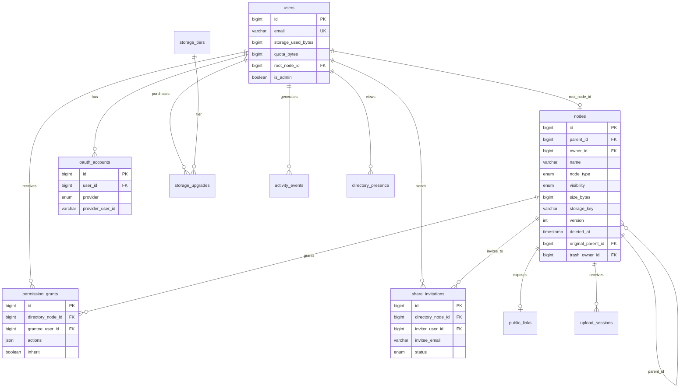

# Ha-to-Pe File System — Database Schema

This document defines the relational database schema for Ha-to-Pe. It supports requirements in [requirement.md](./requirement.md) and use cases in [usecase.md](./usecase.md).

**ORM:** SQLAlchemy  
**Databases:** SQLite (development), MySQL 8+ (production)

---

## 1. Design Principles

1. **Single tree table** — All file system items (`file`, `directory`, `zip`) live in `nodes` with a `node_type` discriminator.
2. **Paths are not stored** — Only `parent_id` + `name`; paths are resolved at query time.
3. **Soft delete via trash** — `deleted_at` and `original_parent_id` support restore; trash is scoped per user.
4. **ACL on directories** — `permission_grants` attach to directory nodes and inherit to descendants.
5. **Blob metadata on nodes** — `storage_key` and `size_bytes` reference object storage; bytes are not stored in the DB.
6. **Denormalized quota** — `users.storage_used_bytes` is updated transactionally on upload/delete.
7. **Optimistic locking** — `nodes.version` increments on every write (RTC-04).

---

## 2. Entity Relationship Diagram



---

## 3. Enumerations

### 3.1 `node_type`

| Value | Description |
|-------|-------------|
| `directory` | Container node |
| `file` | Binary file node |
| `zip` | Compressed archive node |

### 3.2 `visibility`

| Value | Description |
|-------|-------------|
| `private` | Owner and explicit grants only |
| `shared` | Accessible via invitation |
| `public` | Accessible via public link |

### 3.3 `oauth_provider`

| Value |
|-------|
| `google` |
| `github` |

### 3.4 `invitation_status`

| Value |
|-------|
| `pending` |
| `accepted` |
| `rejected` |
| `revoked` |
| `expired` |

### 3.5 `upload_session_status`

| Value |
|-------|
| `pending` |
| `completed` |
| `expired` |
| `cancelled` |

### 3.6 `storage_upgrade_status`

| Value |
|-------|
| `pending` |
| `completed` |
| `failed` |
| `refunded` |

### 3.7 `activity_event_type`

| Value | Used for analytics |
|-------|------------------|
| `node_created` | Yes |
| `node_deleted` | Yes |
| `node_restored` | Yes |
| `upload` | Yes |
| `download` | Yes |
| `zip_created` | Yes |
| `unzip` | Yes |
| `share_invited` | Yes |
| `share_accepted` | Yes |
| `quota_exceeded` | Yes |

### 3.8 Permission `actions` (JSON array values)

Stored as a JSON array of strings on `permission_grants` and `share_invitations`.

**File actions:** `create`, `write`, `read`, `delete`, `copy`, `move`, `zip`, `download`, `upload`

**Directory actions:** `create`, `read`, `delete`, `copy`, `move`, `zip`, `download`, `dir_contents`

**Zip actions:** `unzip`, `copy`, `move`, `delete`, `download`

`dir_contents` implies all file actions on descendants when `inherit = true`.

---

## 4. Tables

### 4.1 `users`

Authenticated accounts.

| Column | Type | Constraints | Description |
|--------|------|-------------|-------------|
| `id` | `BIGINT` | PK, auto-increment | Surrogate key |
| `email` | `VARCHAR(255)` | NOT NULL, UNIQUE | Primary contact / login identifier |
| `display_name` | `VARCHAR(255)` | NOT NULL | Shown in UI and presence |
| `storage_used_bytes` | `BIGINT` | NOT NULL, DEFAULT 0 | Denormalized usage (STO-03) |
| `quota_bytes` | `BIGINT` | NOT NULL | Effective quota (STO-01) |
| `root_node_id` | `BIGINT` | FK → `nodes.id`, UNIQUE | Private root directory (ACC-04) |
| `is_admin` | `BOOLEAN` | NOT NULL, DEFAULT FALSE | Admin role (ADM-05) |
| `is_active` | `BOOLEAN` | NOT NULL, DEFAULT TRUE | Account enabled flag |
| `created_at` | `TIMESTAMP` | NOT NULL | Registration time |
| `updated_at` | `TIMESTAMP` | NOT NULL | Last profile/quota update |

**Indexes**
- `uq_users_email` UNIQUE (`email`)
- `uq_users_root_node_id` UNIQUE (`root_node_id`)

---

### 4.2 `oauth_accounts`

Links users to OAuth provider identities (ACC-03).

| Column | Type | Constraints | Description |
|--------|------|-------------|-------------|
| `id` | `BIGINT` | PK | Surrogate key |
| `user_id` | `BIGINT` | FK → `users.id`, NOT NULL | Owner |
| `provider` | `ENUM` | NOT NULL | `google`, `github` |
| `provider_user_id` | `VARCHAR(255)` | NOT NULL | Subject ID from provider |
| `provider_email` | `VARCHAR(255)` | NULL | Email returned by provider |
| `created_at` | `TIMESTAMP` | NOT NULL | Link created |
| `updated_at` | `TIMESTAMP` | NOT NULL | Last token refresh / update |

**Indexes**
- `uq_oauth_provider_user` UNIQUE (`provider`, `provider_user_id`)
- `idx_oauth_accounts_user_id` (`user_id`)

---

### 4.3 `nodes`

Central file system tree. One row per file, directory, or zip.

| Column | Type | Constraints | Description |
|--------|------|-------------|-------------|
| `id` | `BIGINT` | PK | Surrogate key |
| `parent_id` | `BIGINT` | FK → `nodes.id`, NULL | Parent directory; NULL only for user roots |
| `owner_id` | `BIGINT` | FK → `users.id`, NOT NULL | Owner responsible for quota |
| `name` | `VARCHAR(255)` | NOT NULL | Segment name; unique among active siblings (FS-03) |
| `node_type` | `ENUM` | NOT NULL | `directory`, `file`, `zip` |
| `visibility` | `ENUM` | NULL | `private`, `shared`, `public`; directories only (VIS-01) |
| `size_bytes` | `BIGINT` | NOT NULL, DEFAULT 0 | Logical size; files and zips (UDL-06) |
| `mime_type` | `VARCHAR(127)` | NULL | File/zip MIME type |
| `storage_key` | `VARCHAR(512)` | NULL | Blob key in object storage; files and zips |
| `checksum_sha256` | `CHAR(64)` | NULL | Integrity hash of blob |
| `zip_entry_count` | `INT` | NULL | Entry count for zip nodes (ZIP-04) |
| `zip_uncompressed_bytes` | `BIGINT` | NULL | Uncompressed total for zip bomb checks |
| `version` | `INT` | NOT NULL, DEFAULT 1 | Optimistic lock counter (RTC-04) |
| `deleted_at` | `TIMESTAMP` | NULL | Soft-delete timestamp (TRH-01) |
| `original_parent_id` | `BIGINT` | FK → `nodes.id`, NULL | Pre-trash parent (TRH-02) |
| `trash_owner_id` | `BIGINT` | FK → `users.id`, NULL | Trash scope owner (TRH-06) |
| `created_at` | `TIMESTAMP` | NOT NULL | Creation time |
| `updated_at` | `TIMESTAMP` | NOT NULL | Last metadata/content change |

**Constraints**
- `chk_nodes_visibility` — `visibility` IS NOT NULL when `node_type = 'directory'`; NULL otherwise.
- `chk_nodes_storage` — `storage_key` IS NOT NULL when `node_type IN ('file', 'zip')` and `deleted_at IS NULL`.
- Active sibling uniqueness: UNIQUE (`parent_id`, `name`) WHERE `deleted_at IS NULL` (partial index; see §6).

**Indexes**
- `idx_nodes_parent_id` (`parent_id`)
- `idx_nodes_owner_id` (`owner_id`)
- `idx_nodes_node_type` (`node_type`)
- `idx_nodes_deleted_at` (`deleted_at`)
- `idx_nodes_trash_owner_id` (`trash_owner_id`)
- `idx_nodes_name` (`name`) — supports name search (SRC-01)
- `idx_nodes_parent_name_active` UNIQUE (`parent_id`, `name`) — active siblings only (§6)

---

### 4.4 `permission_grants`

ACL entries attached to a directory (PRM-02, PRM-03).

| Column | Type | Constraints | Description |
|--------|------|-------------|-------------|
| `id` | `BIGINT` | PK | Surrogate key |
| `directory_node_id` | `BIGINT` | FK → `nodes.id`, NOT NULL | Must reference `node_type = 'directory'` |
| `grantee_user_id` | `BIGINT` | FK → `users.id`, NOT NULL | User receiving access |
| `actions` | `JSON` | NOT NULL | Array of permission action strings |
| `inherit` | `BOOLEAN` | NOT NULL, DEFAULT TRUE | Propagate to descendants (PRM-03) |
| `granted_by_user_id` | `BIGINT` | FK → `users.id`, NOT NULL | Granting owner/admin |
| `created_at` | `TIMESTAMP` | NOT NULL | Grant created |
| `updated_at` | `TIMESTAMP` | NOT NULL | Grant last modified |

**Indexes**
- `uq_grant_directory_grantee` UNIQUE (`directory_node_id`, `grantee_user_id`)
- `idx_permission_grants_grantee` (`grantee_user_id`)

---

### 4.5 `share_invitations`

Pending or historical invitations to shared directories (VIS-02, VIS-03).

| Column | Type | Constraints | Description |
|--------|------|-------------|-------------|
| `id` | `BIGINT` | PK | Surrogate key |
| `directory_node_id` | `BIGINT` | FK → `nodes.id`, NOT NULL | Shared directory |
| `inviter_user_id` | `BIGINT` | FK → `users.id`, NOT NULL | Inviting owner |
| `invitee_user_id` | `BIGINT` | FK → `users.id`, NULL | Set when invitee is known |
| `invitee_email` | `VARCHAR(255)` | NOT NULL | Invitation target email |
| `actions` | `JSON` | NOT NULL | Permissions offered on accept |
| `inherit` | `BOOLEAN` | NOT NULL, DEFAULT TRUE | Inheritance flag |
| `status` | `ENUM` | NOT NULL, DEFAULT `pending` | Invitation lifecycle |
| `token` | `CHAR(64)` | NOT NULL, UNIQUE | Secure accept/decline token |
| `expires_at` | `TIMESTAMP` | NOT NULL | Invitation expiry |
| `responded_at` | `TIMESTAMP` | NULL | Accept/decline timestamp |
| `created_at` | `TIMESTAMP` | NOT NULL | Invitation created |

**Indexes**
- `uq_share_invitations_token` UNIQUE (`token`)
- `idx_share_invitations_email_status` (`invitee_email`, `status`)
- `idx_share_invitations_directory` (`directory_node_id`)

---

### 4.6 `public_links`

Optional tokenized access to public directories (VIS-04).

| Column | Type | Constraints | Description |
|--------|------|-------------|-------------|
| `id` | `BIGINT` | PK | Surrogate key |
| `directory_node_id` | `BIGINT` | FK → `nodes.id`, NOT NULL, UNIQUE | One link per public directory |
| `token` | `CHAR(64)` | NOT NULL, UNIQUE | URL token |
| `allow_write` | `BOOLEAN` | NOT NULL, DEFAULT FALSE | Public write access |
| `created_by_user_id` | `BIGINT` | FK → `users.id`, NOT NULL | Link creator |
| `expires_at` | `TIMESTAMP` | NULL | Optional expiry |
| `created_at` | `TIMESTAMP` | NOT NULL | Link created |
| `revoked_at` | `TIMESTAMP` | NULL | Manual revocation |

**Indexes**
- `uq_public_links_token` UNIQUE (`token`)
- `uq_public_links_directory` UNIQUE (`directory_node_id`)

---

### 4.7 `system_config`

Key-value store for admin settings (ADM-01, ADM-02).

| Column | Type | Constraints | Description |
|--------|------|-------------|-------------|
| `key` | `VARCHAR(128)` | PK | Config key |
| `value` | `JSON` | NOT NULL | Config payload |
| `description` | `VARCHAR(512)` | NULL | Admin UI hint |
| `updated_by_user_id` | `BIGINT` | FK → `users.id`, NULL | Last editor |
| `updated_at` | `TIMESTAMP` | NOT NULL | Last change |

**Seed keys**

| Key | Example `value` |
|-----|-----------------|
| `default_quota_bytes` | `549755813888` (512 GiB) |
| `trash_retention_days` | `30` |
| `max_upload_bytes` | `5368709120` |
| `max_zip_entries` | `10000` |
| `max_zip_uncompressed_bytes` | `10737418240` |

---

### 4.8 `storage_tiers`

Upgrade tiers configured by admin (ADM-02).

| Column | Type | Constraints | Description |
|--------|------|-------------|-------------|
| `id` | `BIGINT` | PK | Surrogate key |
| `name` | `VARCHAR(128)` | NOT NULL | Tier label (e.g., "1 TB") |
| `capacity_bytes` | `BIGINT` | NOT NULL | Added capacity |
| `price_cents` | `INT` | NOT NULL | Price in minor currency units |
| `currency` | `CHAR(3)` | NOT NULL, DEFAULT `USD` | ISO 4217 |
| `is_active` | `BOOLEAN` | NOT NULL, DEFAULT TRUE | Visible to users |
| `sort_order` | `INT` | NOT NULL, DEFAULT 0 | Display order |
| `created_at` | `TIMESTAMP` | NOT NULL | Tier created |
| `updated_at` | `TIMESTAMP` | NOT NULL | Tier updated |

---

### 4.9 `storage_upgrades`

Purchase history for quota increases (STO-02).

| Column | Type | Constraints | Description |
|--------|------|-------------|-------------|
| `id` | `BIGINT` | PK | Surrogate key |
| `user_id` | `BIGINT` | FK → `users.id`, NOT NULL | Purchaser |
| `tier_id` | `BIGINT` | FK → `storage_tiers.id`, NOT NULL | Selected tier |
| `amount_paid_cents` | `INT` | NOT NULL | Charged amount |
| `currency` | `CHAR(3)` | NOT NULL | ISO 4217 |
| `quota_delta_bytes` | `BIGINT` | NOT NULL | Quota increase applied |
| `status` | `ENUM` | NOT NULL | Payment status |
| `external_payment_id` | `VARCHAR(255)` | NULL | Stripe or provider reference |
| `created_at` | `TIMESTAMP` | NOT NULL | Purchase initiated |
| `completed_at` | `TIMESTAMP` | NULL | Payment confirmed |

**Indexes**
- `idx_storage_upgrades_user_id` (`user_id`)
- `idx_storage_upgrades_status` (`status`)

---

### 4.10 `upload_sessions`

Tracks in-progress REST uploads (UDL-01, UDL-06).

| Column | Type | Constraints | Description |
|--------|------|-------------|-------------|
| `id` | `BIGINT` | PK | Surrogate key |
| `user_id` | `BIGINT` | FK → `users.id`, NOT NULL | Uploader |
| `target_directory_id` | `BIGINT` | FK → `nodes.id`, NOT NULL | Destination directory |
| `file_name` | `VARCHAR(255)` | NOT NULL | Intended file name |
| `expected_size_bytes` | `BIGINT` | NOT NULL | Declared upload size |
| `mime_type` | `VARCHAR(127)` | NULL | Declared MIME type |
| `status` | `ENUM` | NOT NULL, DEFAULT `pending` | Session state |
| `result_node_id` | `BIGINT` | FK → `nodes.id`, NULL | Created file after completion |
| `expires_at` | `TIMESTAMP` | NOT NULL | Session TTL |
| `created_at` | `TIMESTAMP` | NOT NULL | Session started |
| `completed_at` | `TIMESTAMP` | NULL | Upload finished |

**Indexes**
- `idx_upload_sessions_user_status` (`user_id`, `status`)
- `idx_upload_sessions_expires_at` (`expires_at`)

---

### 4.11 `refresh_tokens`

OAuth/session refresh token store.

| Column | Type | Constraints | Description |
|--------|------|-------------|-------------|
| `id` | `BIGINT` | PK | Surrogate key |
| `user_id` | `BIGINT` | FK → `users.id`, NOT NULL | Token owner |
| `token_hash` | `CHAR(64)` | NOT NULL, UNIQUE | SHA-256 of refresh token |
| `expires_at` | `TIMESTAMP` | NOT NULL | Expiry |
| `revoked_at` | `TIMESTAMP` | NULL | Revocation time |
| `created_at` | `TIMESTAMP` | NOT NULL | Issued at |

**Indexes**
- `uq_refresh_tokens_hash` UNIQUE (`token_hash`)
- `idx_refresh_tokens_user_id` (`user_id`)

---

### 4.12 `directory_presence`

Ephemeral presence for real-time collaboration (RTC-03).

| Column | Type | Constraints | Description |
|--------|------|-------------|-------------|
| `id` | `BIGINT` | PK | Surrogate key |
| `user_id` | `BIGINT` | FK → `users.id`, NOT NULL | Viewing user |
| `directory_node_id` | `BIGINT` | FK → `nodes.id`, NOT NULL | Shared directory |
| `client_type` | `VARCHAR(32)` | NOT NULL | `web`, `mobile`, `desktop`, `shell` |
| `last_seen_at` | `TIMESTAMP` | NOT NULL | Heartbeat timestamp |

**Indexes**
- `uq_presence_user_directory_client` UNIQUE (`user_id`, `directory_node_id`, `client_type`)
- `idx_presence_directory_last_seen` (`directory_node_id`, `last_seen_at`)

Rows older than a threshold (e.g., 60 seconds) are treated as offline.

---

### 4.13 `activity_events`

Append-only audit/analytics log (ADM-03, ADM-04).

| Column | Type | Constraints | Description |
|--------|------|-------------|-------------|
| `id` | `BIGINT` | PK | Surrogate key |
| `user_id` | `BIGINT` | FK → `users.id`, NULL | Actor; NULL for system/guest |
| `node_id` | `BIGINT` | FK → `nodes.id`, NULL | Affected node |
| `directory_node_id` | `BIGINT` | FK → `nodes.id`, NULL | Context directory |
| `event_type` | `ENUM` | NOT NULL | Event category |
| `bytes_delta` | `BIGINT` | NOT NULL, DEFAULT 0 | Storage change |
| `metadata` | `JSON` | NULL | Extra context (IP, client, etc.) |
| `created_at` | `TIMESTAMP` | NOT NULL | Event time |

**Indexes**
- `idx_activity_events_created_at` (`created_at`)
- `idx_activity_events_event_type` (`event_type`)
- `idx_activity_events_user_id` (`user_id`)

---

## 5. Relationships Summary

| From | To | Cardinality | FK column | Notes |
|------|----|-------------|-----------|-------|
| `users` | `nodes` | 1 : 0..1 | `users.root_node_id` | Each user has one root |
| `nodes` | `nodes` | 1 : N | `nodes.parent_id` | Tree structure |
| `nodes` | `users` | N : 1 | `nodes.owner_id` | Quota owner |
| `oauth_accounts` | `users` | N : 1 | `oauth_accounts.user_id` | Multiple providers per user |
| `permission_grants` | `nodes` | N : 1 | `directory_node_id` | Directory only |
| `permission_grants` | `users` | N : 1 | `grantee_user_id` | Collaborator |
| `share_invitations` | `nodes` | N : 1 | `directory_node_id` | Shared directory |
| `public_links` | `nodes` | 1 : 1 | `directory_node_id` | Public directory |
| `storage_upgrades` | `users` | N : 1 | `user_id` | Purchase history |
| `storage_upgrades` | `storage_tiers` | N : 1 | `tier_id` | Tier reference |

**Circular dependency note:** `users.root_node_id` ↔ `nodes.owner_id` requires a two-step insert at registration (create user, create root node, update `root_node_id`).

---

## 6. Partial Unique Index (Active Sibling Names)

FS-03 requires unique names among active siblings. Deleted (trashed) nodes may reuse names.

**MySQL 8+** (functional / filtered unique not fully supported — enforce in application + trigger, or use generated column):

```sql
-- Application-level check recommended; optional helper index:
CREATE INDEX idx_nodes_parent_name ON nodes (parent_id, name);
```

**SQLite 3.8+**

```sql
CREATE UNIQUE INDEX uq_nodes_parent_name_active
ON nodes (parent_id, name)
WHERE deleted_at IS NULL;
```

---

## 7. DDL (SQLite — Development)

```sql
-- Enums simulated as TEXT + CHECK constraints in SQLite.

CREATE TABLE users (
    id                      INTEGER PRIMARY KEY AUTOINCREMENT,
    email                   VARCHAR(255) NOT NULL UNIQUE,
    display_name            VARCHAR(255) NOT NULL,
    storage_used_bytes      BIGINT NOT NULL DEFAULT 0,
    quota_bytes             BIGINT NOT NULL,
    root_node_id            BIGINT UNIQUE,
    is_admin                BOOLEAN NOT NULL DEFAULT 0,
    is_active               BOOLEAN NOT NULL DEFAULT 1,
    created_at              TIMESTAMP NOT NULL DEFAULT CURRENT_TIMESTAMP,
    updated_at              TIMESTAMP NOT NULL DEFAULT CURRENT_TIMESTAMP
);

CREATE TABLE nodes (
    id                      INTEGER PRIMARY KEY AUTOINCREMENT,
    parent_id               BIGINT REFERENCES nodes(id),
    owner_id                BIGINT NOT NULL REFERENCES users(id),
    name                    VARCHAR(255) NOT NULL,
    node_type               TEXT NOT NULL CHECK (node_type IN ('directory', 'file', 'zip')),
    visibility              TEXT CHECK (visibility IN ('private', 'shared', 'public')),
    size_bytes              BIGINT NOT NULL DEFAULT 0,
    mime_type               VARCHAR(127),
    storage_key             VARCHAR(512),
    checksum_sha256         CHAR(64),
    zip_entry_count         INTEGER,
    zip_uncompressed_bytes  BIGINT,
    version                 INTEGER NOT NULL DEFAULT 1,
    deleted_at              TIMESTAMP,
    original_parent_id      BIGINT REFERENCES nodes(id),
    trash_owner_id          BIGINT REFERENCES users(id),
    created_at              TIMESTAMP NOT NULL DEFAULT CURRENT_TIMESTAMP,
    updated_at              TIMESTAMP NOT NULL DEFAULT CURRENT_TIMESTAMP
);

CREATE UNIQUE INDEX uq_nodes_parent_name_active
    ON nodes (parent_id, name) WHERE deleted_at IS NULL;

CREATE INDEX idx_nodes_parent_id ON nodes (parent_id);
CREATE INDEX idx_nodes_owner_id ON nodes (owner_id);
CREATE INDEX idx_nodes_name ON nodes (name);
CREATE INDEX idx_nodes_trash_owner_id ON nodes (trash_owner_id);

CREATE TABLE oauth_accounts (
    id                  INTEGER PRIMARY KEY AUTOINCREMENT,
    user_id             BIGINT NOT NULL REFERENCES users(id),
    provider            TEXT NOT NULL CHECK (provider IN ('google', 'github')),
    provider_user_id    VARCHAR(255) NOT NULL,
    provider_email      VARCHAR(255),
    created_at          TIMESTAMP NOT NULL DEFAULT CURRENT_TIMESTAMP,
    updated_at          TIMESTAMP NOT NULL DEFAULT CURRENT_TIMESTAMP,
    UNIQUE (provider, provider_user_id)
);

CREATE TABLE permission_grants (
    id                  INTEGER PRIMARY KEY AUTOINCREMENT,
    directory_node_id   BIGINT NOT NULL REFERENCES nodes(id),
    grantee_user_id     BIGINT NOT NULL REFERENCES users(id),
    actions             JSON NOT NULL,
    inherit             BOOLEAN NOT NULL DEFAULT 1,
    granted_by_user_id  BIGINT NOT NULL REFERENCES users(id),
    created_at          TIMESTAMP NOT NULL DEFAULT CURRENT_TIMESTAMP,
    updated_at          TIMESTAMP NOT NULL DEFAULT CURRENT_TIMESTAMP,
    UNIQUE (directory_node_id, grantee_user_id)
);

CREATE TABLE share_invitations (
    id                  INTEGER PRIMARY KEY AUTOINCREMENT,
    directory_node_id   BIGINT NOT NULL REFERENCES nodes(id),
    inviter_user_id     BIGINT NOT NULL REFERENCES users(id),
    invitee_user_id     BIGINT REFERENCES users(id),
    invitee_email       VARCHAR(255) NOT NULL,
    actions             JSON NOT NULL,
    inherit             BOOLEAN NOT NULL DEFAULT 1,
    status              TEXT NOT NULL DEFAULT 'pending'
                        CHECK (status IN ('pending','accepted','rejected','revoked','expired')),
    token               CHAR(64) NOT NULL UNIQUE,
    expires_at          TIMESTAMP NOT NULL,
    responded_at        TIMESTAMP,
    created_at          TIMESTAMP NOT NULL DEFAULT CURRENT_TIMESTAMP
);

CREATE TABLE public_links (
    id                  INTEGER PRIMARY KEY AUTOINCREMENT,
    directory_node_id   BIGINT NOT NULL UNIQUE REFERENCES nodes(id),
    token               CHAR(64) NOT NULL UNIQUE,
    allow_write         BOOLEAN NOT NULL DEFAULT 0,
    created_by_user_id  BIGINT NOT NULL REFERENCES users(id),
    expires_at          TIMESTAMP,
    created_at          TIMESTAMP NOT NULL DEFAULT CURRENT_TIMESTAMP,
    revoked_at          TIMESTAMP
);

CREATE TABLE system_config (
    key                     VARCHAR(128) PRIMARY KEY,
    value                   JSON NOT NULL,
    description             VARCHAR(512),
    updated_by_user_id      BIGINT REFERENCES users(id),
    updated_at              TIMESTAMP NOT NULL DEFAULT CURRENT_TIMESTAMP
);

CREATE TABLE storage_tiers (
    id              INTEGER PRIMARY KEY AUTOINCREMENT,
    name            VARCHAR(128) NOT NULL,
    capacity_bytes  BIGINT NOT NULL,
    price_cents     INTEGER NOT NULL,
    currency        CHAR(3) NOT NULL DEFAULT 'USD',
    is_active       BOOLEAN NOT NULL DEFAULT 1,
    sort_order      INTEGER NOT NULL DEFAULT 0,
    created_at      TIMESTAMP NOT NULL DEFAULT CURRENT_TIMESTAMP,
    updated_at      TIMESTAMP NOT NULL DEFAULT CURRENT_TIMESTAMP
);

CREATE TABLE storage_upgrades (
    id                  INTEGER PRIMARY KEY AUTOINCREMENT,
    user_id             BIGINT NOT NULL REFERENCES users(id),
    tier_id             BIGINT NOT NULL REFERENCES storage_tiers(id),
    amount_paid_cents   INTEGER NOT NULL,
    currency            CHAR(3) NOT NULL,
    quota_delta_bytes   BIGINT NOT NULL,
    status              TEXT NOT NULL CHECK (status IN ('pending','completed','failed','refunded')),
    external_payment_id VARCHAR(255),
    created_at          TIMESTAMP NOT NULL DEFAULT CURRENT_TIMESTAMP,
    completed_at        TIMESTAMP
);

CREATE TABLE upload_sessions (
    id                      INTEGER PRIMARY KEY AUTOINCREMENT,
    user_id                 BIGINT NOT NULL REFERENCES users(id),
    target_directory_id     BIGINT NOT NULL REFERENCES nodes(id),
    file_name               VARCHAR(255) NOT NULL,
    expected_size_bytes     BIGINT NOT NULL,
    mime_type               VARCHAR(127),
    status                  TEXT NOT NULL DEFAULT 'pending'
                            CHECK (status IN ('pending','completed','expired','cancelled')),
    result_node_id          BIGINT REFERENCES nodes(id),
    expires_at              TIMESTAMP NOT NULL,
    created_at              TIMESTAMP NOT NULL DEFAULT CURRENT_TIMESTAMP,
    completed_at            TIMESTAMP
);

CREATE TABLE refresh_tokens (
    id          INTEGER PRIMARY KEY AUTOINCREMENT,
    user_id     BIGINT NOT NULL REFERENCES users(id),
    token_hash  CHAR(64) NOT NULL UNIQUE,
    expires_at  TIMESTAMP NOT NULL,
    revoked_at  TIMESTAMP,
    created_at  TIMESTAMP NOT NULL DEFAULT CURRENT_TIMESTAMP
);

CREATE TABLE directory_presence (
    id                  INTEGER PRIMARY KEY AUTOINCREMENT,
    user_id             BIGINT NOT NULL REFERENCES users(id),
    directory_node_id   BIGINT NOT NULL REFERENCES nodes(id),
    client_type         VARCHAR(32) NOT NULL,
    last_seen_at        TIMESTAMP NOT NULL,
    UNIQUE (user_id, directory_node_id, client_type)
);

CREATE TABLE activity_events (
    id                  INTEGER PRIMARY KEY AUTOINCREMENT,
    user_id             BIGINT REFERENCES users(id),
    node_id             BIGINT REFERENCES nodes(id),
    directory_node_id   BIGINT REFERENCES nodes(id),
    event_type          TEXT NOT NULL,
    bytes_delta         BIGINT NOT NULL DEFAULT 0,
    metadata            JSON,
    created_at          TIMESTAMP NOT NULL DEFAULT CURRENT_TIMESTAMP
);

-- Deferred FK: users.root_node_id → nodes.id
-- SQLite supports this if nodes is created first without the users FK on owner_id being deferred,
-- or add via migration after both tables exist.
```

---

## 8. DDL Notes (MySQL — Production)

| Topic | SQLite | MySQL |
|-------|--------|-------|
| PK type | `INTEGER AUTOINCREMENT` | `BIGINT AUTO_INCREMENT` |
| JSON | Native JSON | Native JSON |
| Partial unique index | `WHERE deleted_at IS NULL` | Enforce in service layer or trigger |
| `BOOLEAN` | `INTEGER` 0/1 | `TINYINT(1)` |
| Timestamps | `CURRENT_TIMESTAMP` | `DEFAULT CURRENT_TIMESTAMP ON UPDATE` |
| Charset | — | `utf8mb4` / `utf8mb4_unicode_ci` |

Use Alembic migrations to maintain parity between environments.

---

## 9. Common Queries

### 9.1 List active children of a directory

```sql
SELECT id, name, node_type, size_bytes, updated_at, version
FROM nodes
WHERE parent_id = :directory_id
  AND deleted_at IS NULL
ORDER BY node_type DESC, name ASC;
```

### 9.2 List user's trash

```sql
SELECT id, name, node_type, size_bytes, original_parent_id, deleted_at
FROM nodes
WHERE trash_owner_id = :user_id
  AND deleted_at IS NOT NULL
ORDER BY deleted_at DESC;
```

### 9.3 Search by name (current directory subtree)

Use a recursive CTE (MySQL 8+ / SQLite 3.8+):

```sql
WITH RECURSIVE subtree AS (
    SELECT id FROM nodes WHERE id = :current_dir_id AND deleted_at IS NULL
    UNION ALL
    SELECT n.id FROM nodes n
    INNER JOIN subtree s ON n.parent_id = s.id
    WHERE n.deleted_at IS NULL
)
SELECT n.id, n.name, n.node_type, n.parent_id
FROM nodes n
INNER JOIN subtree s ON n.id = s.id
WHERE n.name LIKE :pattern
  AND n.id != :current_dir_id;
```

Post-filter by effective permissions in the service layer (SRC-04).

### 9.4 Effective grants for a user on a directory ancestor chain

```sql
WITH RECURSIVE ancestors AS (
    SELECT id, parent_id FROM nodes WHERE id = :node_id
    UNION ALL
    SELECT n.id, n.parent_id FROM nodes n
    INNER JOIN ancestors a ON n.id = a.parent_id
)
SELECT pg.actions, pg.inherit, pg.directory_node_id
FROM permission_grants pg
INNER JOIN ancestors a ON pg.directory_node_id = a.id
WHERE pg.grantee_user_id = :user_id;
```

Merge `actions` in application code walking from root to node (PRM-04).

### 9.5 Quota check before upload

```sql
SELECT storage_used_bytes, quota_bytes
FROM users
WHERE id = :user_id
FOR UPDATE;  -- MySQL; use BEGIN IMMEDIATE in SQLite
```

Reject if `storage_used_bytes + :new_bytes > quota_bytes`.

### 9.6 Optimistic lock update

```sql
UPDATE nodes
SET name = :new_name,
    version = version + 1,
    updated_at = CURRENT_TIMESTAMP
WHERE id = :node_id
  AND version = :expected_version
  AND deleted_at IS NULL;
-- affected_rows = 0 → conflict (RTC-04)
```

### 9.7 Admin analytics — total storage used

```sql
SELECT
    COUNT(*) AS total_users,
    SUM(storage_used_bytes) AS total_storage_used,
    AVG(storage_used_bytes) AS avg_storage_used
FROM users
WHERE is_active = TRUE;
```

---

## 10. Registration Transaction (ACC-04)

Order of operations within a single database transaction:

```
1. INSERT users (root_node_id = NULL, quota_bytes = default from system_config)
2. INSERT nodes (parent_id = NULL, node_type = 'directory', name = 'root', owner_id = user.id, visibility = 'private')
3. UPDATE users SET root_node_id = nodes.id
4. INSERT activity_events (event_type = 'node_created')
5. COMMIT
```

---

## 11. Trash Lifecycle

| Step | Column changes |
|------|----------------|
| Soft delete | `deleted_at = NOW()`, `original_parent_id = parent_id`, `trash_owner_id = actor`, `parent_id = NULL` |
| Restore | `parent_id = original_parent_id` (or user root fallback), `deleted_at = NULL`, clear trash columns |
| Permanent delete | `DELETE FROM nodes` + remove blob; decrement `users.storage_used_bytes` |

---

## 12. SQLAlchemy Model Mapping (Reference)

| SQLAlchemy model | Table | Notes |
|------------------|-------|-------|
| `User` | `users` | |
| `OAuthAccount` | `oauth_accounts` | |
| `Node` | `nodes` | Single mapped class; `node_type` discriminator |
| `PermissionGrant` | `permission_grants` | |
| `ShareInvitation` | `share_invitations` | |
| `PublicLink` | `public_links` | |
| `SystemConfig` | `system_config` | |
| `StorageTier` | `storage_tiers` | |
| `StorageUpgrade` | `storage_upgrades` | |
| `UploadSession` | `upload_sessions` | |
| `RefreshToken` | `refresh_tokens` | |
| `DirectoryPresence` | `directory_presence` | |
| `ActivityEvent` | `activity_events` | |

Use SQLAlchemy 2.0 declarative style with `Mapped` and `mapped_column`.

---

## 13. Future Extensions (Not in v1)

| Extension | Approach |
|-----------|----------|
| Full-text content search | `node_search_index` table or Elasticsearch |
| File revisions | `file_versions` table linked to `nodes.id` |
| Roles / groups | `groups`, `group_members`, `permission_grants.grantee_group_id` |
| S3 storage backend | `storage_key` already abstracts blob location |

---

## 14. Document History

| Version | Date | Author | Changes |
|---------|------|--------|---------|
| 0.1 | 2026-06-08 | — | Initial database schema draft |
