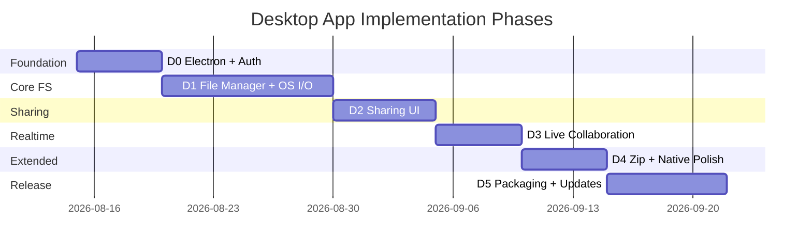

# Ha-to-Pe File System — Desktop App Implementation Plan

End-to-end plan for implementing the Ha-to-Pe desktop client (`frontend-desktop/`) with **Electron**, **React**, and **electron-vite**. This document aligns with [requirement.md](./requirement.md), [usecase.md](./usecase.md), [tech_stack.md](./tech_stack.md), [backend_implementation_plan.md](./backend_implementation_plan.md), and [web_app_implementation_plan.md](./web_app_implementation_plan.md).

**Priority:** Should (GUI-03) — start after web Phase W1; maximize reuse of web UI and `packages/shared`.

---

## 1. Goals and Success Criteria

### 1.1 Desktop Deliverables

By the end of all phases, the desktop app must:

1. Provide a **native desktop file manager** for browse, upload, download, and manage (Windows, macOS, Linux).
2. Support **trash**, **search**, **sharing**, and **real-time collaboration** in shared directories.
3. Handle **zip/unzip** and **storage quota** visibility.
4. Integrate with the **OS filesystem** — native open/save dialogs, drag-and-drop from Explorer/Finder, reveal in folder.
5. Ship installable builds (`.dmg`, `.exe`, `.AppImage`/`.deb`) with optional **auto-update**.

### 1.2 Architecture Rules

| Rule | Detail |
|------|--------|
| Electron three-process model | Main (Node), preload (bridge), renderer (React) — strict IPC boundary |
| No Node in renderer | All `fs` / `dialog` access via `contextBridge` exposed APIs |
| Reuse web UI | Share React components, hooks, and styles with `frontend-web` where practical |
| Shared API layer | `packages/shared` for GraphQL, auth, upload/download logic |
| Backend is source of truth | Same GraphQL + REST as web/mobile |
| GraphQL for metadata | Tree, search, sharing, mutations, subscriptions |
| REST for bytes | Upload sessions, download streams |
| Desktop-native affordances | Menus, shortcuts, tray, OS file associations (optional) |

### 1.3 Dependency Map

| Desktop phase | Requires backend phase | Recommended web gate |
|---------------|------------------------|----------------------|
| D0 | Backend Phase 0 | — |
| D1 | Backend Phase 1 | Web W1 complete |
| D2 | Backend Phase 2 | Web W2 complete |
| D3 | Backend Phase 3 | Web W3 complete |
| D4 | Backend Phase 4 | Web W4 complete |
| D5 | Backend Phase 5 | Web W5 complete |

### 1.4 Target Directory Structure

```
frontend-desktop/
├── package.json
├── electron.vite.config.ts
├── tsconfig.json
├── tsconfig.node.json
├── codegen.ts
├── electron/
│   ├── main.ts                    # app lifecycle, windows, IPC handlers
│   ├── preload.ts                 # contextBridge API
│   └── utils/
│       ├── paths.ts               # userData, downloads dir
│       ├── menu.ts                # application menu template
│       └── updater.ts             # electron-updater (D5)
├── src/                           # renderer (React)
│   ├── main.tsx
│   ├── App.tsx
│   ├── routes/                    # mirror web routes
│   ├── pages/                     # import from web or symlink shared pages
│   ├── components/
│   │   ├── desktop/               # desktop-only UI
│   │   │   ├── TitleBar.tsx       # custom title bar (optional)
│   │   │   ├── NativeDropZone.tsx # OS file drop overlay
│   │   │   └── TransferPanel.tsx  # upload/download queue
│   │   └── ...                    # shared with frontend-web
│   ├── hooks/
│   ├── api/
│   ├── store/
│   └── utils/
├── resources/
│   ├── icon.icns
│   ├── icon.ico
│   └── icon.png
├── build/                         # electron-builder config artifacts
└── tests/
    ├── unit/
    └── e2e/

packages/shared/                   # shared with web + mobile
frontend-web/                      # component source to import/re-export
```

### 1.5 Reuse Strategy vs Web

| Layer | Strategy |
|-------|----------|
| Pages (`FilesPage`, `TrashPage`, …) | Copy once, then extract to `packages/ui-web` or import via TS path alias `@web/*` |
| Hooks / API / stores | `packages/shared` |
| Desktop-only | `electron/` + `src/components/desktop/` |
| Styling | Same Tailwind config extended in desktop Vite config |

---

## 2. Tech Stack

| Layer | Choice | Notes |
|-------|--------|-------|
| Shell | Electron 30+ | Cross-platform desktop |
| Bundler | electron-vite | Main, preload, renderer builds |
| UI | React 18 + TypeScript | Same as web |
| Router | React Router v6 | Same route map as web |
| GraphQL | Apollo Client | Queries, mutations, subscriptions |
| Codegen | GraphQL Code Generator | Shared schema |
| REST | `fetch` | Upload/download |
| State | Zustand | Auth, selection, transfer queue |
| Styling | Tailwind CSS | Shared with web |
| Native dialogs | `electron.dialog` via IPC | Open file, save file, open directory |
| File I/O | Node `fs` / `fs.promises` in main only | Stream local files for upload |
| Secure storage | `safeStorage` (Electron) or keytar | Refresh token encryption |
| Packaging | electron-builder | dmg, nsis, AppImage, deb |
| Auto-update | electron-updater | GitHub Releases or custom server |
| Tests | Vitest + RTL (renderer), Vitest (main) | Unit tests |
| E2E | Playwright (Electron mode) | Critical flows |
| Lint | ESLint + Prettier | Match web |

### 2.1 Key Dependencies (planned)

```json
{
  "dependencies": {
    "electron-updater": "^6",
    "@apollo/client": "^3",
    "graphql": "^16",
    "react": "^18",
    "react-dom": "^18",
    "react-router-dom": "^6",
    "zustand": "^4"
  },
  "devDependencies": {
    "electron": "^30",
    "electron-vite": "^2",
    "electron-builder": "^24",
    "vite": "^5",
    "typescript": "^5",
    "vitest": "^1",
    "@playwright/test": "^1",
    "tailwindcss": "^3"
  }
}
```

---

## 3. Phase Overview



| Phase | Focus | Exit criterion |
|-------|-------|----------------|
| D0 | electron-vite scaffold, IPC bridge, auth | App window opens; login works |
| D1 | File manager + native dialogs + drag-drop | Full private FS with OS integration |
| D2 | Sharing, invitations, public browse | Same as web W2 |
| D3 | Subscriptions, presence | Live shared directory updates |
| D4 | Zip, menus, shortcuts, transfer panel | Desktop-grade UX |
| D5 | electron-builder, auto-update, signing | Installable signed builds |

---

## 4. Phase D0 — Electron Scaffold and Auth

**Duration estimate:** 4–6 days  
**Requirements:** GUI-03, ACC-01–03  
**Use cases:** UC-01, UC-02, UC-03  
**Backend gate:** Phase 0

### 4.1 Electron Architecture

```
┌─────────────────────────────────────────────────────────┐
│ Main process (electron/main.ts)                       │
│  • createWindow, menu, IPC handlers                     │
│  • dialog.showOpenDialog / showSaveDialog               │
│  • fs.createReadStream for uploads                      │
│  • safeStorage for refresh token                        │
└───────────────────────┬─────────────────────────────────┘
                        │ IPC invoke/handle
┌───────────────────────▼─────────────────────────────────┐
│ Preload (electron/preload.ts)                         │
│  contextBridge.exposeInMainWorld('hatoPe', { ... })     │
└───────────────────────┬─────────────────────────────────┘
                        │ window.hatoPe.*
┌───────────────────────▼─────────────────────────────────┐
│ Renderer (src/) — React app                             │
│  Apollo, routes, pages (no direct Node access)          │
└─────────────────────────────────────────────────────────┘
```

### 4.2 Tasks

| # | Task | Output |
|---|------|--------|
| D0.1 | `npm create @electron-vite/create` → `frontend-desktop` | Project scaffold |
| D0.2 | Configure `electron.vite.config.ts` — renderer aliases to `@web`, `@shared` | Path aliases |
| D0.3 | `electron/preload.ts` — expose minimal `hatoPe` API stub | IPC bridge |
| D0.4 | `electron/main.ts` — single window, devtools in dev, external link handler | Main entry |
| D0.5 | Port or import web `LoginPage`, `RegisterPage`, `AppShell` | Auth UI reuse |
| D0.6 | `packages/shared` — Apollo client, auth REST, codegen | Shared API |
| D0.7 | Main: IPC `auth:saveRefreshToken`, `auth:getRefreshToken` via safeStorage | Secure tokens |
| D0.8 | OAuth: open system browser (`shell.openExternal`) + localhost/deep link callback | ACC-03 |
| D0.9 | React Router + `ProtectedRoute` — same routes as web (stub pages) | Navigation |
| D0.10 | Application menu skeleton (File, Edit, View, Help) | `electron/utils/menu.ts` |
| D0.11 | Vitest config for main and renderer | Test setup |

### 4.3 Preload API (D0 stub — expanded in D1)

```ts
// electron/preload.ts — exposed as window.hatoPe
interface HatoPeDesktopAPI {
  platform: NodeJS.Platform;
  auth: {
    saveRefreshToken(token: string): Promise<void>;
    getRefreshToken(): Promise<string | null>;
    clearTokens(): Promise<void>;
  };
  // D1 additions: dialog, fs, shell
}
```

### 4.4 OAuth Desktop Flow

```
1. Renderer calls REST login or opens shell.openExternal('/auth/google?desktop=1')
2. Backend redirects to http://127.0.0.1:PORT/callback?token=... (loopback)
   OR custom protocol: hato-pe://auth/callback?token=...
3. Main process captures callback, sends tokens to renderer via IPC
4. Renderer stores access token in memory; main stores refresh in safeStorage
```

Register `hato-pe://` protocol in `electron/main.ts` for production OAuth.

### 4.5 Definition of Done

- [ ] `npm run dev` opens Electron window with React UI
- [ ] Email/password login works
- [ ] Refresh token survives app restart (safeStorage)
- [ ] No `nodeIntegration` in renderer; `contextIsolation: true`
- [ ] OAuth flow documented for at least one provider

---

## 5. Phase D1 — File Manager and OS Integration

**Duration estimate:** 8–12 days  
**Requirements:** GUI-04, FS-01–05, UDL-01–02, TRH-01–04, SRC-01–03  
**Use cases:** UC-04–18, UC-28  
**Backend gate:** Phase 1  
**Web gate:** W1

### 5.1 Desktop UX Advantages

| Capability | Implementation |
|------------|----------------|
| Native open dialog | IPC → `dialog.showOpenDialog({ properties: ['openFile', 'multiSelections'] })` |
| Native save dialog | IPC → `dialog.showSaveDialog` before download |
| Drag OS files into app | `NativeDropZone` listens to `onDrop`; main reads paths |
| Drag app files to OS | Download to temp → HTML5 drag-out (advanced; optional) |
| Reveal in Finder/Explorer | IPC → `shell.showItemInFolder(localPath)` |
| Open with default app | IPC → `shell.openPath(localPath)` |
| Keyboard shortcuts | Application menu + in-app handlers (match web W4) |

### 5.2 IPC API Extensions (D1)

```ts
interface HatoPeDesktopAPI {
  dialog: {
    openFiles(): Promise<string[]>;
    openDirectory(): Promise<string | null>;
    saveFile(defaultName: string): Promise<string | null>;
  };
  fs: {
    stat(path: string): Promise<{ size: number; isFile: boolean }>;
    readStream(path: string): Promise<ReadableStream>;  // or chunked read
  };
  shell: {
    openPath(path: string): Promise<void>;
    showItemInFolder(path: string): Promise<void>;
    openExternal(url: string): Promise<void>;
  };
  downloads: {
    getDefaultDir(): Promise<string>;
  };
}
```

Main process validates paths (no arbitrary read outside user-selected files).

### 5.3 Tasks

| # | Task | Detail |
|---|------|--------|
| D1.1 | Import/adapt web `FilesPage`, `DirectoryTree`, `FileList`, `Breadcrumb` | Core browser |
| D1.2 | `TransferPanel.tsx` — bottom panel: upload/download queue with progress | Desktop transfer UX |
| D1.3 | Upload via native dialog → stream files to REST upload sessions | Multi-file |
| D1.4 | `NativeDropZone.tsx` — drop files onto file list to upload | OS drag-in |
| D1.5 | Download: save dialog → stream REST to chosen path | `fs.createWriteStream` in main |
| D1.6 | Double-click file → download to temp + `shell.openPath` | Quick preview |
| D1.7 | Context menu: Reveal in Folder (after local download) | OS integration |
| D1.8 | Port web trash, search pages | UC-13–18 |
| D1.9 | `StorageMeter` in sidebar | UC-28 |
| D1.10 | Menu: File → Upload, New Folder, Close Window | Native menu actions |
| D1.11 | Shortcuts: Ctrl+O upload, Ctrl+N new folder, Delete → trash | Accelerator keys |

### 5.4 Upload from Local Disk (main process stream)

```
1. User File → Upload (Ctrl+O)
2. IPC dialog.openFiles() → ['C:/Users/me/doc.pdf', ...]
3. For each path:
   a. IPC fs.stat(path)
   b. Renderer POST /upload/sessions
   c. Main reads file stream, PUT to upload URL (main or renderer fetch with stream)
   d. POST complete
4. TransferPanel shows progress per file
5. Refetch directory
```

Prefer upload PUT from **main process** for large files to avoid renderer memory pressure.

### 5.5 Download to Local Disk

```
1. User selects Download
2. IPC dialog.saveFile(node.name) → chosen path
3. Main GET /download/{id} with auth token (passed securely via IPC)
4. Pipe response to fs.createWriteStream
5. On complete: optional shell.showItemInFolder
```

### 5.6 Tests (D1)

| Test | Tool |
|------|------|
| IPC dialog handler returns paths (mocked) | Vitest main |
| `FilesPage` renders listing | RTL |
| Upload queue state updates | Vitest renderer |
| Open app → login → list root | Playwright Electron |

### 5.7 Definition of Done

- [ ] Browse, mkdir, rename, move, copy, delete (trash) work
- [ ] Upload via dialog and drag-and-drop from OS
- [ ] Download via save dialog; file written to disk
- [ ] Trash and search functional
- [ ] Transfer panel shows progress for multi-file operations
- [ ] Keyboard shortcuts work for primary actions

---

## 6. Phase D2 — Sharing and Permissions

**Duration estimate:** 5–7 days  
**Requirements:** VIS-01–04, GUI-04  
**Use cases:** UC-19–23  
**Backend gate:** Phase 2  
**Web gate:** W2

### 6.1 Tasks

| # | Task | Detail |
|---|------|--------|
| D2.1 | Port web `ShareDialog`, `InvitationsPage`, `SharedPage` | Reuse components |
| D2.2 | Port `PublicBrowsePage` — or open public links in-app via `shell.openExternal` | UC-23 |
| D2.3 | `usePermissions` — hide menu items user cannot perform | Same as web |
| D2.4 | Menu: Share… on directory (owner only) | Context + menu |
| D2.5 | Copy public link → `clipboard.writeText` via IPC | `clipboard` module in preload |
| D2.6 | Custom protocol handler `hato-pe://invite/{token}` | Opens invitations screen |

### 6.2 Clipboard IPC

```ts
clipboard: {
  writeText(text: string): Promise<void>;
}
```

### 6.3 Definition of Done

- [ ] Share directory, invite, accept invitation — parity with web W2
- [ ] Public link browse works in-app
- [ ] Permission-gated menus and toolbar buttons
- [ ] Invite deep link opens app to invitations

---

## 7. Phase D3 — Real-Time Collaboration

**Duration estimate:** 4–5 days  
**Requirements:** RTC-01–03  
**Use cases:** UC-24  
**Backend gate:** Phase 3  
**Web gate:** W3

### 7.1 Tasks

| # | Task | Detail |
|---|------|--------|
| D3.1 | Port web Apollo subscription setup (`GraphQLWsLink`) | Same as web W3 |
| D3.2 | Port `useDirectorySubscription`, `PresenceAvatars` | Live updates |
| D3.3 | System notification on remote change (optional) | `Notification` API + main permission on macOS |
| D3.4 | Version conflict dialog on rename/move | UC-24 A1 |
| D3.5 | Badge on dock/taskbar for pending invitations (optional) | `app.setBadgeCount` |

### 7.2 Definition of Done

- [ ] Shared directory updates without manual refresh
- [ ] Presence indicators visible
- [ ] Conflict dialog on version mismatch
- [ ] Subscriptions cleaned up on navigation away

---

## 8. Phase D4 — Zip, Menus, and Polish

**Duration estimate:** 4–6 days  
**Requirements:** ZIP-01–03, UDL-03  
**Use cases:** UC-12, UC-25–26  
**Backend gate:** Phase 4  
**Web gate:** W4

### 8.1 Tasks

| # | Task | Detail |
|---|------|--------|
| D4.1 | Port web multi-select + zip/unzip UI | `ZipDialog` |
| D4.2 | Download directory as zip → save dialog + stream | REST |
| D4.3 | Full application menu — File, Edit, View, Go, Window, Help | Platform-specific templates |
| D4.4 | Edit menu: Cut/Copy/Paste (clipboard for node names/metadata only) | Standard UX |
| D4.5 | View menu: list/grid, refresh, toggle sidebar | |
| D4.6 | Go menu: back, forward, root, trash | History stack in `filesStore` |
| D4.7 | System tray (optional) — quick open, quit | `Tray` icon; minimize to tray |
| D4.8 | Window state persistence — size, position, sidebar width | `electron-store` |
| D4.9 | Dark/light theme sync with OS | `nativeTheme.shouldUseDarkColors` |

### 8.2 Platform Menu Notes

| Platform | Consideration |
|----------|---------------|
| macOS | App menu rename, role-based Edit items, hide on fullscreen |
| Windows | Ctrl vs Cmd mappings; system tray |
| Linux | AppImage: Zenity for dialogs fallback; .desktop file |

### 8.3 Definition of Done

- [ ] Zip create/extract and folder zip download work
- [ ] Application menu complete with accelerators
- [ ] Back/forward navigation in file browser
- [ ] Window geometry restored on relaunch
- [ ] OS theme respected

---

## 9. Phase D5 — Packaging, Signing, and Auto-Update

**Duration estimate:** 5–8 days  
**Requirements:** GUI-03  
**Use cases:** UC-29–33 (admin via web; optional upgrade UI)  
**Backend gate:** Phase 5

### 9.1 electron-builder Config

```json
{
  "appId": "com.hato-pe.desktop",
  "productName": "Ha-to-Pe",
  "directories": { "output": "release" },
  "files": ["dist-electron", "dist"],
  "mac": {
    "category": "public.app-category.productivity",
    "target": ["dmg", "zip"],
    "hardenedRuntime": true,
    "entitlements": "build/entitlements.mac.plist"
  },
  "win": {
    "target": ["nsis"]
  },
  "linux": {
    "target": ["AppImage", "deb"],
    "category": "Utility"
  },
  "publish": {
    "provider": "github",
    "owner": "your-org",
    "repo": "Ha-to-Pe__File-System"
  }
}
```

### 9.2 Tasks

| # | Task | Detail |
|---|------|--------|
| D5.1 | electron-builder targets: dmg, nsis, AppImage | CI artifacts |
| D5.2 | Code signing — Apple Developer ID, Windows cert | Required for auto-update trust |
| D5.3 | `electron-updater` — check on launch, notify, install on quit | `electron/utils/updater.ts` |
| D5.4 | GitHub Releases workflow for desktop binaries | CI publish |
| D5.5 | Settings: storage upgrade link (open billing in browser) | UC-29 |
| D5.6 | Admin: defer to web; Help → Open Admin Dashboard | `shell.openExternal` |
| D5.7 | Crash reporting — Sentry Electron SDK | Production |
| D5.8 | Smoke test install on Win/macOS/Linux VMs | QA |

### 9.3 Auto-Update Flow

```
1. App start → updater.checkForUpdates()
2. If available → notify renderer "Update ready"
3. User confirms → download in background
4. on update-downloaded → "Restart to install"
5. quitAndInstall()
```

### 9.4 Definition of Done

- [ ] Signed builds install on Windows and macOS without gatekeeper warnings (where certs configured)
- [ ] Linux AppImage runs on Ubuntu 22.04+
- [ ] Auto-update works from GitHub Releases (staging channel)
- [ ] Sentry reports renderer and main crashes
- [ ] Help menu links to docs and support

---

## 10. Route Map (Final)

Same as web — see [web_app_implementation_plan.md](./web_app_implementation_plan.md) §10.

| Path | Page | Phase |
|------|------|-------|
| `/login` | LoginPage | D0 |
| `/files/:directoryId?` | FilesPage | D1 |
| `/trash` | TrashPage | D1 |
| `/search` | SearchPage | D1 |
| `/shared` | SharedPage | D2 |
| `/invitations` | InvitationsPage | D2 |
| `/public/:token` | PublicBrowsePage | D2 |
| `/settings` | SettingsPage | D0/D5 |
| `/admin/*` | Admin pages (optional) | D5 — or web-only |

---

## 11. Security Model

| Concern | Mitigation |
|---------|------------|
| Renderer escape | `contextIsolation: true`, `nodeIntegration: false`, `sandbox: true` |
| IPC path abuse | Main validates `dialog` paths; no arbitrary `fs.read` from renderer-supplied paths without user dialog |
| Token theft | Refresh token in `safeStorage`; access token short-lived in renderer memory |
| XSS in renderer | Same discipline as web; CSP in production `webPreferences` |
| Deep link injection | Validate OAuth/invite tokens before API calls |
| Auto-update trust | Code signing + HTTPS publish URL |

---

## 12. Code Sharing Plan

### 12.1 Monorepo Workspaces

```
packages/shared     → api, hooks, graphql, utils
packages/ui-web     → (optional) shared React components extracted from frontend-web
frontend-web        → web-only pages if not extracted
frontend-desktop    → imports @hato-pe/ui-web + desktop overlays
frontend-mobile     → imports @hato-pe/shared only
```

### 12.2 Extraction Order

1. Move `api/`, `hooks/`, `utils/` to `packages/shared` (web leads).
2. Extract `components/files/*`, `components/sharing/*` to `packages/ui-web` when desktop starts D1.
3. Desktop adds only `components/desktop/*` and `electron/*`.

---

## 13. UI Wireframe (Desktop)

```
┌──────────────────────────────────────────────────────────────────┐
│ File  Edit  View  Go  Window  Help                    ─  □  ✕    │
├──────────┬───────────────────────────────────────────────────────┤
│ Sidebar  │ root / documents / projects                           │
│          │ [Upload] [New folder] [Zip] [Delete]   [Search___]    │
│ Files    ├───────────────────────────────────────────────────────┤
│ Shared   │ Name          Size      Modified                      │
│ Trash    │ □ 📁 assets     —        Jun 8                         │
│          │ □ 📄 spec.pdf   1.2 MB   Jun 7                         │
│ ──────── │ □ 📄 draft.docx 88 KB    Jun 6                         │
│ Storage  │                                                       │
│ ████░░   │  Drop files here to upload                            │
├──────────┴───────────────────────────────────────────────────────┤
│ Transfers: uploading photo.jpg ████████░░ 80%  | 2 done, 1 left  │
└──────────────────────────────────────────────────────────────────┘
```

---

## 14. Testing Strategy

| Phase | Main (Vitest) | Renderer (RTL) | E2E |
|-------|---------------|----------------|-----|
| D0 | safeStorage IPC mock | LoginPage | Playwright: launch app |
| D1 | dialog + fs handlers | FileList, TransferPanel | upload + download |
| D2 | clipboard IPC | ShareDialog | invite flow |
| D3 | — | subscription hook | — |
| D4 | menu accelerators | — | zip flow |
| D5 | updater (mocked) | — | install smoke |

### 14.1 CI

```bash
npm run lint
npm run typecheck
npm test
npm run build        # electron-vite build
npm run package      # electron-builder on release tag only
```

---

## 15. Environment and Dev Workflow

### 15.1 Environment Variables

```env
# frontend-desktop/.env
VITE_API_URL=http://localhost:8000
VITE_GRAPHQL_URL=http://localhost:8000/graphql
VITE_WS_URL=ws://localhost:8000/graphql
```

### 15.2 Commands

```bash
# Backend
cd backend && uv run uvicorn app.main:app --reload --port 8000

# Desktop
cd frontend-desktop
npm install
npm run dev          # electron-vite dev
npm run build
npm run package      # produces release/*
```

---

## 16. Risk Register

| Risk | Mitigation | Phase |
|------|------------|-------|
| Web/desktop UI drift | Extract `packages/ui-web` early | D1 |
| Large file upload memory | Stream from main process | D1 |
| OAuth loopback blocked | Custom protocol `hato-pe://` fallback | D0 |
| macOS notarization failures | Hardened runtime entitlements plist | D5 |
| Linux dialog differences | Test AppImage on Ubuntu + Fedora | D5 |
| electron-updater without signing | Document manual update path for dev | D5 |
| Playwright Electron flake | Retry CI; headless smoke only | D1+ |

---

## 17. Recommended Build Order (Single Developer)

```
Week 1:  D0 — electron-vite, preload IPC, auth, safeStorage
Week 2:  D1 — port web file manager, sidebar, breadcrumb
Week 3:  D1 — native dialogs, drag-drop, TransferPanel
Week 4:  D1 — download to disk, trash, search, Playwright smoke
Week 5:  D2 — sharing UI, clipboard, invite deep link
Week 6:  D3 — subscriptions, presence
Week 7:  D4 — zip, full menus, navigation history, theme
Week 8:  D5 — electron-builder, signing, auto-update
Week 9:  D5 — Sentry, CI release workflow, cross-platform QA
```

Start desktop after web W1 is stable. Prefer extracting shared UI in week 2 to avoid duplicate fixes.

---

## 18. Document History

| Version | Date | Author | Changes |
|---------|------|--------|---------|
| 0.1 | 2026-06-08 | — | Initial desktop app implementation plan |
