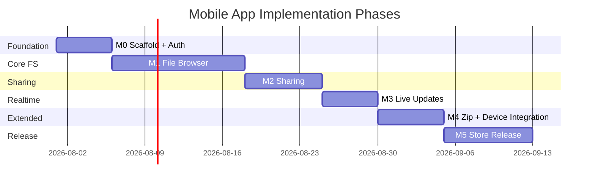

# Ha-to-Pe File System — Mobile App Implementation Plan

End-to-end plan for implementing the Ha-to-Pe mobile client (`frontend-mobile/`) with **React Native**, **Expo**, and **EAS**. This document aligns with [requirement.md](./requirement.md), [usecase.md](./usecase.md), [tech_stack.md](./tech_stack.md), [backend_implementation_plan.md](./backend_implementation_plan.md), and [web_app_implementation_plan.md](./web_app_implementation_plan.md).

**Priority:** Should (GUI-02) — start after web Phase W1 proves the API contract.

---

## 1. Goals and Success Criteria

### 1.1 Mobile Deliverables

By the end of all phases, the mobile app must:

1. Provide a **native file-manager experience** on iOS and Android for browse, upload, download, and manage.
2. Support **trash**, **search**, **sharing**, and **real-time updates** in shared directories.
3. Handle **zip/unzip** (where platform permits) and show **storage quota**.
4. Integrate with **device file picker**, **camera/photos**, and **OS share sheet** for downloads.
5. Ship to TestFlight / Play Internal Testing via **EAS Build**, then to stores via **EAS Submit**.

### 1.2 Architecture Rules

| Rule | Detail |
|------|--------|
| Backend is source of truth | Same GraphQL + REST API as web; no duplicated ACL/quota logic |
| Share logic with web | API client, hooks, types, and utils in `packages/shared` where possible |
| Mobile-native UI | Do not port web layouts; use RN patterns (tabs, stacks, sheets, swipe) |
| Secure token storage | `expo-secure-store` for refresh tokens; short-lived access token in memory |
| GraphQL for metadata | Tree, search, sharing, mutations, subscriptions |
| REST for bytes | Upload sessions, file download streams |
| Online-first v1 | No offline sync; show clear offline state |
| Platform parity | iOS and Android share one codebase; platform branches only when required |

### 1.3 Dependency Map

| Mobile phase | Requires backend phase | Recommended web gate |
|--------------|------------------------|-------------------|
| M0 | Backend Phase 0 | — |
| M1 | Backend Phase 1 | Web W1 complete (API proven) |
| M2 | Backend Phase 2 | Web W2 complete |
| M3 | Backend Phase 3 | Web W3 complete |
| M4 | Backend Phase 4 | Web W4 complete |
| M5 | Backend Phase 5 | Web W5 complete (billing UI optional on mobile) |

### 1.4 Target Directory Structure

```
frontend-mobile/
├── package.json
├── app.json                       # Expo config
├── eas.json                       # EAS Build / Submit profiles
├── tsconfig.json
├── codegen.ts
├── app/                           # Expo Router (file-based routes)
│   ├── _layout.tsx                # root layout, providers
│   ├── index.tsx                  # redirect
│   ├── (auth)/
│   │   ├── _layout.tsx
│   │   ├── login.tsx
│   │   └── register.tsx
│   ├── (tabs)/
│   │   ├── _layout.tsx            # bottom tabs
│   │   ├── files/
│   │   │   ├── _layout.tsx        # stack
│   │   │   ├── index.tsx          # root listing
│   │   │   └── [directoryId].tsx  # folder drill-down
│   │   ├── shared.tsx
│   │   ├── trash.tsx
│   │   └── settings.tsx
│   ├── search.tsx                 # modal or stack screen
│   ├── invitations.tsx
│   ├── public/
│   │   └── [token].tsx
│   └── node/
│       └── [nodeId].tsx           # file preview / actions sheet
├── src/
│   ├── components/
│   │   ├── layout/
│   │   │   ├── Screen.tsx
│   │   │   ├── Header.tsx
│   │   │   └── StorageBar.tsx
│   │   ├── files/
│   │   │   ├── NodeList.tsx
│   │   │   ├── NodeListItem.tsx
│   │   │   ├── NodeIcon.tsx
│   │   │   ├── BreadcrumbBar.tsx
│   │   │   └── EmptyState.tsx
│   │   ├── actions/
│   │   │   ├── NodeActionSheet.tsx
│   │   │   ├── SelectionToolbar.tsx
│   │   │   └── FAB.tsx
│   │   ├── upload/
│   │   │   ├── UploadProgressBanner.tsx
│   │   │   └── UploadPickerSheet.tsx
│   │   ├── sharing/
│   │   │   ├── ShareSheet.tsx
│   │   │   ├── InviteForm.tsx
│   │   │   └── PresenceRow.tsx
│   │   └── ui/
│   │       ├── Button.tsx
│   │       ├── Input.tsx
│   │       ├── Modal.tsx
│   │       └── Toast.tsx
│   ├── hooks/                     # re-export or thin wrappers over shared
│   ├── api/
│   │   ├── apolloClient.ts
│   │   ├── auth.ts
│   │   ├── upload.ts
│   │   ├── download.ts
│   │   └── generated/
│   ├── store/
│   │   ├── authStore.ts
│   │   └── uploadStore.ts
│   └── utils/
│       ├── formatBytes.ts
│       ├── errors.ts
│       └── linking.ts
└── tests/
    ├── unit/
    └── e2e/                       # Detox or Maestro (optional)

packages/shared/                   # monorepo workspace (recommended)
├── package.json
├── src/
│   ├── api/                       # auth, upload, download (platform-agnostic)
│   ├── graphql/                   # operations + generated types
│   ├── hooks/                     # useAuth, useTrash, useSearch, ...
│   ├── constants/                 # permissions, node types
│   └── utils/
```

---

## 2. Tech Stack

| Layer | Choice | Notes |
|-------|--------|-------|
| Framework | React Native | Cross-platform UI |
| Toolchain | Expo SDK 51+ | Managed workflow |
| Router | Expo Router v3 | File-based navigation |
| Language | TypeScript | Strict mode |
| GraphQL | Apollo Client | Same as web |
| Codegen | GraphQL Code Generator | Shared schema with web |
| REST | `fetch` | Upload/download |
| Secure storage | expo-secure-store | Refresh tokens |
| File picker | expo-document-picker | Upload from device |
| Media | expo-image-picker | Photos / camera upload |
| File system | expo-file-system | Download to cache/document dir |
| Sharing | expo-sharing | Open OS share sheet for downloaded files |
| State | Zustand | Auth, upload queue |
| Forms | React Hook Form + Zod | Login, invite |
| UI kit | React Native Paper or custom | Consistent mobile components |
| Icons | @expo/vector-icons / Lucide | Node and action icons |
| Network | @react-native-community/netinfo | Offline banner |
| Build | EAS Build | Cloud iOS/Android builds |
| Submit | EAS Submit | App Store / Play Store |
| OTA updates | expo-updates (optional) | JS bundle updates without store review |
| Tests | Jest + RNTL | Unit/component |
| E2E | Maestro (recommended for Expo) | Smoke flows |

### 2.1 Key Dependencies (planned)

```json
{
  "dependencies": {
    "expo": "~51.0.0",
    "expo-router": "~3.5.0",
    "react": "18.2.0",
    "react-native": "0.74.0",
    "@apollo/client": "^3",
    "graphql": "^16",
    "expo-secure-store": "~13.0.0",
    "expo-document-picker": "~12.0.0",
    "expo-image-picker": "~15.0.0",
    "expo-file-system": "~17.0.0",
    "expo-sharing": "~12.0.0",
    "expo-linking": "~6.3.0",
    "expo-web-browser": "~13.0.0",
    "@react-native-community/netinfo": "^11",
    "zustand": "^4",
    "react-hook-form": "^7",
    "zod": "^3"
  },
  "devDependencies": {
    "@graphql-codegen/cli": "^5",
    "jest": "^29",
    "@testing-library/react-native": "^12",
    "typescript": "^5"
  }
}
```

### 2.2 EAS Profiles (`eas.json`)

```json
{
  "build": {
    "development": {
      "developmentClient": true,
      "distribution": "internal"
    },
    "preview": {
      "distribution": "internal",
      "ios": { "simulator": false },
      "android": { "buildType": "apk" }
    },
    "production": {
      "autoIncrement": true
    }
  },
  "submit": {
    "production": {}
  }
}
```

---

## 3. Phase Overview



| Phase | Focus | Exit criterion |
|-------|-------|----------------|
| M0 | Expo scaffold, auth, Apollo, tabs shell | Login works; `me` loads on device/simulator |
| M1 | File browser, upload, download, trash, search | Full private FS on phone |
| M2 | Sharing, invitations, public link | Collaborator accesses shared folder |
| M3 | Subscriptions, presence | Shared folder updates live |
| M4 | Zip, multi-select, share sheet, polish | Archive flows; store-quality UX |
| M5 | EAS production build, store listing, submit | TestFlight / Play Internal build installable |

---

## 4. Phase M0 — Foundation and Auth

**Duration estimate:** 4–6 days  
**Requirements:** GUI-02, ACC-01–03  
**Use cases:** UC-01, UC-02, UC-03  
**Backend gate:** Phase 0

### 4.1 Tasks

| # | Task | Output |
|---|------|--------|
| M0.1 | `npx create-expo-app frontend-mobile -t expo-template-blank-typescript` | Project scaffold |
| M0.2 | Add Expo Router; configure `app/` directory | File-based routes |
| M0.3 | Create `packages/shared` workspace; move API types/codegen target | Code sharing with web |
| M0.4 | `api/apolloClient.ts` — auth link, error link, refresh | Apollo setup |
| M0.5 | `api/auth.ts` — login, register, refresh; tokens via SecureStore | Secure auth |
| M0.6 | `store/authStore.ts` — user session, hydrate on launch | Auth state |
| M0.7 | `app/(auth)/login.tsx`, `register.tsx` | Auth screens |
| M0.8 | OAuth via `expo-web-browser` + deep link callback | Google/GitHub in-app browser |
| M0.9 | `app/_layout.tsx` — ApolloProvider, auth redirect logic | Protected navigation |
| M0.10 | `app/(tabs)/_layout.tsx` — Files, Shared, Trash, Settings tabs | Tab shell |
| M0.11 | `settings.tsx` — profile, storage stub, logout | Settings screen |
| M0.12 | Configure `app.json` — scheme `hato-pe://` for deep links | OAuth + invites |
| M0.13 | Jest + RNTL setup | Test foundation |

### 4.2 Navigation Structure (M0)

```
App launch
  ├─ unauthenticated → (auth)/login
  └─ authenticated → (tabs)/
        ├─ files/
        ├─ shared
        ├─ trash
        └─ settings
```

### 4.3 OAuth Deep Link Flow

```
1. User taps "Sign in with Google"
2. expo-web-browser opens GET /auth/google?mobile=1
3. Backend redirects to hato-pe://auth/callback?token=...
4. App handles deep link, stores tokens in SecureStore
5. Navigate to (tabs)/files
```

### 4.4 Definition of Done

- [ ] App runs on iOS simulator and Android emulator
- [ ] Email/password login and registration work
- [ ] OAuth deep link flow documented and testable
- [ ] `me` query shows user name on Settings
- [ ] Refresh token persists across app restart

---

## 5. Phase M1 — File Browser (Private FS)

**Duration estimate:** 10–14 days  
**Requirements:** GUI-04, FS-01–05, UDL-01–02, TRH-01–04, SRC-01–03  
**Use cases:** UC-04–18, UC-28  
**Backend gate:** Phase 1

### 5.1 Mobile UX Patterns

| Web pattern | Mobile equivalent |
|-------------|-------------------|
| Sidebar tree | Stack drill-down + breadcrumb bar |
| Right-click menu | Long-press → `NodeActionSheet` |
| Drag-and-drop upload | FAB → `UploadPickerSheet` |
| Grid/list toggle | List default; optional thumbnail grid for images |
| Keyboard shortcuts | Swipe actions (delete, more) |

### 5.2 Screens and Components

| # | Task | Detail |
|---|------|--------|
| M1.1 | `files/index.tsx` — list user root children | Entry to file browser |
| M1.2 | `files/[directoryId].tsx` — stack push per folder | Drill-down navigation |
| M1.3 | `BreadcrumbBar.tsx` — horizontal scroll; tap to pop stack | Path context |
| M1.4 | `NodeList.tsx` — FlatList with pull-to-refresh | Performance for large dirs |
| M1.5 | `NodeListItem.tsx` — icon, name, size, date; swipe actions | Primary row |
| M1.6 | `FAB.tsx` — upload / new folder | Primary actions |
| M1.7 | `UploadPickerSheet.tsx` — Files, Photos, Camera | expo pickers |
| M1.8 | `useUpload()` — REST session flow with progress | Background-friendly upload |
| M1.9 | `useDownload()` — download to cache → Sharing or Save | expo-file-system |
| M1.10 | `NodeActionSheet.tsx` — rename, move, copy, delete, download | Context actions |
| M1.11 | `trash.tsx` tab — list, restore, permanent delete, empty | UC-13–16 |
| M1.12 | `search.tsx` — modal with scope toggle | UC-17–18 |
| M1.13 | `StorageBar.tsx` in header/settings | UC-28 |
| M1.14 | NetInfo offline banner | "No connection" state |

### 5.3 Upload from Device

```
1. User taps FAB → UploadPickerSheet
2. Options:
   a. Document → expo-document-picker (multi-select)
   b. Photos → expo-image-picker (library)
   c. Camera → expo-image-picker (camera)
3. For each file:
   a. POST /upload/sessions
   b. PUT file URI stream (expo-file-system.uploadAsync or fetch blob)
   c. POST complete
4. UploadProgressBanner shows aggregate progress
5. Refetch directory on success
```

### 5.4 Download to Device

```
1. User taps Download on file
2. GET /download/{id} with auth header
3. Save to FileSystem.cacheDirectory + node name
4. Open expo-sharing.shareAsync() or save to media library (images)
```

### 5.5 GraphQL Operations (M1)

Reuse operations from [web_app_implementation_plan.md](./web_app_implementation_plan.md) §5.7 via `packages/shared`.

### 5.6 Tests (M1)

| Test | Tool |
|------|------|
| `NodeListItem` renders file row | RNTL |
| `useUpload` quota error message | Jest |
| Login → browse → upload (smoke) | Maestro |

### 5.7 Definition of Done

- [ ] Browse folders via stack navigation with back gesture
- [ ] Upload from document picker and photo library
- [ ] Download file and open/share via OS sheet
- [ ] Create folder, rename, move, delete to trash
- [ ] Trash tab fully functional
- [ ] Search by name (current + global)
- [ ] Storage bar shows quota usage

---

## 6. Phase M2 — Sharing and Permissions

**Duration estimate:** 6–9 days  
**Requirements:** VIS-01–04, GUI-04  
**Use cases:** UC-19–23  
**Backend gate:** Phase 2

### 6.1 Tasks

| # | Task | Detail |
|---|------|--------|
| M2.1 | `shared.tsx` tab — directories shared with user | Grantee view |
| M2.2 | `ShareSheet.tsx` — visibility, invite, public link | Owner actions |
| M2.3 | `InviteForm.tsx` — email + permission toggles | UC-20 |
| M2.4 | `invitations.tsx` — pending invites; accept/decline | Deep link `hato-pe://invite/{token}` |
| M2.5 | `public/[token].tsx` — unauthenticated browse | UC-23 |
| M2.6 | `usePermissions(nodeId)` — hide disabled actions | Same rules as web W2 |
| M2.7 | Visibility badge on directory rows | private / shared / public |
| M2.8 | Push notification stub for invitations (optional) | expo-notifications + backend hook |

### 6.2 Invitation Deep Link

```
Email link: https://app.hato-pe.com/invite/{token}
  → Universal link opens app
  → invitations screen
  → acceptInvitation mutation
  → navigate to shared directory
```

Configure **iOS Associated Domains** and **Android App Links** in EAS.

### 6.3 Permission-Aware Action Sheet

Hide actions user cannot perform (same matrix as web §6.2). Server remains authoritative; UI is convenience only.

### 6.4 Definition of Done

- [ ] Owner can share directory and copy public link
- [ ] Invitee accepts invitation in-app
- [ ] Shared tab lists accessible shared directories
- [ ] Public link screen works without login
- [ ] Action sheet respects permissions

---

## 7. Phase M3 — Real-Time Collaboration

**Duration estimate:** 4–6 days  
**Requirements:** RTC-01–03  
**Use cases:** UC-24  
**Backend gate:** Phase 3

### 7.1 Tasks

| # | Task | Detail |
|---|------|--------|
| M3.1 | WebSocket subscription link in Apollo (same as web W3) | `GraphQLWsLink` |
| M3.2 | `useDirectorySubscription(directoryId)` in shared folder screens | Live listing |
| M3.3 | Pull-to-refresh as manual fallback | Offline/reconnect |
| M3.4 | `PresenceRow.tsx` — avatars under breadcrumb | RTC-03 |
| M3.5 | Snackbar when remote user adds/deletes file | Lightweight toast |
| M3.6 | Version conflict alert on rename | Alert → refetch |

### 7.2 Battery and Lifecycle

- Subscribe only while shared directory screen is focused (`useFocusEffect`)
- Unsubscribe on blur/back
- Pause presence heartbeat in background (`AppState`)

### 7.3 Definition of Done

- [ ] Shared directory listing updates when another user changes it
- [ ] Presence shows active collaborators
- [ ] Subscriptions unsubscribe when leaving screen
- [ ] Conflict alert shown on version mismatch

---

## 8. Phase M4 — Zip, Multi-Select, Polish

**Duration estimate:** 5–8 days  
**Requirements:** ZIP-01–03, UDL-03  
**Use cases:** UC-12, UC-25–26  
**Backend gate:** Phase 4

### 8.1 Tasks

| # | Task | Detail |
|---|------|--------|
| M4.1 | Selection mode — long-press to enter; tap to toggle | `SelectionToolbar` |
| M4.2 | Compress selection → `createZip` | Name prompt modal |
| M4.3 | Unzip action on zip nodes | Target folder picker |
| M4.4 | Download folder as zip → save via FileSystem | REST stream |
| M4.5 | Image thumbnail preview for image/* files | Optional fast image path |
| M4.6 | Haptic feedback on actions | expo-haptics |
| M4.7 | Splash screen + app icon + adaptive icon | `app.json` assets |
| M4.8 | Dark mode support | useColorScheme |
| M4.9 | Tablet layout — two-pane master/detail (optional) | iPad / large Android |

### 8.2 Platform Notes

| Feature | iOS | Android |
|---------|-----|---------|
| Save to Files | expo-sharing / document picker | SAF / Downloads |
| Background upload | Limited; show in-app progress | WorkManager (future) |
| Large zip download | Warn on cellular | Same + size confirm dialog |

### 8.3 Definition of Done

- [ ] Multi-select zip creation works
- [ ] Unzip into selected folder works
- [ ] Folder zip download saves and is shareable
- [ ] App icon and splash configured
- [ ] Dark mode readable

---

## 9. Phase M5 — Store Release and Billing UI

**Duration estimate:** 6–10 days  
**Requirements:** STO-02, GUI-02  
**Use cases:** UC-29 (optional on mobile)  
**Backend gate:** Phase 5

### 9.1 Store Preparation

| # | Task | Detail |
|---|------|--------|
| M5.1 | EAS production build iOS + Android | `eas build --platform all` |
| M5.2 | App Store Connect listing — screenshots, description, privacy | Apple review |
| M5.3 | Google Play Console listing — Data safety form | Google review |
| M5.4 | Privacy policy URL + terms | Required for OAuth and stores |
| M5.5 | `eas submit` to TestFlight and Play Internal | Internal testers |
| M5.6 | Crash reporting — Sentry (`@sentry/react-native`) | Production monitoring |
| M5.7 | Storage upgrade UI on Settings (optional) | Link to web checkout or in-app browser |

### 9.2 Admin on Mobile

**Out of scope for v1.** Admins use web admin dashboard. Mobile app hides admin routes entirely.

### 9.3 App Store Checklist

- [ ] Sign in with Apple (required if Google OAuth offered on iOS)
- [ ] Account deletion flow in Settings (store requirement)
- [ ] Privacy nutrition labels / Data safety accurate
- [ ] No broken links in OAuth flow
- [ ] IAP: if billing stays web-only, disclose in review notes

### 9.4 Definition of Done

- [ ] TestFlight and Play Internal builds install successfully
- [ ] Account deletion works
- [ ] Sentry captures errors in preview build
- [ ] Store submissions ready for review

---

## 10. Screen Map (Final)

| Screen | Route | Phase | Auth |
|--------|-------|-------|------|
| Login | `/(auth)/login` | M0 | Public |
| Register | `/(auth)/register` | M0 | Public |
| Files root | `/(tabs)/files/` | M1 | User |
| Folder | `/(tabs)/files/[directoryId]` | M1 | User |
| Shared | `/(tabs)/shared` | M2 | User |
| Trash | `/(tabs)/trash` | M1 | User |
| Settings | `/(tabs)/settings` | M0 | User |
| Search | `/search` | M1 | User |
| Invitations | `/invitations` | M2 | User |
| Public browse | `/public/[token]` | M2 | Public |
| Node detail | `/node/[nodeId]` | M1 | User |

---

## 11. Code Sharing with Web

### 11.1 Shared Package (`packages/shared`)

| Module | Shared | Platform-specific |
|--------|--------|-------------------|
| GraphQL operations | Yes | — |
| Generated types | Yes | — |
| `formatBytes`, `errors` | Yes | — |
| `useTrash`, `useSearch` hooks | Yes | — |
| `useUpload`, `useDownload` | Core logic shared | File input/output per platform |
| UI components | No | Web and mobile separate |
| Navigation | No | React Router vs Expo Router |

### 11.2 Monorepo Setup (recommended)

```
Ha-to-Pe__File-System/
├── package.json              # workspaces: ["frontend-web", "frontend-mobile", "packages/*"]
├── packages/shared/
├── frontend-web/
└── frontend-mobile/
```

Run codegen once against backend schema; both clients import from `@hato-pe/shared`.

---

## 12. API Integration (Mobile-Specific)

### 12.1 Secure Token Storage

```tsx
import * as SecureStore from 'expo-secure-store';

export async function saveRefreshToken(token: string) {
  await SecureStore.setItemAsync('refresh_token', token);
}
```

Access token: in-memory only (Zustand), refreshed on 401.

### 12.2 Upload from URI

```tsx
import * as FileSystem from 'expo-file-system';

await FileSystem.uploadAsync(uploadUrl, fileUri, {
  httpMethod: 'PUT',
  uploadType: FileSystem.FileSystemUploadType.BINARY_CONTENT,
  headers: { Authorization: `Bearer ${accessToken}` },
});
```

### 12.3 Download and Share

```tsx
const localUri = FileSystem.cacheDirectory + fileName;
await FileSystem.downloadAsync(downloadUrl, localUri, { headers });
await Sharing.shareAsync(localUri);
```

### 12.4 Error Mapping

Reuse `packages/shared/utils/errors.ts` — same messages as web.

---

## 13. UI Wireframe (Files Tab)

```
┌─────────────────────────────────────┐
│ ≡  Files          [Search]     [···] │
│ root › documents                    │
│ ████████░░░░  412 GB / 512 GB       │
├─────────────────────────────────────┤
│ 👤 Alice  👤 Bob   (presence, M3)   │
├─────────────────────────────────────┤
│ 📁 projects          4 items        │
│ 📄 notes.txt         12 KB    Jun 8 │
│ 📄 photo.jpg         2.1 MB   Jun 7│
│ 📦 backup.zip        88 MB    Jun 5 │
│                                     │
│                          ┌───┐      │
│                          │ + │ FAB  │
│                          └───┘      │
├─────────────────────────────────────┤
│  Files   Shared   Trash   Settings  │
└─────────────────────────────────────┘
```

Long-press row → action sheet. FAB → upload options.

---

## 14. Testing Strategy

| Phase | Unit (Jest) | Component (RNTL) | E2E |
|-------|-------------|------------------|-----|
| M0 | authStore, token storage | Login screen | Maestro: login |
| M1 | useUpload errors | NodeListItem | browse + upload |
| M2 | usePermissions | ShareSheet | accept invite |
| M3 | subscription hook | PresenceRow | — |
| M4 | — | SelectionToolbar | zip flow |
| M5 | — | — | preview build smoke |

### 14.1 CI

```bash
npm run lint
npm run typecheck
npm test
npx eas build --platform android --profile preview --non-interactive  # on release branch
```

---

## 15. Environment and Dev Workflow

### 15.1 Environment Variables (`app.config.ts`)

```ts
extra: {
  apiUrl: process.env.EXPO_PUBLIC_API_URL ?? 'http://localhost:8000',
  graphqlUrl: process.env.EXPO_PUBLIC_GRAPHQL_URL ?? 'http://localhost:8000/graphql',
  wsUrl: process.env.EXPO_PUBLIC_WS_URL ?? 'ws://localhost:8000/graphql',
}
```

Use LAN IP for physical device dev (`192.168.x.x:8000`), not `localhost`.

### 15.2 Local Development

```bash
# Backend
cd backend && uv run uvicorn app.main:app --reload --host 0.0.0.0 --port 8000

# Mobile
cd frontend-mobile
npm install
npx expo start
# press i (iOS) or a (Android)
```

### 15.3 Development Build

OAuth and some native modules require a **development build** (not Expo Go):

```bash
npx eas build --profile development --platform ios
npx eas build --profile development --platform android
```

---

## 16. Accessibility and Platform Standards

| Requirement | Implementation |
|-------------|----------------|
| Touch targets | Minimum 44×44 pt |
| Screen reader | `accessibilityLabel` on list items and FAB |
| Dynamic type | Allow font scaling |
| Safe areas | `SafeAreaView` / Expo Router headers |
| Haptics | Light impact on destructive confirm |
| Permissions | Runtime prompts for camera, photos, storage |

---

## 17. Risk Register

| Risk | Mitigation | Phase |
|------|------------|-------|
| Expo Go limitations | Use EAS development builds early | M0 |
| localhost on device | `--host 0.0.0.0` + LAN IP in env | M0 |
| Large upload on mobile network | Wi-Fi hint; show file size before upload | M1 |
| iOS Sign in with Apple required | Add Apple OAuth or email-only on iOS | M5 |
| Store rejection (account deletion) | Delete account in Settings | M5 |
| Schema drift from web | Shared codegen in CI | M0+ |
| Background upload killed | Keep foreground banner; retry on fail | M1 |

---

## 18. Recommended Build Order (Single Developer)

```
Week 1:   M0 — Expo Router, auth, SecureStore, tabs
Week 2:   M1 — file list, drill-down, breadcrumb
Week 3:   M1 — upload picker, download/share, FAB
Week 4:   M1 — trash, search, action sheet, Maestro smoke
Week 5:   M2 — share sheet, invitations, shared tab
Week 6:   M2 — public link, deep links, permissions UI
Week 7:   M3 — subscriptions, presence
Week 8:   M4 — multi-select, zip, dark mode, icons
Week 9:   M5 — EAS preview builds, Sentry, polish
Week 10:  M5 — store listings, TestFlight, Play Internal submit
```

Start mobile after web W1 stabilizes the API. Parallel work is possible if OpenAPI/GraphQL schema is frozen.

---

## 19. Document History

| Version | Date | Author | Changes |
|---------|------|--------|---------|
| 0.1 | 2026-06-08 | — | Initial mobile app implementation plan |
