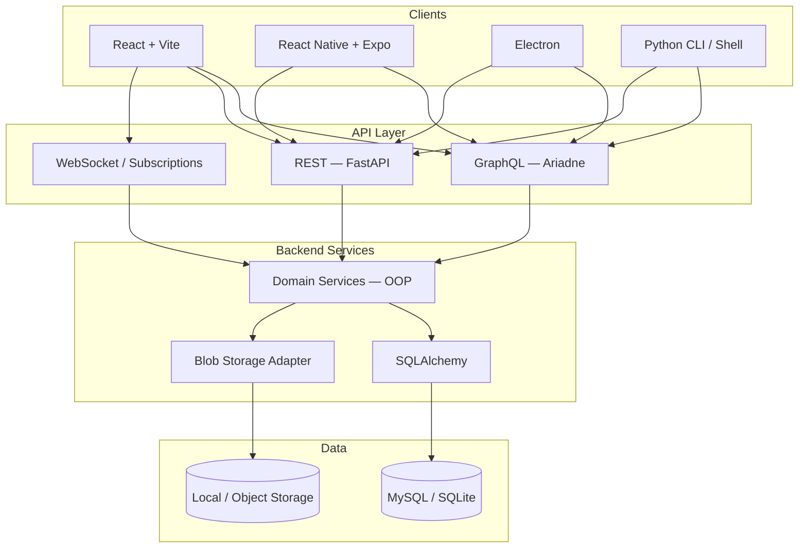

# Ha-to-Pe File System — Technology Stack

This document defines the technologies, tools, and architectural conventions for Ha-to-Pe. It extends the stack summary in [requirement.md](./requirement.md) and aligns with [db_schema.md](./db_schema.md) and [usecase.md](./usecase.md).

---

## 1. Stack Overview



---

## 2. Monorepo Layout

```
Ha-to-Pe__File-System/
├── backend/                 # FastAPI + Ariadne + SQLAlchemy
├── frontend-web/            # React + Vite
├── frontend-mobile/         # React Native + Expo
├── frontend-desktop/        # Electron
├── cli/                     # Terminal shell client
└── docs/                    # Requirements, schema, use cases
```

Each package is independently buildable but shares API contracts (GraphQL schema, OpenAPI spec, shared TypeScript types where applicable).

---

## 3. Backend

### 3.1 Core

| Component | Technology | Version | Purpose |
|-----------|------------|---------|---------|
| Language | Python | 3.12+ | Backend runtime |
| Web framework | FastAPI | latest stable | HTTP server, REST routes, dependency injection |
| ASGI server | Uvicorn | latest stable | Production/dev server |
| GraphQL | Ariadne | latest stable | Schema-first GraphQL (queries, mutations, subscriptions) |
| ORM | SQLAlchemy | 2.x | Database models and queries |
| Migrations | Alembic | latest stable | Schema versioning |
| Validation | Pydantic | v2 | Request/response schemas, settings |
| Package manager | UV | latest stable | Dependency lock, virtualenv, scripts |
| Testing | pytest | latest stable | Unit and integration tests |
| Test utilities | pytest-asyncio, httpx | latest stable | Async tests, API client |
| Formatting | black, isort | latest stable | Code style (NFR-07) |
| Linting | ruff | latest stable | Fast lint + optional format checks |

### 3.2 Authentication and Security

| Component | Technology | Purpose |
|-----------|------------|---------|
| OAuth 2.0 | Google, GitHub providers | Social login (ACC-03) |
| OAuth library | Authlib or python-jose | OAuth flow, JWT handling |
| Password hashing | passlib + bcrypt | If email/password fallback is added |
| Token strategy | JWT (access) + refresh tokens | Stateless API auth |
| Secrets | `.env` + environment variables | Never committed (NFR-03) |

### 3.3 Real-Time

| Component | Technology | Purpose |
|-----------|------------|---------|
| WebSocket | FastAPI WebSocket / Starlette | Directory change broadcasts (RTC-02) |
| GraphQL subscriptions | Ariadne subscription handlers | Live tree updates, presence (RTC-03) |
| Pub/sub (optional, scale) | Redis | Multi-instance event fan-out |

### 3.4 File and Blob Storage

| Component | Technology | Purpose |
|-----------|------------|---------|
| Storage adapter | Custom Python interface | Abstract blob read/write/delete |
| Dev storage | Local filesystem | `storage/{owner_id}/{node_id}` |
| Prod storage (future) | S3-compatible (MinIO, AWS S3) | Scalable blob backend |
| Zip handling | Python `zipfile` / `shutil` | Create and extract archives (ZIP-01–05) |
| Streaming | FastAPI `StreamingResponse` | Upload/download without loading full file (UDL-06) |

### 3.5 Backend Architecture

Layered, OOP-first design:

```
backend/app/
├── domain/           # Entities, enums, value objects (Node, User, Permission)
├── services/         # Business logic (FileService, TrashService, PermissionService)
├── repositories/     # SQLAlchemy data access
├── storage/          # Blob storage adapter
├── api/
│   ├── graphql/      # Ariadne schema, resolvers, subscriptions
│   └── rest/         # Upload, download, OAuth callbacks
├── core/             # Config, security, dependencies
└── tests/
    ├── unit/
    └── integration/
```

**Dependency rule:** `domain` → `services` → `api`. Resolvers and route handlers stay thin; logic lives in services.

### 3.6 Key Backend Dependencies (planned)

```toml
# backend/pyproject.toml (target)
dependencies = [
    "fastapi",
    "uvicorn[standard]",
    "ariadne",
    "sqlalchemy",
    "alembic",
    "pydantic-settings",
    "authlib",
    "python-jose[cryptography]",
    "httpx",
    "python-multipart",
    "aiofiles",
]

[project.optional-dependencies]
dev = [
    "pytest",
    "pytest-asyncio",
    "pytest-cov",
    "httpx",
    "black",
    "isort",
    "ruff",
]
mysql = ["pymysql", "cryptography"]
```

---

## 4. Database

| Environment | Engine | Driver | Notes |
|-------------|--------|--------|-------|
| Development | SQLite 3 | built-in / aiosqlite | Fast local setup, partial unique indexes |
| Production | MySQL 8+ | PyMySQL or asyncmy | utf8mb4, `FOR UPDATE` quota checks |
| Migrations | Alembic | — | Single migration source for both engines |

Schema details: [db_schema.md](./db_schema.md).

---

## 5. API Design

### 5.1 Protocol Split

| Protocol | Endpoints / Operations | Rationale |
|----------|------------------------|-----------|
| **GraphQL** | Tree listing, node metadata, rename, move, copy, trash, search, permissions, sharing, subscriptions | Flexible queries, schema-first, real-time |
| **REST** | `POST /upload`, `GET /download/{id}`, `GET /auth/google`, `GET /auth/github/callback`, zip stream | Binary streaming, OAuth redirects, multipart |

### 5.2 GraphQL (Ariadne)

- Schema-first: `backend/app/api/graphql/schema.graphql`
- Resolvers delegate to services
- DataLoaders for N+1 prevention on tree listing
- Subscriptions for shared directory events

### 5.3 REST (FastAPI)

- OpenAPI docs auto-generated at `/docs`
- Signed/temporary URLs for upload and download
- `Content-Disposition` headers for file downloads
- Rate limiting on upload endpoints (optional)

### 5.4 API Contract Sharing

| Artifact | Consumers |
|----------|-----------|
| GraphQL schema | Web, mobile, desktop, CLI |
| OpenAPI spec | CLI, third-party integrations |
| Shared TypeScript types (codegen) | Web, mobile, desktop |

---

## 6. Frontend Clients

### 6.1 Web — React + Vite

| Component | Technology | Purpose |
|-----------|------------|---------|
| Framework | React 18+ | UI components |
| Build tool | Vite | Dev server, bundling |
| Language | TypeScript | Type safety |
| GraphQL client | Apollo Client or urql | Queries, mutations, subscriptions |
| HTTP client | fetch / axios | REST upload/download |
| Routing | React Router | Page navigation |
| State | Zustand or React Context | Session, cwd, UI state |
| Styling | Tailwind CSS or CSS Modules | Layout and theme |
| File upload | tus or native multipart | Large file uploads |

**Phase:** 1 (Must)

### 6.2 Mobile — React Native + Expo + EAS

| Component | Technology | Purpose |
|-----------|------------|---------|
| Framework | React Native | iOS and Android |
| Toolchain | Expo SDK | Dev workflow, native modules |
| Build/deploy | EAS Build / EAS Submit | CI builds, app store |
| GraphQL | Apollo Client | Same API as web |
| Navigation | Expo Router | Screen routing |
| File access | expo-document-picker, expo-file-system | Upload/download |

**Phase:** 4 (Should)

### 6.3 Desktop — Electron

| Component | Technology | Purpose |
|-----------|------------|---------|
| Shell | Electron | Cross-platform desktop app |
| UI | React (shared with web where possible) | Reuse components |
| Bundler | Vite + electron-vite | Main/preload/renderer builds |
| Local files | Node.js `fs` via preload | Bridge to OS filesystem for upload |
| Auto-update | electron-updater (optional) | Desktop releases |

**Phase:** 4 (Should)

### 6.4 Code Sharing Across Frontends

| Shared | Approach |
|--------|----------|
| API types | GraphQL Code Generator |
| API client hooks | Shared package or monorepo workspace |
| Business constants | Shared enums (permissions, node types) |
| UI components | Web + Electron share React; mobile shares logic only |

---

## 7. CLI (Terminal Shell)

| Component | Technology | Purpose |
|-----------|------------|---------|
| Language | Python 3.12+ | Match backend ecosystem |
| CLI framework | Typer or Click | Command parsing, help |
| Output | Rich | Tables, colors, progress |
| HTTP | httpx | GraphQL and REST calls |
| Auth | OAuth device flow or token file | Shell authentication |
| Local files | Python `pathlib` | `upload` / `download` local paths |

The CLI is a **virtual shell** over the API — not direct host filesystem access. See UC-27 in [usecase.md](./usecase.md).

**Commands:** `cd`, `ls`, `mkdir`, `touch`, `mv`, `cp`, `rm`, `upload`, `download`, `zip`, `unzip`, `trash`, `restore`, `search`

**Phase:** 4 (Must)

---

## 8. DevOps and Tooling

### 8.1 Version Control and CI

| Tool | Purpose |
|------|---------|
| Git | Source control |
| GitHub Actions (or similar) | CI pipeline |
| pre-commit | black, isort, ruff before commit |

### 8.2 CI Pipeline (recommended)

```
lint (ruff, black --check, isort --check)
  → test (pytest, coverage)
  → build (backend import check, frontend build)
  → migrate check (alembic heads)
```

### 8.3 Environment Configuration

| Variable | Example | Purpose |
|----------|---------|---------|
| `DATABASE_URL` | `sqlite:///./dev.db` | DB connection |
| `STORAGE_PATH` | `./storage` | Local blob directory |
| `JWT_SECRET` | — | Token signing |
| `GOOGLE_CLIENT_ID` | — | OAuth |
| `GITHUB_CLIENT_ID` | — | OAuth |
| `DEFAULT_QUOTA_BYTES` | `549755813888` | 512 GiB |

### 8.4 Containerization (optional)

| Component | Technology |
|-----------|------------|
| API container | Docker + Uvicorn |
| Database | MySQL Docker image (prod-like dev) |
| Compose | docker-compose for local full stack |

---

## 9. Testing Strategy

| Layer | Tool | Scope |
|-------|------|-------|
| Unit | pytest | Services, permission resolution, path logic |
| Integration | pytest + httpx + test DB | Upload, trash, sharing, quota |
| API | pytest + FastAPI TestClient | REST and GraphQL resolvers |
| E2E (future) | Playwright | Web UI flows |
| CLI | pytest + CliRunner (Typer) | Shell commands |

**Coverage targets (recommended):**
- `services/` and `domain/`: ≥ 90%
- `api/` resolvers: smoke + critical paths

---

## 10. Security Stack

| Concern | Approach |
|---------|----------|
| Authentication | OAuth 2.0 + JWT |
| Authorization | Service-layer permission checks (PRM-05) |
| Path traversal | Validate/sanitize all logical paths (NFR-02) |
| Zip bombs | Entry count and uncompressed size limits (ZIP-04) |
| HTTPS | TLS in production (reverse proxy) |
| CORS | Restrict to known client origins |
| Rate limiting | slowapi or reverse proxy |
| Secrets | Environment variables only (NFR-03) |

---

## 11. Admin and Analytics

| Component | Technology | Purpose |
|-----------|------------|---------|
| Admin UI | React (web app, role-gated) | Quota config, analytics dashboard |
| Analytics data | `activity_events` table | See [db_schema.md](./db_schema.md) |
| Reporting | CSV/JSON export via REST or GraphQL | ADM-04 |
| Billing (future) | Stripe or similar | Storage upgrades (STO-02) |

**Phase:** 5

---

## 12. Delivery Phases vs Stack

| Phase | Stack delivered |
|-------|-----------------|
| **0 — Foundation** | Python, FastAPI, SQLAlchemy, Alembic, UV, pytest, SQLite |
| **1 — Private FS** | + Ariadne (queries/mutations), REST upload/download, React + Vite web |
| **2 — Sharing** | + Permission services, GraphQL sharing mutations |
| **3 — Real-time** | + WebSocket, GraphQL subscriptions |
| **4 — Extended clients** | + CLI (Typer), zip libs, React Native, Electron |
| **5 — Admin** | + Admin UI, analytics, billing integration, MySQL production |

---

## 13. Rationale Summary

| Decision | Why |
|----------|-----|
| FastAPI + Ariadne | Async HTTP, auto OpenAPI, schema-first GraphQL in one app |
| GraphQL + REST | GraphQL for metadata/tree; REST for binary streaming |
| SQLAlchemy 2.x | Mature ORM, works with SQLite and MySQL |
| UV | Fast dependency install and lockfile management |
| OOP services | Testable business logic isolated from API layer |
| React everywhere | Shared skills across web, mobile (RN), desktop (Electron) |
| Python CLI | Reuses HTTP patterns; same language as backend |
| SQLite → MySQL | Simple dev; production-grade concurrency and locking |

---

## 14. Document History

| Version | Date | Author | Changes |
|---------|------|--------|---------|
| 0.1 | 2026-06-08 | — | Initial tech stack document |
