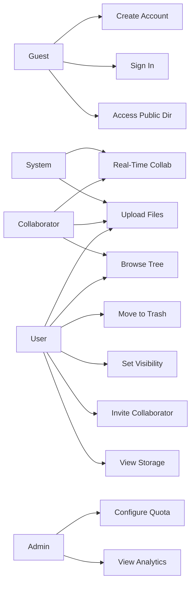

# Ha-to-Pe File System — Use Cases

This document describes functional use cases for the Ha-to-Pe File System. Each use case maps to requirements in [requirement.md](./requirement.md).

---

## 1. Actors

| Actor | Description |
|-------|-------------|
| **Guest** | Unauthenticated visitor; may access public directories only. |
| **User** | Authenticated account holder; owns a private root and manages personal files. |
| **Collaborator** | Authenticated user invited to a shared directory with granted permissions. |
| **Admin** | Authenticated user with elevated privileges for system configuration and analytics. |
| **System** | Backend services that enforce quotas, permissions, and real-time notifications. |

### Client Surfaces (secondary)

Use cases may be initiated from any supported client:

- Web (React + Vite)
- Mobile (React Native + Expo)
- Desktop (Electron)
- Terminal / Shell

---

## 2. Use Case Index

| ID | Use Case | Primary Actor | Phase |
|----|----------|---------------|-------|
| UC-01 | Create Account | Guest | 0 |
| UC-02 | Sign In | Guest | 0 |
| UC-03 | Sign Out | User | 0 |
| UC-04 | Browse Directory Tree | User, Collaborator | 1 |
| UC-05 | Create Directory | User, Collaborator | 1 |
| UC-06 | Create File | User, Collaborator | 1 |
| UC-07 | Rename Node | User, Collaborator | 1 |
| UC-08 | Copy Node | User, Collaborator | 1 |
| UC-09 | Move Node | User, Collaborator | 1 |
| UC-10 | Upload File(s) | User, Collaborator | 1 |
| UC-11 | Download File | User, Collaborator, Guest | 1 |
| UC-12 | Download Directory as Zip | User, Collaborator | 1 |
| UC-13 | Move to Trash | User, Collaborator | 1 |
| UC-14 | Restore from Trash | User | 1 |
| UC-15 | Permanently Delete from Trash | User | 1 |
| UC-16 | Empty Trash | User | 1 |
| UC-17 | Search by Name (Current Directory) | User, Collaborator | 1 |
| UC-18 | Search by Name (Global) | User, Collaborator | 1 |
| UC-19 | Set Directory Visibility | User | 2 |
| UC-20 | Invite Collaborator | User | 2 |
| UC-21 | Accept Invitation | Collaborator | 2 |
| UC-22 | Manage Permission Grants | User | 2 |
| UC-23 | Access Public Directory | Guest, User | 2 |
| UC-24 | Collaborate in Real Time | User, Collaborator | 3 |
| UC-25 | Create Zip Archive | User, Collaborator | 4 |
| UC-26 | Unzip Archive | User, Collaborator | 4 |
| UC-27 | Operate via Terminal Shell | User, Collaborator | 4 |
| UC-28 | View Storage Usage | User | 1 |
| UC-29 | Upgrade Storage | User | 5 |
| UC-30 | Configure Default Storage Quota | Admin | 5 |
| UC-31 | Configure Upgrade Pricing | Admin | 5 |
| UC-32 | View Analytics Summary | Admin | 5 |
| UC-33 | Generate Analytics Report | Admin | 5 |

---

## 3. Use Case Diagram (Overview)

---

## 4. Authentication and Account

### UC-01 — Create Account

| Field | Value |
|-------|-------|
| **Actors** | Guest |
| **Requirements** | ACC-01, ACC-03, ACC-04, ACC-05, STO-01 |
| **Description** | A guest registers a new Ha-to-Pe account and receives a private root directory with a default storage quota. |

**Preconditions**
- Guest is not signed in.
- OAuth provider (Google or GitHub) is available.

**Main Flow**
1. Guest selects "Create account" and chooses an OAuth provider.
2. Guest completes authentication with the provider.
3. System creates a user record linked to the OAuth identity.
4. System creates a private root directory for the user.
5. System assigns the default storage quota (e.g., 512 GB).
6. System signs the user in and redirects to their root directory.

**Postconditions**
- User account exists.
- Private root directory exists.
- User is authenticated.

**Alternative Flows**
- **A1 — Account already exists:** At step 3, if the OAuth identity is already linked, the system signs the user in instead of creating a duplicate account.

**Exception Flows**
- **E1 — OAuth failure:** System displays an error; account is not created.
- **E2 — Provider unavailable:** System displays a service-unavailable message.

---

### UC-02 — Sign In

| Field | Value |
|-------|-------|
| **Actors** | Guest |
| **Requirements** | ACC-02, ACC-03 |
| **Description** | A guest signs in to an existing account via OAuth. |

**Preconditions**
- Guest is not signed in.
- Account exists for the chosen OAuth identity.

**Main Flow**
1. Guest selects "Sign in" and chooses an OAuth provider.
2. Guest completes authentication with the provider.
3. System validates the OAuth identity against an existing user record.
4. System issues a session token and loads the user's root directory.

**Postconditions**
- User is authenticated.

**Exception Flows**
- **E1 — Unknown identity:** System prompts the user to create an account (UC-01).
- **E2 — OAuth failure:** Sign-in is rejected with an error message.

---

### UC-03 — Sign Out

| Field | Value |
|-------|-------|
| **Actors** | User, Collaborator, Admin |
| **Requirements** | ACC-02 |
| **Description** | An authenticated user ends their session. |

**Preconditions**
- Actor is signed in.

**Main Flow**
1. Actor selects "Sign out".
2. System invalidates the session token.
3. System redirects to the sign-in page.

**Postconditions**
- Session is terminated.
- Actor is unauthenticated.

---

## 5. File and Directory Management

### UC-04 — Browse Directory Tree

| Field | Value |
|-------|-------|
| **Actors** | User, Collaborator |
| **Requirements** | FS-04, FS-05, PRM-04, PRM-05 |
| **Description** | An actor navigates the logical directory tree and views contents of accessible directories. |

**Preconditions**
- Actor is signed in.
- Target directory exists and actor has `read` permission.

**Main Flow**
1. Actor opens a directory (via tree navigation or path).
2. System resolves the path (absolute or relative) to a directory node.
3. System checks effective `read` permission on the directory.
4. System returns child nodes (files, directories, zips) the actor may see.
5. Actor views the listing with metadata (name, type, size, modified date).

**Postconditions**
- Directory contents are displayed.

**Alternative Flows**
- **A1 — Relative path:** Actor provides a path relative to the current working directory; system resolves from session `cwd`.
- **A2 — Absolute path:** Actor provides a path from root (e.g., `/home/docs`).

**Exception Flows**
- **E1 — Directory not found:** System returns a not-found error.
- **E2 — Insufficient permission:** System returns an authorization error without leaking node existence (NFR-06).

---

### UC-05 — Create Directory

| Field | Value |
|-------|-------|
| **Actors** | User, Collaborator |
| **Requirements** | FS-01, FS-03, PRM-05 |
| **Description** | An actor creates a new subdirectory inside an existing directory. |

**Preconditions**
- Actor is signed in.
- Parent directory exists.
- Actor has `create` permission on the parent directory.

**Main Flow**
1. Actor selects a parent directory and enters a new directory name.
2. System validates the name (non-empty, no invalid characters, unique among siblings).
3. System checks `create` permission on the parent.
4. System creates a directory node with default visibility `private`.
5. System returns the new directory metadata.

**Postconditions**
- New directory exists under the parent.

**Exception Flows**
- **E1 — Duplicate name:** System rejects with a conflict error (FS-03).
- **E2 — Insufficient permission:** Operation is rejected.

---

### UC-06 — Create File

| Field | Value |
|-------|-------|
| **Actors** | User, Collaborator |
| **Requirements** | FS-01, FS-03 |
| **Description** | An actor creates an empty file placeholder in a directory (content added via upload). |

**Preconditions**
- Actor is signed in.
- Parent directory exists.
- Actor has `create` permission on the parent.

**Main Flow**
1. Actor selects a parent directory and enters a file name.
2. System validates the name.
3. System checks `create` permission.
4. System creates a file node with zero-byte content.
5. System returns the new file metadata.

**Postconditions**
- Empty file node exists (ready for upload).

**Exception Flows**
- **E1 — Duplicate name:** System rejects with a conflict error.
- **E2 — Insufficient permission:** Operation is rejected.

---

### UC-07 — Rename Node

| Field | Value |
|-------|-------|
| **Actors** | User, Collaborator |
| **Requirements** | FS-02, FS-03 |
| **Description** | An actor renames a file, directory, or zip node. |

**Preconditions**
- Actor is signed in.
- Node exists.
- Actor has `write` permission (files/zips) or `create` + ownership (directories).

**Main Flow**
1. Actor selects a node and enters a new name.
2. System validates the new name is unique among siblings.
3. System checks effective write permission.
4. System updates the node name and timestamp.
5. System notifies subscribed clients in shared directories (UC-24).

**Postconditions**
- Node is renamed.

**Exception Flows**
- **E1 — Duplicate name:** Rename is rejected.
- **E2 — Insufficient permission:** Operation is rejected.

---

### UC-08 — Copy Node

| Field | Value |
|-------|-------|
| **Actors** | User, Collaborator |
| **Requirements** | FS-02, PRM-05 |
| **Description** | An actor duplicates a file, directory, or zip into a target directory. |

**Preconditions**
- Actor is signed in.
- Source node and target directory exist.
- Actor has `copy` on source and `create` on target.

**Main Flow**
1. Actor selects a source node and a target directory.
2. System checks permissions on source and target.
3. System checks storage quota if copying file/zip content (STO-04).
4. System deep-copies the node (and subtree for directories).
5. System updates `storage_used_bytes`.
6. System returns the new node metadata.

**Postconditions**
- Duplicate node exists in the target directory.
- Storage usage is updated.

**Exception Flows**
- **E1 — Quota exceeded:** Copy is rejected.
- **E2 — Insufficient permission:** Operation is rejected.

---

### UC-09 — Move Node

| Field | Value |
|-------|-------|
| **Actors** | User, Collaborator |
| **Requirements** | FS-02, PRM-05 |
| **Description** | An actor relocates a node to a different directory. |

**Preconditions**
- Actor is signed in.
- Source node and target directory exist.
- Actor has `move` on source and `create` on target.

**Main Flow**
1. Actor selects a source node and a target directory.
2. System validates the target is not a descendant of the source (for directories).
3. System checks permissions.
4. System updates the node's `parent_id`.
5. System notifies subscribed clients in shared directories.

**Postconditions**
- Node is under the new parent.

**Exception Flows**
- **E1 — Cyclic move:** System rejects moving a directory into its own subtree.
- **E2 — Duplicate name in target:** System rejects if a sibling with the same name exists.
- **E3 — Insufficient permission:** Operation is rejected.

---

## 6. Upload and Download

### UC-10 — Upload File(s)

| Field | Value |
|-------|-------|
| **Actors** | User, Collaborator |
| **Requirements** | UDL-01, UDL-04, UDL-05, UDL-06, STO-04 |
| **Description** | An actor uploads one or more files into a target directory. |

**Preconditions**
- Actor is signed in.
- Target directory exists.
- Actor has `upload` / `create` permission on the target.

**Main Flow**
1. Actor selects a target directory and one or more local files.
2. System checks effective upload permission.
3. For each file, system checks `storage_used + file_size <= quota`.
4. System returns a signed upload URL (REST) for each file.
5. Actor uploads file bytes via streaming REST endpoint.
6. System stores blobs, creates or updates file nodes, and increments `storage_used_bytes`.
7. System notifies subscribed clients in shared directories.

**Postconditions**
- File nodes exist with correct content.
- Storage usage is updated.

**Exception Flows**
- **E1 — Quota exceeded:** Upload is rejected before transfer begins.
- **E2 — Insufficient permission:** Upload is rejected.
- **E3 — Invalid file name:** Upload is rejected (NFR-01).

---

### UC-11 — Download File

| Field | Value |
|-------|-------|
| **Actors** | User, Collaborator, Guest |
| **Requirements** | UDL-02, UDL-04, UDL-06 |
| **Description** | An actor downloads a single file's content. |

**Preconditions**
- File node exists.
- Actor has `download` / `read` permission (Guest: only in public directories).

**Main Flow**
1. Actor selects a file to download.
2. System checks effective download permission.
3. System returns a signed download URL (REST).
4. Actor downloads file bytes via streaming REST endpoint.

**Postconditions**
- File content is delivered to the actor.

**Exception Flows**
- **E1 — Insufficient permission:** Download is rejected.
- **E2 — File not found:** System returns not-found error.

---

### UC-12 — Download Directory as Zip

| Field | Value |
|-------|-------|
| **Actors** | User, Collaborator |
| **Requirements** | UDL-03, UDL-06 |
| **Description** | An actor downloads an entire directory subtree as a zip archive. |

**Preconditions**
- Directory exists.
- Actor has `download` permission on the directory.

**Main Flow**
1. Actor selects a directory to download.
2. System checks `download` permission.
3. System builds a zip archive from the directory subtree (streaming).
4. System returns the zip as a streamed REST response.

**Postconditions**
- Actor receives a zip file containing the directory contents.

**Exception Flows**
- **E1 — Insufficient permission:** Download is rejected.
- **E2 — Empty directory:** System returns an empty zip or informative message.

---

## 7. Trash Management

### UC-13 — Move to Trash

| Field | Value |
|-------|-------|
| **Actors** | User, Collaborator |
| **Requirements** | TRH-01, TRH-06 |
| **Description** | An actor soft-deletes a file, directory, or zip by moving it to trash. |

**Preconditions**
- Node exists and is not already in trash.
- Actor has `delete` permission.

**Main Flow**
1. Actor selects one or more nodes to delete.
2. System checks `delete` permission on each node.
3. System sets `deleted_at` and records `original_parent_id`.
4. System moves nodes to the actor's trash scope.
5. System notifies subscribed clients in shared directories.

**Postconditions**
- Nodes are in trash.
- Nodes no longer appear in the active directory listing.
- Storage remains counted until permanent deletion (TRH-05).

**Exception Flows**
- **E1 — Insufficient permission:** Operation is rejected.

---

### UC-14 — Restore from Trash

| Field | Value |
|-------|-------|
| **Actors** | User |
| **Requirements** | TRH-02 |
| **Description** | An actor restores a trashed item to its original location. |

**Preconditions**
- Item exists in the actor's trash.
- Actor owns the trash scope.

**Main Flow**
1. Actor opens trash and selects an item to restore.
2. System looks up `original_parent_id`.
3. If the original parent exists, system moves the item back.
4. If the original parent no longer exists, system moves the item to the actor's root (fallback).
5. System clears `deleted_at`.

**Postconditions**
- Item is active again in a valid directory.

**Exception Flows**
- **E1 — Name conflict at destination:** System prompts for rename or rejects restore.

---

### UC-15 — Permanently Delete from Trash

| Field | Value |
|-------|-------|
| **Actors** | User |
| **Requirements** | TRH-03, STO-05 |
| **Description** | An actor permanently removes a single item from trash. |

**Preconditions**
- Item exists in the actor's trash.

**Main Flow**
1. Actor selects an item in trash and confirms permanent deletion.
2. System deletes the blob from storage.
3. System removes the node record (and descendants if directory).
4. System decrements `storage_used_bytes`.

**Postconditions**
- Item is irrecoverable.
- Storage is freed.

---

### UC-16 — Empty Trash

| Field | Value |
|-------|-------|
| **Actors** | User |
| **Requirements** | TRH-04, STO-05 |
| **Description** | An actor permanently deletes all items in their trash. |

**Preconditions**
- Actor's trash contains one or more items.

**Main Flow**
1. Actor selects "Empty trash" and confirms.
2. System iterates all trashed items.
3. System deletes blobs and node records for each item.
4. System updates `storage_used_bytes`.

**Postconditions**
- Trash is empty.
- Storage is freed for all removed items.

---

## 8. Search

### UC-17 — Search by Name (Current Directory)

| Field | Value |
|-------|-------|
| **Actors** | User, Collaborator |
| **Requirements** | SRC-01, SRC-02, SRC-04 |
| **Description** | An actor searches for nodes by name within the current directory subtree. |

**Preconditions**
- Actor is signed in.
- Current directory is set.

**Main Flow**
1. Actor enters a search query (name or partial name).
2. Actor selects scope "current directory".
3. System searches descendants of the current directory matching the query.
4. System filters results to nodes the actor has `read` permission on.
5. System returns matching nodes with paths.

**Postconditions**
- Filtered search results are displayed.

---

### UC-18 — Search by Name (Global)

| Field | Value |
|-------|-------|
| **Actors** | User, Collaborator |
| **Requirements** | SRC-01, SRC-03, SRC-04 |
| **Description** | An actor searches for nodes by name across all directories they can access. |

**Preconditions**
- Actor is signed in.

**Main Flow**
1. Actor enters a search query.
2. Actor selects scope "global".
3. System searches all nodes owned by or shared with the actor.
4. System filters results by effective `read` permission.
5. System returns matching nodes with paths.

**Postconditions**
- Global, permission-filtered results are displayed.

---

## 9. Sharing and Visibility

### UC-19 — Set Directory Visibility

| Field | Value |
|-------|-------|
| **Actors** | User |
| **Requirements** | VIS-01 |
| **Description** | A directory owner changes visibility between private, shared, and public. |

**Preconditions**
- Actor is the owner of the directory.

**Main Flow**
1. Actor selects a directory and opens visibility settings.
2. Actor chooses: private, shared, or public.
3. System updates the directory visibility field.
4. If set to public, system optionally generates a public access link (VIS-04).

**Postconditions**
- Directory visibility is updated.
- Access rules apply immediately.

**Exception Flows**
- **E1 — Not owner:** Operation is rejected.

---

### UC-20 — Invite Collaborator

| Field | Value |
|-------|-------|
| **Actors** | User |
| **Requirements** | VIS-02, VIS-03, PRM-02, PRM-03 |
| **Description** | A directory owner invites another user and assigns permissions. |

**Preconditions**
- Actor is the owner of a shared (or sharable) directory.
- Target user has a Ha-to-Pe account.

**Main Flow**
1. Actor opens sharing settings for the directory.
2. Actor enters the collaborator's email or username.
3. Actor selects permission grants (e.g., read, write, delete) and inheritance flag.
4. System creates a share invitation record.
5. System notifies the target user.

**Postconditions**
- Invitation is pending acceptance.

**Exception Flows**
- **E1 — User not found:** System displays an error.
- **E1 — Already has access:** System updates existing grants instead.

---

### UC-21 — Accept Invitation

| Field | Value |
|-------|-------|
| **Actors** | Collaborator |
| **Requirements** | VIS-02, VIS-03, PRM-02 |
| **Description** | An invited user accepts access to a shared directory. |

**Preconditions**
- Pending invitation exists for the actor.

**Main Flow**
1. Actor receives and opens the invitation.
2. Actor accepts the invitation.
3. System creates `PermissionGrant` records with specified actions and inheritance.
4. System marks the invitation as accepted.
5. Shared directory appears in the actor's directory tree.

**Postconditions**
- Collaborator has effective permissions on the shared directory.

**Alternative Flows**
- **A1 — Decline:** Actor declines; invitation is marked rejected; no grants are created.

---

### UC-22 — Manage Permission Grants

| Field | Value |
|-------|-------|
| **Actors** | User |
| **Requirements** | PRM-02, PRM-03, PRM-05 |
| **Description** | A directory owner updates or revokes collaborator permissions. |

**Preconditions**
- Actor is the directory owner.
- Collaborator has existing grants.

**Main Flow**
1. Actor opens the permissions panel for a shared directory.
2. Actor modifies grant actions or inheritance for a collaborator.
3. System updates `PermissionGrant` records.
4. System recalculates effective permissions for all descendants.

**Postconditions**
- Collaborator permissions are updated immediately.

**Alternative Flows**
- **A1 — Revoke access:** Actor removes all grants; collaborator loses access to the directory.

---

### UC-23 — Access Public Directory

| Field | Value |
|-------|-------|
| **Actors** | Guest, User |
| **Requirements** | VIS-04, PRM-05 |
| **Description** | An actor accesses a directory marked as public via link or browse. |

**Preconditions**
- Directory visibility is `public`.

**Main Flow**
1. Actor navigates to a public link or public directory listing.
2. System validates the directory is public.
3. System returns directory contents with read-only access (unless public write is enabled).
4. Actor may download files permitted by the public grant.

**Postconditions**
- Actor views public content within granted permissions.

**Exception Flows**
- **E1 — Directory is not public:** Access is denied.

---

## 10. Real-Time Collaboration

### UC-24 — Collaborate in Real Time

| Field | Value |
|-------|-------|
| **Actors** | User, Collaborator, System |
| **Requirements** | RTC-01, RTC-02, RTC-03, RTC-04, RTC-05 |
| **Description** | Multiple users work in a shared directory and receive live updates. |

**Preconditions**
- Directory visibility is `shared` or `public`.
- Actors have appropriate permissions.
- Actors are connected via WebSocket or GraphQL subscription.

**Main Flow**
1. Actor A opens a shared directory.
2. System registers Actor A's presence in the directory (RTC-03).
3. Actor B creates or modifies a node in the same directory.
4. System broadcasts the change event to all subscribed clients.
5. Actor A's client updates the directory listing without manual refresh.

**Postconditions**
- All connected clients reflect the latest directory state.

**Alternative Flows**
- **A1 — Concurrent write conflict:** Two actors modify the same node simultaneously. System detects version mismatch (RTC-04) and returns a conflict error; the losing client must refresh and retry.

**Exception Flows**
- **E1 — Connection lost:** Client reconnects and performs a full directory sync.

---

## 11. Zip Operations

### UC-25 — Create Zip Archive

| Field | Value |
|-------|-------|
| **Actors** | User, Collaborator |
| **Requirements** | ZIP-01, ZIP-02, ZIP-05, STO-04 |
| **Description** | An actor compresses selected files and/or directories into a zip node. |

**Preconditions**
- Source nodes exist.
- Actor has `zip` permission on each source.
- Actor has `create` permission on the target directory.

**Main Flow**
1. Actor selects files and/or directories to archive.
2. Actor chooses a target directory and zip file name.
3. System checks permissions and storage quota.
4. System compresses selected content into a zip blob.
5. System creates a node of type `zip`.
6. System updates `storage_used_bytes`.

**Postconditions**
- Zip node exists in the target directory.

**Exception Flows**
- **E1 — Quota exceeded:** Operation is rejected.
- **E1 — Insufficient permission:** Operation is rejected.

---

### UC-26 — Unzip Archive

| Field | Value |
|-------|-------|
| **Actors** | User, Collaborator |
| **Requirements** | ZIP-03, ZIP-04, ZIP-05, STO-04 |
| **Description** | An actor extracts a zip archive into a target directory. |

**Preconditions**
- Zip node exists.
- Target directory exists.
- Actor has `unzip` on the zip and `create` on the target.

**Main Flow**
1. Actor selects a zip node and a target directory.
2. System checks permissions.
3. System inspects the archive (entry count, uncompressed size) against safety limits (ZIP-04).
4. System checks storage quota for extracted content.
5. System extracts entries and creates file/directory nodes.
6. System updates `storage_used_bytes`.

**Postconditions**
- Extracted nodes exist in the target directory.

**Exception Flows**
- **E1 — Zip bomb detected:** Extraction is rejected (ZIP-04).
- **E2 — Quota exceeded:** Extraction is rejected.
- **E3 — Insufficient permission:** Operation is rejected.

---

## 12. Terminal Shell

### UC-27 — Operate via Terminal Shell

| Field | Value |
|-------|-------|
| **Actors** | User, Collaborator |
| **Requirements** | SHL-01, SHL-02, SHL-03, SHL-04, SHL-05 |
| **Description** | An actor performs file system operations through a command-line interface. |

**Preconditions**
- Actor is signed in.
- Shell session is active with a current working directory.

**Main Flow**
1. Actor opens the terminal client and authenticates.
2. System initializes session with `cwd` set to the actor's root.
3. Actor issues commands:

   | Command | Maps to |
   |---------|---------|
   | `cd <path>` | UC-04 (change cwd) |
   | `ls [path]` | UC-04 |
   | `mkdir <name>` | UC-05 |
   | `touch <name>` | UC-06 |
   | `mv <src> <dst>` | UC-09 |
   | `cp <src> <dst>` | UC-08 |
   | `rm <name>` | UC-13 |
   | `upload <local> <remote>` | UC-10 |
   | `download <remote> <local>` | UC-11 |
   | `zip <name> <sources...>` | UC-25 |
   | `unzip <zip> [target]` | UC-26 |
   | `trash` | List trash |
   | `restore <name>` | UC-14 |
   | `search <query> [--global]` | UC-17 / UC-18 |

4. System resolves paths (absolute or relative to `cwd`).
5. System enforces the same permissions as the GUI (SHL-04).
6. System returns command output or error messages.

**Postconditions**
- File system state reflects the executed commands.

**Exception Flows**
- **E1 — Unknown command:** System displays help text.
- **E2 — Permission denied:** Command fails with an authorization error.
- **E3 — Invalid path:** System displays a path resolution error.

---

## 13. Storage and Quota

### UC-28 — View Storage Usage

| Field | Value |
|-------|-------|
| **Actors** | User |
| **Requirements** | STO-03, STO-01 |
| **Description** | A user views current storage consumption versus their quota. |

**Preconditions**
- Actor is signed in.

**Main Flow**
1. Actor opens storage settings or dashboard.
2. System returns `storage_used_bytes`, `quota_bytes`, and usage percentage.
3. Actor views breakdown (active files, trash) if available.

**Postconditions**
- Storage usage is displayed.

---

### UC-29 — Upgrade Storage

| Field | Value |
|-------|-------|
| **Actors** | User |
| **Requirements** | STO-02 |
| **Description** | A user purchases additional storage capacity. |

**Preconditions**
- Actor is signed in.
- Upgrade tiers are configured by admin (UC-31).

**Main Flow**
1. Actor opens the upgrade storage page.
2. System displays available tiers and pricing.
3. Actor selects a tier and completes payment (integration TBD).
4. System increases the user's `quota_bytes`.
5. System confirms the new quota to the actor.

**Postconditions**
- User quota is increased.

**Exception Flows**
- **E1 — Payment failure:** Quota is unchanged; actor is notified.

---

## 14. Admin

### UC-30 — Configure Default Storage Quota

| Field | Value |
|-------|-------|
| **Actors** | Admin |
| **Requirements** | ADM-01, ADM-05 |
| **Description** | An admin sets the default free storage allocation for new users. |

**Preconditions**
- Actor has admin role.

**Main Flow**
1. Admin opens system configuration.
2. Admin sets `default_quota_bytes` (e.g., 512 GB).
3. System persists the configuration.
4. New accounts created after this point receive the updated default.

**Postconditions**
- Default quota is updated (existing users are unaffected unless migrated).

---

### UC-31 — Configure Upgrade Pricing

| Field | Value |
|-------|-------|
| **Actors** | Admin |
| **Requirements** | ADM-02, ADM-05 |
| **Description** | An admin defines storage upgrade tiers and pricing. |

**Preconditions**
- Actor has admin role.

**Main Flow**
1. Admin opens billing configuration.
2. Admin creates or edits upgrade tiers (capacity, price, currency).
3. System persists tier definitions.
4. Tiers become available in UC-29.

**Postconditions**
- Upgrade tiers are available to users.

---

### UC-32 — View Analytics Summary

| Field | Value |
|-------|-------|
| **Actors** | Admin |
| **Requirements** | ADM-03, ADM-05 |
| **Description** | An admin views a dashboard of system-wide metrics. |

**Preconditions**
- Actor has admin role.

**Main Flow**
1. Admin opens the analytics dashboard.
2. System aggregates metrics: total users, total storage used, upload count, shared directory count, trash volume, etc.
3. System displays summary charts and tables.

**Postconditions**
- Analytics summary is displayed.

---

### UC-33 — Generate Analytics Report

| Field | Value |
|-------|-------|
| **Actors** | Admin |
| **Requirements** | ADM-04, ADM-05 |
| **Description** | An admin exports an analytics report for a given time period. |

**Preconditions**
- Actor has admin role.

**Main Flow**
1. Admin selects a report type and date range.
2. System generates the report (CSV, PDF, or JSON).
3. Admin downloads the report file.

**Postconditions**
- Exportable report is available to the admin.

---

## 15. Cross-Cutting Rules

The following rules apply across all use cases:

1. **Permission enforcement** — Every mutating and read operation checks effective permissions before execution (PRM-05).
2. **Path safety** — All paths are validated; path traversal attacks are blocked (NFR-01, NFR-02).
3. **Quota enforcement** — Any operation that increases storage usage checks quota first (STO-04).
4. **Logical paths only** — Clients never receive or send host filesystem paths (FS-05).
5. **Consistent API** — GUI, mobile, desktop, and shell clients use the same backend services.

---

## 16. Document History

| Version | Date | Author | Changes |
|---------|------|--------|---------|
| 0.1 | 2026-06-08 | — | Initial use case document |
