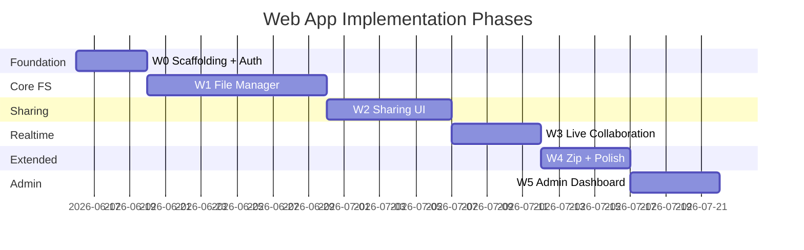

# Ha-to-Pe File System — Web App Implementation Plan

End-to-end plan for implementing the Ha-to-Pe web client (`frontend-web/`) from empty repository to production-ready UI. This document aligns with [requirement.md](./requirement.md), [usecase.md](./usecase.md), [tech_stack.md](./tech_stack.md), and [backend_implementation_plan.md](./backend_implementation_plan.md).

---

## 1. Goals and Success Criteria

### 1.1 Web Deliverables

By the end of all phases, the web app must:

1. Provide a **file-manager UI** for browsing, uploading, downloading, and managing files and directories.
2. Support **trash**, **search**, **sharing**, and **real-time collaboration** in shared directories.
3. Handle **zip/unzip** and **storage quota** visibility.
4. Offer an **admin dashboard** for system configuration and analytics.
5. Work against the backend **GraphQL + REST** API with no duplicated business logic.

### 1.2 Architecture Rules

| Rule | Detail |
|------|--------|
| Backend is source of truth | Permissions, quotas, and path rules enforced server-side only |
| Thin UI layer | Components render state; hooks call API; no ACL logic in components |
| GraphQL for metadata | Tree, search, sharing, mutations, subscriptions |
| REST for bytes | Upload sessions, file download, directory zip download |
| Type-safe API | GraphQL Code Generator for hooks and types |
| Optimistic UI optional | Only where version/conflict handling exists (Phase 3+) |
| Accessible and responsive | Keyboard navigation, mobile-friendly layout |

### 1.3 Backend Dependency Map

Build each web phase **after** the corresponding backend phase is API-stable.

| Web phase | Requires backend phase | Gate |
|-----------|------------------------|------|
| W0 | Backend Phase 0 | `me` query + auth REST works |
| W1 | Backend Phase 1 | Tree, upload, trash, search APIs work |
| W2 | Backend Phase 2 | Sharing + permission mutations work |
| W3 | Backend Phase 3 | Subscriptions + version fields work |
| W4 | Backend Phase 4 | Zip + path APIs work |
| W5 | Backend Phase 5 | Admin + billing APIs work |

### 1.4 Target Directory Structure

```
frontend-web/
├── package.json
├── vite.config.ts
├── tsconfig.json
├── codegen.ts                     # GraphQL Code Generator config
├── index.html
├── public/
└── src/
    ├── main.tsx
    ├── App.tsx
    ├── routes/
    │   ├── index.tsx              # route definitions
    │   ├── ProtectedRoute.tsx
    │   └── AdminRoute.tsx
    ├── pages/
    │   ├── LoginPage.tsx
    │   ├── RegisterPage.tsx
    │   ├── FilesPage.tsx          # main file manager
    │   ├── TrashPage.tsx
    │   ├── SearchPage.tsx
    │   ├── SharedPage.tsx
    │   ├── InvitationsPage.tsx
    │   ├── PublicBrowsePage.tsx
    │   ├── SettingsPage.tsx
    │   └── admin/
    │       ├── AdminDashboardPage.tsx
    │       ├── AdminQuotaPage.tsx
    │       └── AdminAnalyticsPage.tsx
    ├── components/
    │   ├── layout/
    │   │   ├── AppShell.tsx
    │   │   ├── Sidebar.tsx
    │   │   ├── TopBar.tsx
    │   │   └── StorageMeter.tsx
    │   ├── files/
    │   │   ├── DirectoryTree.tsx
    │   │   ├── FileList.tsx
    │   │   ├── FileGrid.tsx
    │   │   ├── Breadcrumb.tsx
    │   │   ├── NodeIcon.tsx
    │   │   ├── NodeContextMenu.tsx
    │   │   └── DropZone.tsx
    │   ├── dialogs/
    │   │   ├── NewFolderDialog.tsx
    │   │   ├── RenameDialog.tsx
    │   │   ├── MoveDialog.tsx
    │   │   ├── DeleteConfirmDialog.tsx
    │   │   ├── ShareDialog.tsx
    │   │   └── ZipDialog.tsx
    │   ├── upload/
    │   │   ├── UploadButton.tsx
    │   │   ├── UploadQueue.tsx
    │   │   └── UploadProgress.tsx
    │   ├── search/
    │   │   └── SearchBar.tsx
    │   ├── sharing/
    │   │   ├── VisibilityBadge.tsx
    │   │   ├── CollaboratorList.tsx
    │   │   ├── InviteForm.tsx
    │   │   └── PresenceAvatars.tsx
    │   └── ui/                    # primitives (Button, Modal, Input, ...)
    ├── hooks/
    │   ├── useAuth.ts
    │   ├── useCurrentDirectory.ts
    │   ├── useFileOperations.ts
    │   ├── useUpload.ts
    │   ├── useDownload.ts
    │   ├── useTrash.ts
    │   ├── useSearch.ts
    │   ├── useSharing.ts
    │   ├── useDirectorySubscription.ts
    │   └── usePermissions.ts
    ├── api/
    │   ├── apolloClient.ts
    │   ├── auth.ts                # REST auth helpers
    │   ├── upload.ts              # REST upload session flow
    │   ├── download.ts            # REST download helpers
    │   └── generated/             # GraphQL codegen output
    ├── store/
    │   ├── authStore.ts           # Zustand: tokens, user
    │   ├── filesStore.ts          # selection, view mode, sort
    │   └── uploadStore.ts         # upload queue state
    ├── types/
    │   └── index.ts               # shared app types
    ├── utils/
    │   ├── formatBytes.ts
    │   ├── formatDate.ts
    │   └── errors.ts              # map API errors to user messages
    └── tests/
        ├── setup.ts
        ├── unit/
        └── e2e/
```

---

## 2. Tech Stack

| Layer | Choice | Notes |
|-------|--------|-------|
| Framework | React 18+ | UI library |
| Build | Vite | Fast HMR, ESM |
| Language | TypeScript | Strict mode |
| Routing | React Router v6 | Nested routes for file manager |
| GraphQL | Apollo Client | Queries, mutations, subscriptions |
| Codegen | `@graphql-codegen/cli` | Types + hooks from backend schema |
| REST | `fetch` wrappers | Upload/download; no axios required |
| State | Zustand | Auth, selection, upload queue |
| Styling | Tailwind CSS | Utility-first; optional shadcn/ui primitives |
| Icons | Lucide React | File/folder/action icons |
| Forms | React Hook Form + Zod | Login, share invite, admin forms |
| Tests | Vitest + React Testing Library | Unit/component |
| E2E | Playwright | Critical flows (Phase W1+) |
| Lint | ESLint + Prettier | Match backend formatting discipline |

### 2.1 Key Dependencies (planned)

```json
{
  "dependencies": {
    "react": "^18",
    "react-dom": "^18",
    "react-router-dom": "^6",
    "@apollo/client": "^3",
    "graphql": "^16",
    "zustand": "^4",
    "react-hook-form": "^7",
    "zod": "^3",
    "lucide-react": "latest",
    "clsx": "latest"
  },
  "devDependencies": {
    "vite": "^5",
    "@vitejs/plugin-react": "^4",
    "typescript": "^5",
    "tailwindcss": "^3",
    "@graphql-codegen/cli": "^5",
    "@graphql-codegen/typescript": "^4",
    "@graphql-codegen/typescript-operations": "^4",
    "@graphql-codegen/typescript-react-apollo": "^4",
    "vitest": "^1",
    "@testing-library/react": "^14",
    "playwright": "^1",
    "eslint": "^8",
    "prettier": "^3"
  }
}
```

---

## 3. Phase Overview



| Phase | Focus | Exit criterion |
|-------|-------|----------------|
| W0 | Vite scaffold, auth, Apollo setup | User can log in and see shell |
| W1 | File manager, upload, trash, search | Full private FS usable in browser |
| W2 | Sharing, visibility, invitations | Owner can share; collaborator sees shared dir |
| W3 | Subscriptions, presence, conflicts | Live updates in shared directory |
| W4 | Zip/unzip, UX polish | Archive flows + responsive layout |
| W5 | Admin pages, storage upgrade | Admin can view stats and configure quota |

---

## 4. Phase W0 — Foundation and Auth

**Duration estimate:** 3–4 days  
**Requirements:** GUI-01, ACC-01–03  
**Use cases:** UC-01, UC-02, UC-03  
**Backend gate:** Phase 0 complete

### 4.1 Tasks

| # | Task | Output |
|---|------|--------|
| W0.1 | `npm create vite@latest frontend-web -- --template react-ts` | Project scaffold |
| W0.2 | Add Tailwind, ESLint, Prettier, path aliases (`@/`) | Dev tooling |
| W0.3 | `api/apolloClient.ts` — HTTP link, auth header, error link, token refresh | Apollo setup |
| W0.4 | `api/auth.ts` — `login`, `register`, `refresh`, `logout` REST calls | Token lifecycle |
| W0.5 | `store/authStore.ts` — access/refresh tokens, persist to `localStorage` | Auth state |
| W0.6 | `hooks/useAuth.ts` — login/logout/register, `me` query on mount | Auth hook |
| W0.7 | `codegen.ts` — pull schema from `http://localhost:8000/graphql` | Codegen config |
| W0.8 | `routes/ProtectedRoute.tsx` — redirect to `/login` if unauthenticated | Route guard |
| W0.9 | `pages/LoginPage.tsx`, `pages/RegisterPage.tsx` | Auth UI |
| W0.10 | OAuth buttons → redirect to `GET /auth/google`, `GET /auth/github` | ACC-03 |
| W0.11 | `components/layout/AppShell.tsx` — sidebar placeholder, top bar with user menu | App chrome |
| W0.12 | `pages/SettingsPage.tsx` — display name, storage meter stub | Settings shell |
| W0.13 | Vitest + RTL setup; test `useAuth` and `ProtectedRoute` | Test foundation |

### 4.2 GraphQL Operations (W0)

```graphql
query Me {
  me {
    id
    email
    displayName
    quotaBytes
    storageUsedBytes
    root {
      id
      name
    }
  }
}
```

### 4.3 Routes (W0)

| Path | Page | Auth |
|------|------|------|
| `/login` | LoginPage | Public |
| `/register` | RegisterPage | Public |
| `/` | Redirect → `/files` | Protected |
| `/files` | FilesPage (stub) | Protected |
| `/settings` | SettingsPage | Protected |

### 4.4 Definition of Done

- [ ] User can register and log in with email/password
- [ ] OAuth redirect buttons present (functional when backend OAuth configured)
- [ ] `me` query populates user name and storage in top bar
- [ ] Unauthenticated users cannot access `/files`
- [ ] `npm run codegen` generates types without error

---

## 5. Phase W1 — File Manager (Private FS)

**Duration estimate:** 8–12 days  
**Requirements:** GUI-04, FS-01–05, UDL-01–02, TRH-01–04, SRC-01–03, STO-03  
**Use cases:** UC-04–18, UC-28  
**Backend gate:** Phase 1 complete

### 5.1 Layout and Navigation

| # | Task | Detail |
|---|------|--------|
| W1.1 | `FilesPage.tsx` — two-pane layout: tree + main content | Primary workspace |
| W1.2 | `DirectoryTree.tsx` — lazy-load children on expand | GraphQL `directory.children` |
| W1.3 | `Breadcrumb.tsx` — click to navigate up the tree | Path from `nodePath` or parent chain |
| W1.4 | `FileList.tsx` / `FileGrid.tsx` — toggle view mode | `filesStore.viewMode` |
| W1.5 | `NodeIcon.tsx` — icons by `nodeType` and mime | Visual distinction |
| W1.6 | `StorageMeter.tsx` — `used / quota` progress bar | UC-28 |

### 5.2 File Operations Hooks

| Hook | GraphQL / REST | Actions |
|------|----------------|---------|
| `useCurrentDirectory(id)` | `directory` query | Load listing, refetch |
| `useFileOperations()` | mutations | mkdir, rename, move, copy |
| `useUpload()` | REST upload sessions | Queue, progress, complete |
| `useDownload()` | REST `GET /download/{id}` | Trigger browser download |
| `useTrash()` | trash mutations/queries | move, restore, delete, empty |
| `useSearch()` | `search` query | current dir + global scope |

### 5.3 Upload Flow (UI)

```
1. User drops files on DropZone or clicks UploadButton
2. useUpload:
   a. POST /upload/sessions (file name, size, target directory id)
   b. PUT bytes with XMLHttpRequest / fetch for progress events
   c. POST /upload/sessions/{id}/complete
   d. Refetch directory listing
3. UploadQueue shows per-file progress, errors, retry
4. On quota error → toast with link to upgrade (stub until W5)
```

### 5.4 Context Menus and Dialogs

| Component | Triggers | API |
|-----------|----------|-----|
| `NewFolderDialog` | Toolbar, context menu | `mkdir` |
| `RenameDialog` | Context menu, F2 | `rename` + `expectedVersion` |
| `MoveDialog` | Drag-drop or context menu | `move` |
| `DeleteConfirmDialog` | Delete key, context menu | `moveToTrash` |
| `NodeContextMenu` | Right-click row | Open, download, rename, move, delete |

### 5.5 Trash Page

| # | Task | Detail |
|---|------|--------|
| W1.14 | `TrashPage.tsx` — list trashed nodes | `trash` query |
| W1.15 | Restore / permanent delete / empty trash actions | UC-14–16 |
| W1.16 | Sidebar link with trash item count badge | Optional query |

### 5.6 Search

| # | Task | Detail |
|---|------|--------|
| W1.17 | `SearchBar.tsx` in top bar | Debounced input |
| W1.18 | Scope toggle: Current folder / Global | SRC-02, SRC-03 |
| W1.19 | `SearchPage.tsx` or inline results panel | Click result → navigate |

### 5.7 GraphQL Operations (W1)

```graphql
query DirectoryContents($id: ID!) {
  directory(id: $id) {
    id
    name
    nodeType
    version
    children {
      id
      name
      nodeType
      sizeBytes
      mimeType
      updatedAt
      version
      ... on Directory { visibility }
    }
  }
}

mutation Mkdir($parentId: ID!, $name: String!) {
  mkdir(parentId: $parentId, name: $name) { id name }
}

mutation MoveToTrash($nodeId: ID!) {
  moveToTrash(nodeId: $nodeId) { id }
}

query Trash {
  trash { id name nodeType sizeBytes deletedAt originalParent { id name } }
}

query Search($query: String!, $scope: SearchScope!, $directoryId: ID) {
  search(query: $query, scope: $scope, directoryId: $directoryId) {
    id name nodeType parent { id name }
  }
}
```

### 5.8 Tests (W1)

| Test | Type |
|------|------|
| `FileList renders children` | RTL component |
| `useUpload handles quota error` | Vitest hook mock |
| `Breadcrumb navigates on click` | RTL |
| `Trash restore calls mutation` | RTL |
| `upload → list → delete flow` | Playwright e2e |

### 5.9 Definition of Done

- [ ] User can browse tree, create folders, upload and download files
- [ ] Rename, move, copy, delete (to trash) work from UI
- [ ] Trash page: restore, permanent delete, empty trash
- [ ] Search works in current directory and global scope
- [ ] Storage meter shows correct usage
- [ ] Playwright e2e passes for happy-path file manager flow

---

## 6. Phase W2 — Sharing and Permissions

**Duration estimate:** 5–8 days  
**Requirements:** VIS-01–04, GUI-04  
**Use cases:** UC-19–23  
**Backend gate:** Phase 2 complete

### 6.1 UI Features

| # | Task | Component / page |
|---|------|------------------|
| W2.1 | Visibility selector on directory | `ShareDialog` — private / shared / public |
| W2.2 | Invite collaborator by email + permission checkboxes | `InviteForm` |
| W2.3 | Manage existing grants (edit / revoke) | `CollaboratorList` |
| W2.4 | Pending invitations page | `InvitationsPage` — accept / decline |
| W2.5 | Shared with me sidebar section | `SharedPage` — dirs where user is grantee |
| W2.6 | Public link copy button | `ShareDialog` |
| W2.7 | `PublicBrowsePage.tsx` — read-only view via `/public/:token` | UC-23, no auth |
| W2.8 | `VisibilityBadge` on directories | private / shared / public chip |
| W2.9 | `usePermissions(nodeId)` — fetch effective actions; hide disabled UI | Thin client; server enforces |

### 6.2 Permission-Aware UI

Disable or hide actions the user cannot perform:

| Action | Hide when |
|--------|-----------|
| Upload / New folder | No `create` / `upload` |
| Rename / Move | No `write` / `move` |
| Delete | No `delete` |
| Share settings | Not owner |
| Download | No `download` / `read` |

Fetch permissions via GraphQL:

```graphql
query NodePermissions($nodeId: ID!) {
  nodePermissions(nodeId: $nodeId) {
    actions
  }
}
```

*(Add `nodePermissions` to backend schema in Phase 2 if not already exposed.)*

### 6.3 Share Dialog Flow

```
1. Owner opens ShareDialog on a directory
2. Sets visibility (private → shared → public)
3. If shared: invite by email, select actions (read, write, delete, ...)
4. If public: generate/copy public link
5. CollaboratorList shows grantees with edit/revoke
```

### 6.4 Routes (W2 additions)

| Path | Page | Auth |
|------|------|------|
| `/shared` | SharedPage | Protected |
| `/invitations` | InvitationsPage | Protected |
| `/public/:token` | PublicBrowsePage | Public |

### 6.5 Tests

- Collaborator sees shared dir in sidebar but not owner's private dirs
- Invite form disabled for non-owner
- Public page renders without login
- Action buttons hidden when permission missing

### 6.6 Definition of Done

- [ ] Owner can set visibility and invite collaborators
- [ ] Invitee can accept invitation and access shared directory
- [ ] Public link opens read-only browse page
- [ ] UI reflects permissions (buttons disabled/hidden appropriately)

---

## 7. Phase W3 — Real-Time Collaboration

**Duration estimate:** 4–6 days  
**Requirements:** RTC-01–03, GUI-04  
**Use cases:** UC-24  
**Backend gate:** Phase 3 complete

### 7.1 Apollo Subscriptions

| # | Task | Detail |
|---|------|--------|
| W3.1 | Add `GraphQLWsLink` (or `split` link) for subscriptions | `apolloClient.ts` |
| W3.2 | `useDirectorySubscription(directoryId)` | Subscribe to `directoryChanged` |
| W3.3 | On event → `cache.evict` or targeted refetch of `directory` query | Live listing update |
| W3.4 | `PresenceAvatars.tsx` — subscribe to `directoryPresence` | RTC-03 |
| W3.5 | Toast when another user changes directory | "Alice added report.pdf" |
| W3.6 | Version conflict handling on rename/move | Show refresh dialog on `CONFLICT` error |

### 7.2 Subscription Operations

```graphql
subscription DirectoryChanged($directoryId: ID!) {
  directoryChanged(directoryId: $directoryId) {
    type
    nodeId
    actor { displayName }
    timestamp
  }
}

subscription DirectoryPresence($directoryId: ID!) {
  directoryPresence(directoryId: $directoryId) {
    user { id displayName }
    clientType
    lastSeenAt
  }
}
```

### 7.3 UX for Shared Directories

- Auto-subscribe when viewing a `shared` or `public` directory
- Unsubscribe on navigate away
- Presence avatars in top bar of `FilesPage`
- Connection status indicator (connected / reconnecting)

### 7.4 Conflict Flow

```
1. User renames file (mutation sends expectedVersion)
2. Backend returns CONFLICT
3. UI shows dialog: "This file was changed by another user. Refresh?"
4. On confirm → refetch directory, discard local edit
```

### 7.5 Definition of Done

- [ ] Two browser tabs on same shared dir see updates without manual refresh
- [ ] Presence avatars show active collaborators
- [ ] Version conflict shows user-friendly message
- [ ] Subscriptions clean up on unmount

---

## 8. Phase W4 — Zip, UX Polish, Responsiveness

**Duration estimate:** 4–6 days  
**Requirements:** ZIP-01–03, UDL-03, GUI-04  
**Use cases:** UC-12, UC-25–26  
**Backend gate:** Phase 4 complete

### 8.1 Zip Features

| # | Task | Detail |
|---|------|--------|
| W4.1 | Multi-select in `FileList` (checkbox + shift-click) | `filesStore.selectedIds` |
| W4.2 | Toolbar: "Compress to zip" | `createZip` mutation |
| W4.3 | Context menu on zip nodes: "Extract here…" | `unzip` mutation + target picker |
| W4.4 | Download directory as zip | REST `GET /download/directory/{id}/zip` |
| W4.5 | `ZipDialog.tsx` — name input, destination | UC-25 |

### 8.2 UX Polish

| # | Task |
|---|------|
| W4.6 | Responsive layout — collapsible sidebar on mobile |
| W4.7 | Keyboard shortcuts (Delete, F2, Ctrl+A, Escape) |
| W4.8 | Empty states (empty folder, empty trash, no search results) |
| W4.9 | Loading skeletons for tree and file list |
| W4.10 | Error boundary + global toast notification system |
| W4.11 | Drag-and-drop move between folders |
| W4.12 | Double-click open: directory navigates, file downloads |

### 8.3 Definition of Done

- [ ] User can create zip from selection and unzip into chosen folder
- [ ] Directory download as zip works
- [ ] App usable on tablet-width viewport
- [ ] No uncaught promise rejections on API errors

---

## 9. Phase W5 — Admin and Storage Upgrade

**Duration estimate:** 4–6 days  
**Requirements:** ADM-01–04, STO-02  
**Use cases:** UC-29–33  
**Backend gate:** Phase 5 complete

### 9.1 Admin Pages

| Page | Features |
|------|----------|
| `AdminDashboardPage` | Total users, storage used, uploads, shared dirs (cards + charts) |
| `AdminQuotaPage` | Edit `default_quota_bytes`; manage storage tiers |
| `AdminAnalyticsPage` | Date range filter, export report button |

### 9.2 User Storage Upgrade

| # | Task | Detail |
|---|------|--------|
| W5.1 | Upgrade section on `SettingsPage` | List `storageTiers` |
| W5.2 | Purchase flow UI | `purchaseStorageUpgrade` → payment redirect (Stripe stub) |
| W5.3 | Post-purchase quota refresh | Refetch `me` |

### 9.3 Route Guard

```tsx
// AdminRoute.tsx — redirect non-admin to /files
if (!user?.isAdmin) return <Navigate to="/files" />;
```

### 9.4 GraphQL Operations (W5)

```graphql
query AdminStats {
  adminStats {
    totalUsers
    totalStorageUsedBytes
    totalSharedDirectories
    uploadsLast30Days
  }
}

query StorageTiers {
  storageTiers { id name capacityBytes priceCents currency }
}

mutation SetDefaultQuota($bytes: BigInt!) {
  setDefaultQuota(bytes: $bytes)
}

mutation PurchaseStorageUpgrade($tierId: ID!) {
  purchaseStorageUpgrade(tierId: $tierId) { id status }
}
```

### 9.5 Definition of Done

- [ ] Admin sees analytics dashboard
- [ ] Admin can update default quota
- [ ] User can view tiers and initiate upgrade
- [ ] Non-admin cannot access `/admin/*`

---

## 10. Page and Route Map (Final)

| Path | Page | Phase | Auth |
|------|------|-------|------|
| `/login` | LoginPage | W0 | Public |
| `/register` | RegisterPage | W0 | Public |
| `/files` | FilesPage | W1 | User |
| `/files/:directoryId` | FilesPage | W1 | User |
| `/trash` | TrashPage | W1 | User |
| `/search` | SearchPage | W1 | User |
| `/shared` | SharedPage | W2 | User |
| `/invitations` | InvitationsPage | W2 | User |
| `/public/:token` | PublicBrowsePage | W2 | Public |
| `/settings` | SettingsPage | W0/W5 | User |
| `/admin` | AdminDashboardPage | W5 | Admin |
| `/admin/quota` | AdminQuotaPage | W5 | Admin |
| `/admin/analytics` | AdminAnalyticsPage | W5 | Admin |

---

## 11. State Management Guide

### 11.1 Zustand Stores

| Store | State | Persisted |
|-------|-------|-----------|
| `authStore` | `accessToken`, `refreshToken`, `user` | localStorage |
| `filesStore` | `selectedIds`, `viewMode`, `sortBy`, `sortDir` | sessionStorage |
| `uploadStore` | `queue: UploadItem[]` | memory only |

### 11.2 Apollo Cache Strategy

| Entity | Cache key | Policy |
|--------|-----------|--------|
| `Directory` | `id` | `children` replaced on refetch |
| `File` | `id` | Updated after rename mutation |
| `me` | singleton | Refetched after upgrade |

Prefer `refetchQueries` for tree consistency after mutations in Phase W1; migrate to targeted cache updates in W3 when subscriptions arrive.

### 11.3 URL as Navigation State

- Current directory: `/files/:directoryId`
- Deep-linking to folders works on refresh
- Search scope in query params: `/search?q=report&scope=global`

---

## 12. API Integration Patterns

### 12.1 GraphQL Mutations — Standard Pattern

```tsx
const [renameNode] = useRenameNodeMutation();

async function handleRename(nodeId: string, name: string, version: number) {
  try {
    await renameNode({ variables: { nodeId, name, expectedVersion: version } });
    refetchDirectory();
  } catch (e) {
    showError(mapGraphQLError(e));
  }
}
```

### 12.2 REST Upload with Progress

```tsx
async function uploadFile(sessionId: string, file: File, onProgress: (pct: number) => void) {
  return new Promise((resolve, reject) => {
    const xhr = new XMLHttpRequest();
    xhr.upload.onprogress = (e) => e.lengthComputable && onProgress((e.loaded / e.total) * 100);
    xhr.onload = () => xhr.status < 300 ? resolve(xhr.response) : reject(xhr.status);
    xhr.open('PUT', `${API_URL}/upload/sessions/${sessionId}`);
    xhr.setRequestHeader('Authorization', `Bearer ${accessToken}`);
    xhr.send(file);
  });
}
```

### 12.3 Download

```tsx
function downloadFile(nodeId: string, fileName: string) {
  const url = `${API_URL}/download/${nodeId}`;
  const a = document.createElement('a');
  a.href = url;
  a.download = fileName;
  a.click();
}
```

Or `fetch` + blob URL for auth header control.

### 12.4 Error Mapping (`utils/errors.ts`)

| API error | User message |
|-----------|--------------|
| `FORBIDDEN` | "You don't have permission to do this." |
| `QUOTA_EXCEEDED` | "Storage full. Upgrade or free space." |
| `CONFLICT` | "This item was changed. Refresh and try again." |
| `NOT_FOUND` | "File or folder not found." |

---

## 13. Component Wireframe (Files Page)

```
┌─────────────────────────────────────────────────────────────┐
│ TopBar: Logo | SearchBar | StorageMeter | UserMenu          │
├──────────┬──────────────────────────────────────────────────┤
│ Sidebar  │ Breadcrumb: root / docs / projects               │
│          ├──────────────────────────────────────────────────┤
│ • Files  │ Toolbar: [Upload] [New folder] [Zip] [Delete]    │
│ • Shared │ PresenceAvatars (W3)                               │
│ • Trash  ├──────────────────────────────────────────────────┤
│          │ FileList / FileGrid                                │
│ Tree     │  □ 📁 designs                                      │
│  📁 docs │  □ 📄 report.pdf      2.1 MB    Jun 8           │
│  📁 work │  □ 📦 archive.zip     14 MB     Jun 7           │
│          │                                                    │
│          │ DropZone overlay on drag                           │
└──────────┴──────────────────────────────────────────────────┘
```

---

## 14. Testing Strategy

| Phase | Unit (Vitest) | Component (RTL) | E2E (Playwright) |
|-------|---------------|-----------------|------------------|
| W0 | authStore, auth API | LoginPage, ProtectedRoute | login → see shell |
| W1 | formatBytes, useUpload | FileList, TrashPage | upload, delete, restore |
| W2 | usePermissions | ShareDialog | invite → accept → see file |
| W3 | subscription hook | PresenceAvatars | two tabs sync (optional) |
| W4 | — | ZipDialog | zip + unzip |
| W5 | — | AdminDashboard | admin route guard |

### 14.1 CI Pipeline

```bash
npm run lint
npm run typecheck
npm run test
npm run build
npx playwright test   # on main branch or nightly
```

### 14.2 Mocking in Tests

- MSW (Mock Service Worker) for GraphQL and REST in component tests
- Shared handlers mirroring backend schema shapes

---

## 15. Environment and Dev Workflow

### 15.1 Environment Variables

```env
# frontend-web/.env.development
VITE_API_URL=http://localhost:8000
VITE_GRAPHQL_URL=http://localhost:8000/graphql
VITE_WS_URL=ws://localhost:8000/graphql
```

### 15.2 Local Development

```bash
# Terminal 1 — backend
cd backend && uv run uvicorn app.main:app --reload --port 8000

# Terminal 2 — web
cd frontend-web
npm install
npm run codegen
npm run dev    # http://localhost:5173
```

### 15.3 Vite Proxy (optional)

```ts
// vite.config.ts
server: {
  proxy: {
    '/graphql': 'http://localhost:8000',
    '/upload': 'http://localhost:8000',
    '/download': 'http://localhost:8000',
    '/auth': 'http://localhost:8000',
  },
}
```

---

## 16. Accessibility and UX Standards

| Requirement | Implementation |
|-------------|----------------|
| Keyboard navigation | Tree arrows, Enter to open, Delete to trash |
| Focus management | Trap focus in modals |
| ARIA | `role="tree"`, `role="grid"` on file list |
| Color contrast | WCAG AA for text and badges |
| Loading | Skeleton + `aria-busy` |
| Errors | `aria-live` region for toasts |

---

## 17. Production Build and Deploy

| Item | Action |
|------|--------|
| Build | `npm run build` → `dist/` |
| Env | `VITE_API_URL` points to production API |
| Hosting | Static host (Vercel, Netlify, S3+CloudFront, nginx) |
| CORS | Backend allows production web origin |
| CSP | Restrict script sources |
| OAuth redirect | Production callback URLs registered |

---

## 18. Risk Register

| Risk | Mitigation | Phase |
|------|------------|-------|
| Backend API not ready | Gate each web phase on backend phase DoD | All |
| Large upload failures | Retry button; chunked upload (future) | W1 |
| Stale cache after mutations | Refetch on success; subscriptions in W3 | W1–W3 |
| Permission UI drift | Single `usePermissions` hook; never hardcode | W2 |
| GraphQL schema changes | CI codegen check; fail build on drift | W0+ |
| Mobile layout cramped | Collapsible sidebar; list view default on narrow | W4 |

---

## 19. Recommended Build Order (Single Developer)

```
Week 1:  W0 — scaffold, auth, Apollo, shell
Week 2:  W1 — file list, tree, breadcrumb, mkdir
Week 3:  W1 — upload queue, download, context menus
Week 4:  W1 — trash, search, storage meter, e2e
Week 5:  W2 — share dialog, invitations, shared sidebar
Week 6:  W2 — public page, permission-aware UI
Week 7:  W3 — subscriptions, presence, conflict UX
Week 8:  W4 — zip, multi-select, drag-drop, responsive
Week 9:  W5 — admin dashboard, quota config
Week 10: W5 — storage upgrade UI, polish, production build
```

Start W1 only when backend Phase 1 integration tests pass. Run web and backend phases in parallel only where backend API contracts are frozen for that slice.

---

## 20. Document History

| Version | Date | Author | Changes |
|---------|------|--------|---------|
| 0.1 | 2026-06-08 | — | Initial web app implementation plan |
